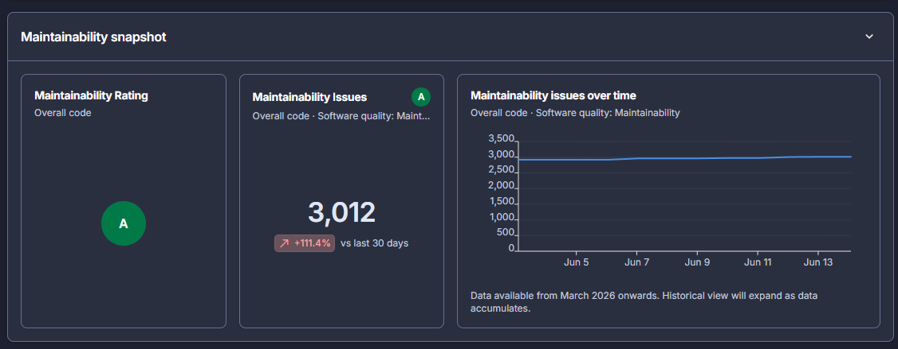
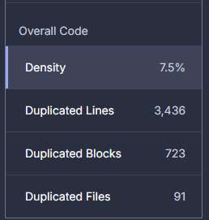
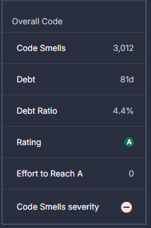

# Analyse onderhoudbaarheid

Om de onderhoudbaarheid van de gekozen OpenMRS REST Webservices module systematisch te beoordelen, hebben wij SonarCloud toegepast op ons project. SonarCloud analyseert de broncode automatisch en levert metrieken op het gebied van complexiteit, duplicatie, code smells en technische schuld. De resultaten van deze analyse vormen de basis voor de beoordeling van de onderhoudbaarheid van de module en zijn gekoppeld aan de ISO 25010 kwaliteitskenmerken analyseerbaarheid, aanpasbaarheid, testbaarheid en modulariteit.

Op het hoogste niveau geeft SonarCloud de module een **Maintainability Rating A**, bij in totaal **3.012 openstaande maintainability-issues** (code smells). De A-rating betekent dat de geschatte technische schuld klein is ten opzichte van het totale codevolume; het absolute aantal issues laat echter zien dat er wel degelijk onderhoudbaarheidsaandachtspunten zijn, die in de onderstaande metrieken verder worden uitgesplitst.

*Figuur 1: SonarCloud maintainability snapshot van de module — overall Maintainability Rating (A) en het totaal aantal maintainability-issues over de tijd.*

---

## Cyclomatic Complexity

Cyclomatic complexity (CC) meet het aantal onafhankelijke paden door een stuk code. Per extra `if`, `loop`, `case`, `&&` of `||` stijgt de waarde met 1. Een hogere CC betekent dat er meer testgevallen nodig zijn om de code volledig te dekken en dat de code moeilijker te begrijpen en aan te passen is.

De SIG/TÜViT Evaluation Criteria Trusted Product Maintainability hanteert de volgende drempelwaarden per functie:

| CC per functie | Risicocategorie |
|---|---|
| 1 – 5 | Laag risico |
| 6 – 10 | Gemiddeld risico |
| 11 – 25 | Hoog risico |
| > 25 | Zeer hoog risico |

De module bevat in totaal **2.521 functies** met een gecombineerde cyclomatic complexity van **4.756**. Dit geeft een gemiddelde van **1,89 CC per functie**, wat in de categorie *laag risico* valt.

Ondanks het lage gemiddelde zijn er duidelijke uitschieters. De vijf bestanden met de hoogste cyclomatic complexity binnen de `omod`-map zijn:

| Bestand | CC totaal | Functies | CC / functie |
|---|---|---|---|
| `ConceptResource1_8.java` | 83 | 32 | 2,59 |
| `PersonResource1_8.java` | 76 | 33 | 2,30 |
| `ObsResource1_8.java` | 71 | 20 | 3,55 |
| `VisitResource1_9.java` | 63 | 25 | 2,52 |
| `ModuleActionResource1_8.java` | 58 | 19 | 3,05 |

Ondanks de hoge totale CC vallen de gemiddelden per functie nog steeds in de *laag risico*-categorie (≤ 5) van SIG/TÜViT. De complexiteit is hier verspreid over relatief veel functies. Toch wijst de hoge totale CC op veel conditionele logica voor het verwerken van uiteenlopende invoerscenario's, wat de aanpasbaarheid en testbaarheid negatief beïnvloedt.

**Koppeling ISO 25010:** hoge cyclomatic complexity per bestand raakt twee kwaliteitskenmerken direct:
- *Testbaarheid* — elke extra branch vereist een extra testgeval voor volledige dekking; klassen met CC > 50 vereisen tientallen testgevallen voor volledige branch coverage.
- *Aanpasbaarheid (Modifiability)* — meer paden door de code betekent een grotere kans op regressie bij wijzigingen.

---

## Cognitive Complexity

Cognitive complexity is een alternatieve metriek van SonarQube die niet alleen branches telt, maar ook rekening houdt met de diepte van nesting. Diep geneste structuren worden zwaarder gewogen omdat ze voor een ontwikkelaar moeilijker te volgen zijn, ook al hebben ze formeel dezelfde cyclomatic complexity als vlakkere code.

SonarQube hanteert voor cognitive complexity de volgende drempelwaarden per functie:

| Cogn. complexity per functie | Beoordeling |
|---|---|
| 1 – 5 | Laag risico |
| 6 – 15 | Gemiddeld risico |
| > 15 | Hoog risico — SonarQube geeft automatisch een issue |

De totale cognitive complexity van de module bedraagt **3.621**, met een gemiddelde van **1,44 per functie** — eveneens laag. De verdeling is echter scheef: de `omod`-map is verantwoordelijk voor **2.324** (64%) en `omod-common` voor **1.297** (36%) van de totale cognitive complexity.

De vijf bestanden met de hoogste cognitive complexity binnen `omod` zijn:

| Bestand | Cogn. totaal | Functies | Cogn. / functie |
|---|---|---|---|
| `ObsResource1_8.java` | 103 | 20 | 5,15 |
| `EncounterSearchHandler1_9.java` | 88 | 5 | 17,6 |
| `ConceptResource1_8.java` | 69 | 32 | 2,16 |
| `PersonResource1_8.java` | 64 | 33 | 1,94 |
| `ConceptSearchHandler1_8.java` | 62 | 2 | 31,0 |

Wanneer de cognitive complexity per functie wordt bekeken, verschuift het beeld aanzienlijk. `ConceptSearchHandler1_8.java` heeft slechts 2 functies met een gemiddelde cognitive complexity van **31,0** — ruim boven de SIG-grens van 25 (zeer hoog risico). `EncounterSearchHandler1_9.java` scoort **17,6** per functie (hoog risico). Dit betekent dat deze SearchHandler-klassen, hoewel klein qua omvang, individuele functies bevatten die extreem moeilijk te begrijpen en te onderhouden zijn.

`ObsResource1_8.java` komt in beide top 5-lijsten voor met een cognitive complexity (103) die hoger ligt dan de cyclomatic complexity (71). Dit duidt op diepe nesting bovenop de vertakkingslogica, wat de leesbaarheid verder vermindert.

**Koppeling ISO 25010:** hoge cognitive complexity raakt voornamelijk:
- *Analyseerbaarheid (Analysability)* — diep geneste code is moeilijker te doorgronden bij het opsporen van defecten of het begrijpen van gedrag.
- *Aanpasbaarheid (Modifiability)* — complexe logica vergroot het risico dat een wijziging onbedoelde neveneffecten heeft.

---

## Duplicatie

Codeduplicatie meet welk deel van de broncode redundant is: blokken die (vrijwel) identiek op meerdere plekken voorkomen. Duplicatie is schadelijk voor de onderhoudbaarheid omdat een wijziging of bugfix telkens op álle kopieën moet worden doorgevoerd; wordt één kopie vergeten, dan ontstaat inconsistentie en een latente bug. SonarCloud detecteert duplicatie op blok- en regelniveau en drukt dit uit als een dichtheid (*density*): het percentage gedupliceerde regels ten opzichte van de totale codebase.

Het SIG-onderhoudbaarheidsmodel (Visser et al.) hanteert de volgende drempelwaarden voor het percentage redundante code:

| Duplicatie (% redundante code) | Risicocategorie (SIG-rating) |
|---|---|
| ≤ 3% | Zeer laag risico (★★★★★) |
| 3 – 5% | Laag risico (★★★★) |
| 5 – 10% | Gemiddeld risico (★★★) |
| 10 – 20% | Hoog risico (★★) |
| > 20% | Zeer hoog risico (★) |

SonarCloud rapporteert voor de volledige module een duplicatiedichtheid van **7,5%**, verspreid over **3.436 gedupliceerde regels**, **723 gedupliceerde blokken** en **91 gedupliceerde bestanden**. Daarmee valt de module in de categorie *gemiddeld risico* (★★★) van het SIG-model. Ter vergelijking: de standaard quality gate van SonarCloud hanteert een grens van **3% op nieuwe code** — de huidige 7,5% ligt daar ruim boven.

*Figuur 2: SonarCloud duplicatie-overzicht (Overall Code) van de module.*

De spreiding over 91 bestanden en 723 blokken wijst niet op één enkel uitgekopieerd bestand, maar op een structureel patroon: terugkerende boilerplate. Dit is in deze module goed verklaarbaar door de vele versie-specifieke resource-klassen (`*Resource1_8`, `*Resource1_9`, `*Resource1_11`, enz.), waarin per OpenMRS-versie grotendeels dezelfde property-mappings en conversielogica worden herhaald. Dergelijke duplicatie maakt de codebase gevoelig voor inconsistente wijzigingen wanneer gedrag in één versie wel en in een andere niet wordt aangepast.

**Koppeling ISO 25010:** duplicatie raakt vooral:
- *Aanpasbaarheid (Modifiability)* — een wijziging moet op elke kopie worden herhaald; het vergeten van een kopie introduceert direct een regressie of inconsistentie.
- *Analyseerbaarheid (Analysability)* — duplicatie vergroot het codevolume zonder functionele meerwaarde, waardoor het moeilijker wordt te bepalen waar de "echte" logica zit en welke kopie leidend is.

---

## Code smells en technische schuld

Een *code smell* is geen bug — de code werkt — maar een patroon in de broncode dat duidt op een zwakke structuur en het onderhoud lastiger en risicovoller maakt. Bekende voorbeelden zijn te lange methodes, te grote klassen, gedupliceerde code, te diep geneste logica en dode (ongebruikte) code. Een smell breekt op zichzelf niets, maar vergroot de kans op fouten zodra de code later wordt gewijzigd.

SonarCloud detecteert deze patronen via een vaste set regels en koppelt aan elke gevonden smell een geschatte hersteltijd. De som van al die hersteltijden is de **technische schuld** (*technical debt*): de hoeveelheid werk die nodig zou zijn om alle smells op te lossen. Om die schuld vergelijkbaar te maken tussen projecten van verschillende omvang, drukt SonarCloud deze ook uit als **debt ratio**: de verhouding tussen de hersteltijd en de geschatte tijd om de volledige codebase opnieuw te bouwen. De debt ratio bepaalt de **SQALE Maintainability Rating**:

| Debt ratio | Maintainability Rating |
|---|---|
| ≤ 5% | A |
| 6 – 10% | B |
| 11 – 20% | C |
| 21 – 50% | D |
| > 50% | E |

Voor de volledige module rapporteert SonarCloud de volgende waarden:

| Metriek | Waarde |
|---|---|
| Code smells | 3.012 |
| Technische schuld | 81 dagen |
| Debt ratio | 4,4% |
| Maintainability Rating | A |
| Effort to reach A | 0 |

Met een debt ratio van **4,4%** valt de module in de **A-categorie**, de hoogste maintainability-rating; er is geen extra werk nodig om die rating te bereiken (*effort to reach A: 0*). De A-rating betekent dat de technische schuld klein is ten opzichte van het zeer grote codevolume van de module. Tegelijk is de schuld in absolute zin niet verwaarloosbaar: **81 dagen** verdeeld over **3.012 smells**. Deze smells overlappen grotendeels met de bevindingen uit de voorgaande secties — een aanzienlijk deel komt voort uit de gedupliceerde versie-specifieke resource-klassen en uit de functies met een hoge (cognitive) complexity. Het oplossen daarvan vermindert dus tegelijk de duplicatie, de complexiteit én de technische schuld.

*Figuur 3: SonarCloud overzicht van code smells en technische schuld (Overall Code) van de module.*

**Koppeling ISO 25010:** technische schuld en code smells raken:
- *Analyseerbaarheid (Analysability)* — smells zoals lange methodes en dode code maken het moeilijker om gedrag te doorgronden en defecten op te sporen.
- *Aanpasbaarheid (Modifiability)* — opgebouwde schuld verhoogt de inspanning en het regressierisico bij elke toekomstige wijziging.

---

## Bronnen

- SIG/TÜViT. *Evaluation Criteria for Trusted Product Maintainability.* Software Improvement Group, versie 11.0 (2023). Beschikbaar via: [https://www.softwareimprovementgroup.com](https://www.softwareimprovementgroup.com)
- Visser, J., Rigal, S., van der Leek, R., van Eck, P. & Wijnholds, N. *Building Maintainable Software: Ten Guidelines for Future-Proof Code.* O'Reilly Media / Software Improvement Group (2016).
- SonarSource. *Cognitive Complexity — A new way of measuring understandability.* G. Ann Campbell (2023). Beschikbaar via: [https://www.sonarsource.com/resources/cognitive-complexity/](https://www.sonarsource.com/resources/cognitive-complexity/)
- SonarSource. *Metric Definitions — Maintainability (SQALE rating, technical debt, debt ratio).* SonarQube/SonarCloud documentatie. Beschikbaar via: [https://docs.sonarsource.com](https://docs.sonarsource.com)
- ISO/IEC 25010:2023. *Systems and software engineering — Systems and software Quality Requirements and Evaluation (SQuaRE) — Product quality model.*
