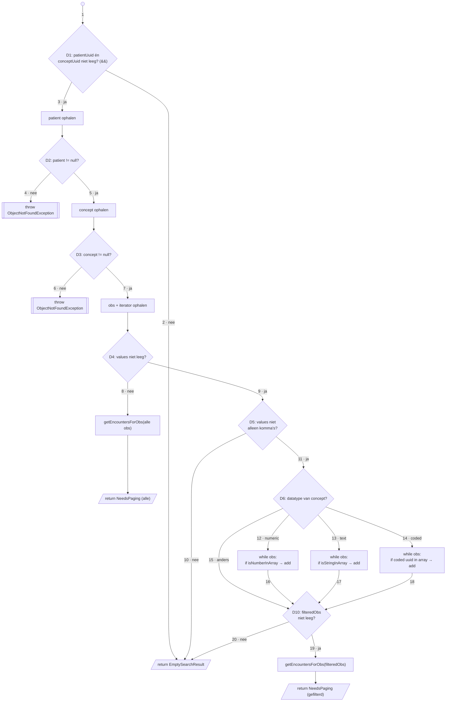
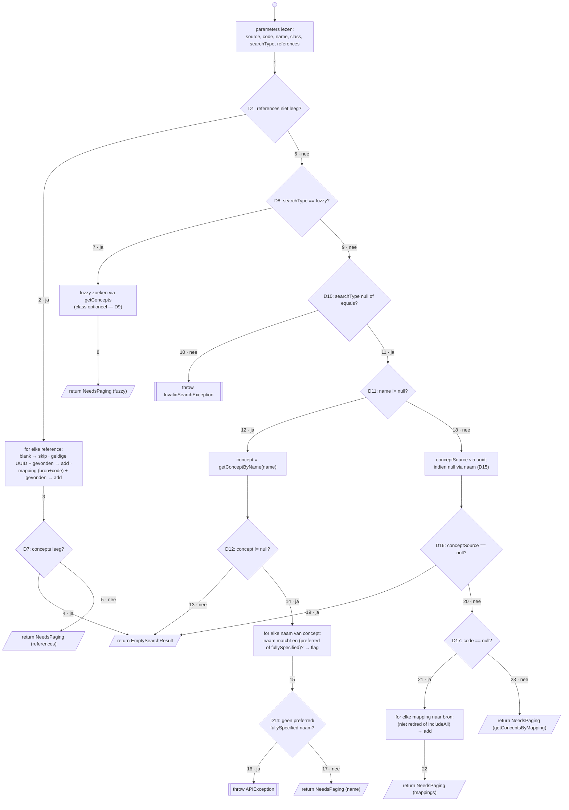

# Testopzet en testresultaten

Rubric: *"Verbeteronderzoek onderhoudbaarheid"* — **Testopzet en testresultaten** (20 pt).

---

## Teststrategie

De onderhoudbaarheidsanalyse in [`01-analyse-onderhoudbaarheid`](../01-analyse-onderhoudbaarheid/01.md) liet zien dat de module gemiddeld laag scoort op complexiteit, maar enkele duidelijke uitschieters bevat: `ConceptSearchHandler1_8` (cognitive complexity 31 per functie) en `EncounterSearchHandler1_9` (17,6 per functie). 
We onderscheiden **white-box** (testen mét kennis van de interne code-structuur, ook wel glass-box) en **black-box** (het systeem als geheel benaderen, zonder die kennis), conform het vakmateriaal (*Testen a.d.h.v. path coverage*, sheet "Kritische evaluatie") en de ISTQB-terminologie. We gebruiken meerdere testtypen naast elkaar:

| Testtype | Box | Waarop | Doel / dekking |
|---|---|---|---|
| Unit / basis-path tests | white-box | de complexe methodes uit 01 (de SearchHandlers, conversielogica) | branch-/padcoverage van de beslislogica |
| Integratie- / controllertests | black-box | de REST-endpoints (`*ControllerTest` op `BaseModuleWebContextSensitiveTest`) | gedrag via de API |
| Regressietests | — | de volledige bestaande testsuite (nulmeting) | huidig gedrag vastleggen als referentie; de voor/na-vergelijking volgt in [`06`](../06-validatie-verbeteringen/06.md) |
| Coverage-meting | white-box | branch coverage met JaCoCo | kwantitatief, reproduceerbaar |

White-box path-coverage is arbeidsintensief en fouten kunnen meelekken naar de testcode. We passen het daarom alleen toe op de twee handlers met hoge complexity; voor de rest van de module leunen we op de bestaande controller-/integratietests en de coverage-meting.

---

## White-box: basis-path testing van `EncounterSearchHandler1_9`

**Functie.** Deze SearchHandler bedient het REST-endpoint `GET /ws/rest/v1/encounter?s=byObs` en zoekt *encounters* op basis van observaties (obs) die matchen met een opgegeven patiënt en concept, optioneel gefilterd op numerieke, tekst- of coded obs-waarden (parameter `obsValues`). Hij vertaalt dus een patiënt+concept(+waarden)-query naar de bijbehorende encounters.

Als uitgewerkt voorbeeld nemen we de methode `EncounterSearchHandler1_9.search()` (`omod/.../search/openmrs1_9/EncounterSearchHandler1_9.java`). We volgen de stappen van *basis path testing*: (1) code als graaf, (2) basispaden bepalen, (3) padvergelijkingen opstellen, (4+5) testcases met verwachte uitkomst, (6–8) implementeren, uitvoeren en rapporteren.

### Stap 1: control-flow graaf

*Figuur 1: Control-flow graaf van `EncounterSearchHandler1_9.search()`. De drie `while`-lussen (pijlen 12/13/14) zijn als één knoop weergegeven; intern bevat elke lus nog een `while` plus een `if`.*

Per beslispunt en per `&&`/`||` telt 1 op bij een basis van 1. Voor `search()` geeft dit **CC ≈ 17** (SIG/TÜViT: *hoog risico*, 11–25): D1 (`&&`, +2), D2–D5 (+4), de drie datatype-takken van D6 (+3), per datatype-lus een `while` + inner-`if` (+6) en D10 (+1). De helpers `isNumberInArray`, `getEncountersForObs` en `containsEncounter` testen we als losse units.

### Stap 2 & 3: basispaden en padvergelijkingen

| Pad | Route (pijlen) | Padvergelijking (conditie) |
|---|---|---|
| P1 | 1-2 | `patient`- of `obsConcept`-parameter leeg |
| P2 | 1-3-4 | beide parameters gevuld, maar `patient == null` |
| P3 | …-5-6 | patient gevonden, maar `concept == null` |
| P4 | …-7-8 | concept gevonden, `obsValues` leeg |
| P5 | …-9-10 | `obsValues` bevat alleen komma's |
| P6 | …-11-12-16-19 | datatype numeric, ≥1 obs matcht een waarde |
| P7 | …-13-17-19 | datatype text, ≥1 obs matcht een waarde |
| P8 | …-14-18-19 | datatype coded, ≥1 obs matcht een waarde |
| P9 | …-12-16-20 | datatype numeric/text/coded, geen enkele obs matcht |
| P10 | …-15-20 | datatype is geen numeric/text/coded (bv. datum/boolean) |

### Stap 4 & 5: testcases en verwachte uitkomst

| TC | patient | obsConcept | obsValues | datatype | obs / match | Pad | Verwachte uitkomst |
|---|---|---|---|---|---|---|---|
| 1 | leeg | – | – | – | – | P1 | `EmptySearchResult` |
| 2 | onbekend uuid | geldig | – | – | – | P2 | `ObjectNotFoundException` (patient) |
| 3 | geldig | onbekend uuid | – | – | – | P3 | `ObjectNotFoundException` (concept) |
| 4 | geldig | geldig | *(geen)* | numeric | obs aanwezig | P4 | `NeedsPaging`, álle encounters |
| 5 | geldig | geldig | `","` | numeric | – | P5 | `EmptySearchResult` |
| 6 | geldig | geldig | `"150"` | numeric | obs = 150 | P6 | `NeedsPaging`, gefilterd |
| 7 | geldig | geldig | `"POS"` | text | obs = "POS" | P7 | `NeedsPaging`, gefilterd |
| 8 | geldig | geldig | `<uuid>` | coded | obs = coded uuid | P8 | `NeedsPaging`, gefilterd |
| 9 | geldig | geldig | `"999"` | numeric | geen match | P9 | `EmptySearchResult` |
| 10 | geldig | geldig | `"x"` | date/boolean | n.v.t. | P10 | `EmptySearchResult` |

Deze 10 testcases dekken alle basispaden op methodeniveau; de lus-interne branches (0 vs. ≥1 obs-iteratie, inner-`if` wel/niet match) volgen uit de match/no-match-data in TC6–9. We implementeren ze als JUnit-tests op de handler, en aanvullend via een controllertest (`BaseModuleWebContextSensitiveTest`).

---

## White-box: basis-path testing van `ConceptSearchHandler1_8`

De tweede uitschieter uit [`01`](../01-analyse-onderhoudbaarheid/01.md) is `ConceptSearchHandler1_8.search()` (`omod/.../search/openmrs1_8/ConceptSearchHandler1_8.java`), met **cognitive complexity 31 per functie** de zwaarste methode van de module.

**Functie.** Dit is de *default* zoekhandler voor het endpoint `GET /ws/rest/v1/concept` en vindt *concepten* op drie elkaar uitsluitende manieren: (1) op bron + code (`source`/`code`), (2) op naam + klasse (`name`/`class`/`searchType`, met `equals` of `fuzzy`), of (3) via een lijst referenties (`references`, dus UUID's of `bron:code`-mappings). Dat al deze zoekmodi in één `search()` zitten, verklaart de hoge complexiteit.

### Stap 1: control-flow graaf

*Figuur 2: Control-flow graaf van `ConceptSearchHandler1_8.search()`. De vier lussen (LREF, LFZ, LNM, LMP) zijn als één knoop weergegeven; hun interne beslissingen (D2–D6, D9, D13, D18) zitten in die knopen verborgen.*

Optellen van alle beslispunten incl. `&&`/`||` geeft **CC ≈ 28** voor `search()`: D1, de referentie-lus (D2–D6, met D5 een `&&`), D7, D8, D9 + fuzzy-lus, D10 (`||`), D11, D12, de namen-lus (D13 met `&&` + `||`), D14, D15–D17 en de mapping-lus (D18, `||`). JaCoCo rapporteert **30** voor de hele klasse en de cognitive complexity is **31**, dus *zeer hoog risico* (> 25).

### Stap 2 & 3: basispaden en padvergelijkingen

| Pad | Route (pijlen) | Padvergelijking (conditie) |
|---|---|---|
| P1 | 1-2-3-4 | `references` gevuld; geen enkele reference resolveert |
| P2 | 1-2-3-5 | `references` gevuld; ≥1 reference resolveert (UUID óf mapping) |
| P3 | 6-7-8 | geen references; `searchType` = "fuzzy" |
| P4 | 6-9-10 | geen references; `searchType` ongeldig (niet null/equals/fuzzy) |
| P5 | 6-9-11-12-14-15-17 | `searchType` null/equals; `name` gezet; concept met preferred/fullySpecified naam |
| P6 | …-14-15-16 | `name` gezet; concept gevonden zónder preferred/fullySpecified naam |
| P7 | …-12-13 | `name` gezet; geen concept gevonden |
| P8 | 6-9-11-18-19 | `name` leeg; `source` resolveert niet |
| P9 | …-18-20-21-22 | `name` leeg; `source` resolveert; `code` leeg → mappings |
| P10 | …-20-23 | `name` leeg; `source` resolveert; `code` gezet → `getConceptsByMapping` |

### Stap 4 & 5: testcases en verwachte uitkomst

| TC | references | searchType | name | source | code | Pad | Verwachte uitkomst |
|---|---|---|---|---|---|---|---|
| 1 | `"xyz"` (onresolvebaar) | – | – | – | – | P1 | `EmptySearchResult` |
| 2 | `<bestaand uuid>` | – | – | – | – | P2 | `NeedsPaging` (via UUID) |
| 3 | `SNOMED CT:107` (mapping) | – | – | – | – | P2 | `NeedsPaging` (via mapping) |
| 4 | – | `fuzzy` | `"asp"` | – | – | P3 | `NeedsPaging` (fuzzy); `class` optioneel |
| 5 | – | `banana` | – | – | – | P4 | `InvalidSearchException` |
| 6 | – | `equals` | `"Aspirin"` (preferred) | – | – | P5 | `NeedsPaging` (1 concept) |
| 7 | – | – | `"aspirine"` (synoniem, niet-preferred) | – | – | P6 | `APIException` |
| 8 | – | – | `"BestaatNiet"` | – | – | P7 | `EmptySearchResult` |
| 9 | – | – | – | `"onbekend"` | – | P8 | `EmptySearchResult` |
| 10 | – | – | – | `SNOMED CT` | *(geen)* | P9 | `NeedsPaging` (mappings naar bron) |
| 11 | – | – | – | `SNOMED CT` | `107` | P10 | `NeedsPaging` (`getConceptsByMapping`) |

TC2 en TC3 vallen beide op pad P2, maar dekken verschillende lus-interne takken: TC2 de UUID-tak (D3/D4), TC3 de mapping-tak (D5/D6). Samen dekken deze 11 testcases alle basispaden op methodeniveau; de overige lus-interne branches (lege/dubbele reference D2, onbekende class D9, retired/includeAll D18) volgen uit de testdata. Deze tests vormen tegelijk het regressievangnet voor de geplande refactoring (splitsen per zoekmodus).

---

## Integratie- en regressietests

Naast de white-box units draaien we de bestaande testsuite van de module: controllertests per resource (black-box via de REST-API, op `BaseModuleWebContextSensitiveTest`) en de IT's in [`integration-tests`](../../../integration-tests/). Deze suite vormt de regressie-nulmeting: ze legt vast dat het huidige gedrag klopt. De voor/na-vergelijking zelf, de suite opnieuw draaien ná de refactoring, hoort bij [`06`](../06-validatie-verbeteringen/06.md) en niet bij deze stap.

De volledige `omod`-suite telt **1.828 tests** (1 falend, 14 geskipt). Die ene fail is een bekende versie-specifieke integratietest die afgaat wanneer meerdere OpenMRS-versies tegelijk actief zijn in de testcontext, en is dus geen regressie in de handlers die we aanpassen. De endpoints van onze twee handlers worden onder meer gedekt door:

| Testklasse | Type | Tests | Resultaat |
|---|---|---|---|
| `EncounterSearchHandler1_9Test` | white-box (handler) | 7 | ✅ |
| `EncounterController1_9Test` | black-box (API) | 18 (2 skip) | ✅ |
| `ConceptController1_8Test` | black-box (API) | 41 (3 skip) | ✅ |

`EncounterSearchHandler1_9` heeft dus al een eigen handler-test (7 cases); `ConceptSearchHandler1_8` heeft die **niet** en wordt alleen indirect geraakt via `ConceptController1_8Test`. Dat verklaart waarom juist die klasse 9 ongedekte branches houdt: precies het gat dat de basis-path set TC1–11 zou dichten.

---

## Code coverage

Coverage wordt gemeten met de JaCoCo Maven-plugin (v0.8.13, geconfigureerd in [`pom.xml`](../../../pom.xml)) en draait mee in de CI-pipeline: de workflow [`sonarcloud-coverage.yml`](../../../.github/workflows/sonarcloud-coverage.yml) voert `mvn verify` uit, genereert de JaCoCo-rapporten en publiceert ze als artefact `coverage-report` (90 dagen retentie). Dezelfde run voedt de coverage door naar SonarCloud, dat op elke pull request een quality gate afdwingt.

We kijken naast line coverage vooral naar **branch coverage**, omdat die aansluit op de cyclomatische complexiteit: het laat zien welke beslistakken (zoals in Figuur 1) wél en niet doorlopen zijn.

---

## Testresultaten

### Nulmeting coverage (bestaande testsuite)

De onderstaande cijfers komen uit het JaCoCo-rapport dat met `mvn verify` is gegenereerd (run van **2026-06-12**, `omod`-submodule, `omod/target/site/jacoco/jacoco.csv`), met hetzelfde commando dat de CI-workflow draait. Ze vormen de **nulmeting**; de voor/na-vergelijking zelf gebeurt in [`06-validatie-verbeteringen`](../06-validatie-verbeteringen/06.md).

**Module-breed (`omod`):**

| Metriek | Coverage |
|---|---|
| Instructions | 37.464 / 43.040 — **87,0 %** |
| Branches | 2.349 / 3.153 — **74,5 %** |
| Lines | 9.160 / 10.563 — **86,7 %** |
| Methods | 1.659 / 1.951 — **85,0 %** |
| Complexity (cyclomatisch gedekt) | 2.601 / 3.532 — **73,6 %** |

**De twee complexe handlers uit [`01`](../01-analyse-onderhoudbaarheid/01.md):**

| Klasse | Branch coverage | Line coverage | Ongedekte branches |
|---|---|---|---|
| `EncounterSearchHandler1_9` | 36 / 44 — **81,8 %** | 72 / 73 — 98,6 % | **8** |
| `ConceptSearchHandler1_8` | 45 / 54 — **83,3 %** | 81 / 83 — 97,6 % | **9** |

De line coverage van beide handlers is hoog (> 97 %), maar de branch coverage blijft achter (≈ 82 %): respectievelijk 8 en 9 beslistakken worden door de bestaande suite niet doorlopen. Op die ongedekte takken (bv. de `date/boolean`-tak P10 en de "alleen komma's"-tak P5) mikken de basis-path testsets, om de branch coverage richting 100 % te brengen.

### Bewijsartefacten

| Bewijsstuk | Bron / locatie | Status |
|---|---|---|
| Testrun bestaande suite (black-box + units) | `omod/target/surefire-reports/` | ✅ 1.828 tests (1 fail, 14 skip) |
| Coveragerapport (HTML + CSV/XML) | [`omod/target/site/jacoco/`](../../../omod/target/site/jacoco/) | ✅ gegenereerd (2026-06-12) |
| Coverage als CI-artefact `coverage-report` | [`sonarcloud-coverage.yml`](../../../.github/workflows/sonarcloud-coverage.yml) | ✅ geconfigureerd |
| Coverage + quality gate | SonarCloud (`GrannyGuard_webservices-rest-audit`) | ✅ actief op elke PR |

---

## Bronnen

- McCabe, T.J. *A Complexity Measure.* IEEE Transactions on Software Engineering, SE-2(4), 1976.
- Vakmateriaal ATIx IN-B2.4 — *Testen a.d.h.v. path coverage* (college­sheets, incl. "Kritische evaluatie": white-box/glass-box vs. black-box).
- ISTQB. *Certified Tester Foundation Level Syllabus* — §4 Testtechnieken (black-box vs. white-box testing). International Software Testing Qualifications Board.
- Myers, G.J., Sandler, C. & Badgett, T. *The Art of Software Testing* (3e ed.). Wiley, 2011.
- SIG/TÜViT. *Evaluation Criteria for Trusted Product Maintainability.* Software Improvement Group, v11.0 (2023).
- ISO/IEC 25010:2023. *Systems and software Quality Requirements and Evaluation (SQuaRE) — Product quality model.*
- EclEmma/JaCoCo. *Java Code Coverage Library — documentatie.* Beschikbaar via: [https://www.jacoco.org/jacoco/](https://www.jacoco.org/jacoco/)
