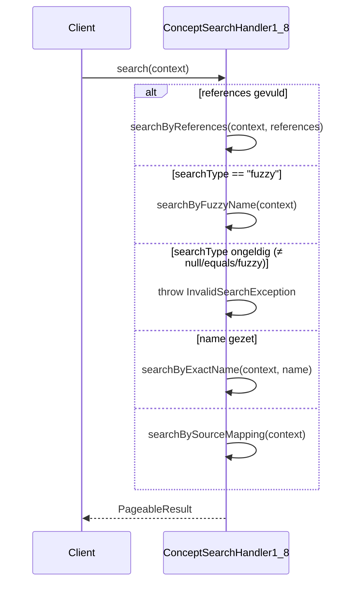
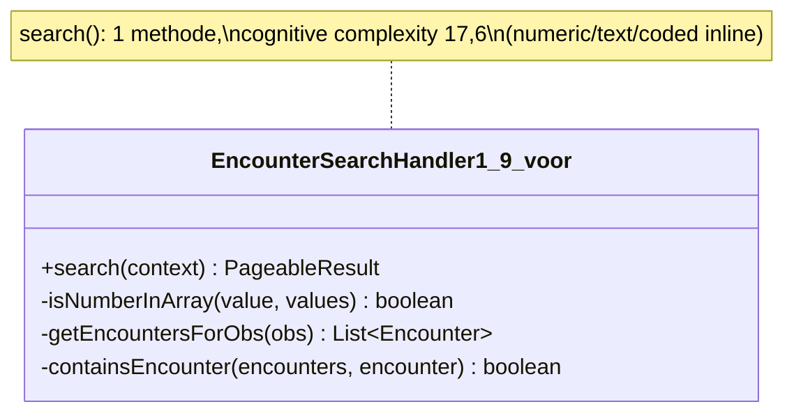
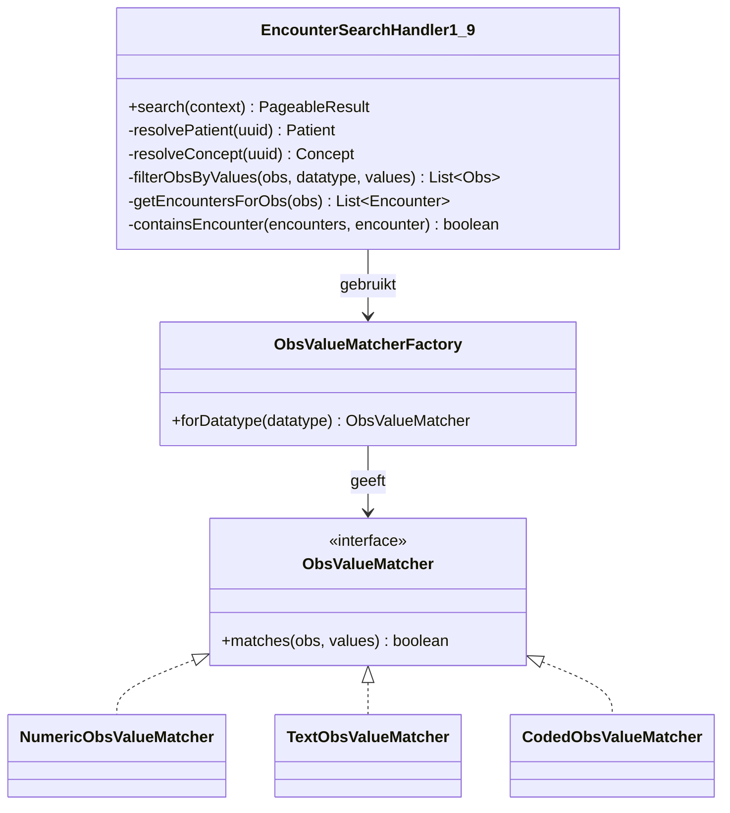

# Aangepast ontwerp

Rubric: *"Verbeteronderzoek onderhoudbaarheid"* — **Aangepast ontwerp** (20 pt).

Dit ontwerp werkt de twee verbeteringen uit [`03-verbeteringen-prioritering`](../03-verbeteringen-prioritering/03.md) uit: het splitsen van `ConceptSearchHandler1_8.search()` en `EncounterSearchHandler1_9.search()` per zoekmodus/datatype. Voor beide geldt als harde randvoorwaarde dat de **publieke `search(RequestContext)`-methode** (het `SearchHandler`-contract) ongewijzigd blijft, zodat de basis-path tests uit [`02-testopzet-en-testresultaten`](../02-testopzet-en-testresultaten/02.md) zonder aanpassing als regressievangnet dienen.

---

## 1. Ontwerp `ConceptSearchHandler1_8`

### Huidige situatie

`search()` bevat drie elkaar uitsluitende zoekmodi in één lange `if`/`else if`-keten (zie de control-flow graaf in [02, Figuur 2](../02-testopzet-en-testresultaten/02.md)):

1. zoeken op `references` (UUID's of bron:code-mappings),
2. zoeken op `name` (`fuzzy` of `equals`),
3. zoeken op `source`/`code`-mapping.

Cognitive complexity: **31** per functie (zeer hoog risico, > 25 — SIG/TÜViT).

### Aangepast ontwerp: Extract Method per zoekmodus

Elke zoekmodus wordt een eigen `private`-methode met een single responsibility; `search()` wordt een dunne **dispatcher** die op basis van de aanwezige parameters naar de juiste methode doorverwijst (guard clauses i.p.v. geneste `if`/`else`):

```java
@Override
public PageableResult search(RequestContext context) throws ResponseException {
    String conceptReferences = context.getParameter("references");
    if (StringUtils.isNotBlank(conceptReferences)) {
        return searchByReferences(context, conceptReferences);
    }

    String searchType = context.getParameter("searchType");
    if ("fuzzy".equals(searchType)) {
        return searchByFuzzyName(context);
    }
    if (searchType != null && !"equals".equals(searchType)) {
        throw new InvalidSearchException("Invalid searchType: " + searchType
                + ". Allowed values: \"equals\" and \"fuzzy\"");
    }

    String name = context.getParameter("name");
    if (name != null) {
        return searchByExactName(context, name);
    }

    return searchBySourceMapping(context);
}

private PageableResult searchByReferences(RequestContext context, String conceptReferences) { /* P1/P2 */ }

private PageableResult searchByFuzzyName(RequestContext context) { /* P3 */ }

private PageableResult searchByExactName(RequestContext context, String name) { /* P5/P6/P7 */ }

private PageableResult searchBySourceMapping(RequestContext context) { /* P8/P9/P10 */ }
```

### Sequentiediagram (na)



### Verwachte impact op cognitive complexity

| Methode | Inhoud (paden uit 02) | Geschatte cognitive complexity |
|---|---|---|
| `search()` (dispatcher) | guard clauses, geen geneste logica | ≈ 4 (laag risico) |
| `searchByReferences` | P1/P2 — referentielus + lege-check | ≈ 9 (gemiddeld risico) |
| `searchByFuzzyName` | P3 — fuzzy-zoekopdracht | ≈ 3 (laag risico) |
| `searchByExactName` | P5/P6/P7 — naamlus + preferred-check | ≈ 8 (gemiddeld risico) |
| `searchBySourceMapping` | P8/P9/P10 — bron + mapping/code | ≈ 6 (gemiddeld risico) |

Geen enkele methode komt nog boven de SIG-grens van 15 (hoog risico) uit — tegenover de huidige 31 voor de ongesplitste `search()`. De daadwerkelijke meting volgt in [`06-validatie-verbeteringen`](../06-validatie-verbeteringen/06.md).

---

## 2. Ontwerp `EncounterSearchHandler1_9`

### Huidige situatie

`search()` (cognitive complexity **17,6** per functie, hoog risico) combineert drie verantwoordelijkheden: (1) patiënt/concept resolutie met `ObjectNotFoundException`, (2) bepalen of er gefilterd moet worden op `obsValues`, en (3) per **datatype** (numeric/text/coded) een vrijwel identieke lus — alleen het predicaat in de `if` verschilt (zie [02, Figuur 1](../02-testopzet-en-testresultaten/02.md)).

Die derde verantwoordelijkheid is een klassiek geval van **Replace Conditional with Polymorphism**: drie takken met identieke vorm (`while (obs) { if (predicate(obs, values)) filteredObs.add(obs) }`) die alleen in het predicaat verschillen.

### Aangepast ontwerp: Extract Method + Strategy

**Extract Method** voor de resolutiestappen (D1–D3) en **Strategy pattern** voor de datatype-afhankelijke filtering (D6):

```java
public interface ObsValueMatcher {
    boolean matches(Obs obs, String[] values);
}

public class NumericObsValueMatcher implements ObsValueMatcher {
    public boolean matches(Obs obs, String[] values) {
        return isNumberInArray(obs.getValueNumeric(), values);
    }
}

public class TextObsValueMatcher implements ObsValueMatcher {
    public boolean matches(Obs obs, String[] values) {
        return OpenmrsUtil.isStringInArray(obs.getValueText(), values);
    }
}

public class CodedObsValueMatcher implements ObsValueMatcher {
    public boolean matches(Obs obs, String[] values) {
        return OpenmrsUtil.isStringInArray(obs.getValueCoded().getUuid(), values);
    }
}
```

```java
@Override
public PageableResult search(RequestContext context) throws ResponseException {
    String patientUuid = context.getRequest().getParameter(REQUEST_PARAM_PATIENT);
    String conceptUuid = context.getRequest().getParameter(REQUEST_PARAM_CONCEPT);
    String values = context.getRequest().getParameter(REQUEST_PARAM_VALUES);

    if (StringUtils.isBlank(patientUuid) || StringUtils.isBlank(conceptUuid)) {
        return new EmptySearchResult();
    }

    Patient patient = resolvePatient(patientUuid);
    Concept concept = resolveConcept(conceptUuid);
    List<Obs> obs = Context.getObsService().getObservationsByPersonAndConcept(patient, concept);

    if (StringUtils.isBlank(values)) {
        return toPagedEncounters(obs, context);
    }
    if (StringUtils.strip(values, ",").trim().isEmpty()) {
        return new EmptySearchResult();
    }

    List<Obs> filteredObs = filterObsByValues(obs, concept.getDatatype(), values.split(","));
    return filteredObs.isEmpty() ? new EmptySearchResult() : toPagedEncounters(filteredObs, context);
}

private List<Obs> filterObsByValues(List<Obs> obs, ConceptDatatype datatype, String[] valueArray) {
    ObsValueMatcher matcher = ObsValueMatcherFactory.forDatatype(datatype); // null voor P10 (date/boolean/...)
    List<Obs> result = new ArrayList<>();
    if (matcher == null) {
        return result; // P10: geen matcher -> leeg, zelfde gedrag als huidige "anders"-tak
    }
    for (Obs o : obs) {
        if (matcher.matches(o, valueArray)) {
            result.add(o);
        }
    }
    return result;
}
```

`resolvePatient`/`resolveConcept` blijven Extract Method-helpers die `ObjectNotFoundException` gooien bij `null` (P2/P3); `getEncountersForObs`/`containsEncounter`/`toPagedEncounters` blijven ongewijzigd.

### Klassendiagram (voor → na)





### Verwachte impact op cognitive complexity

| Methode/klasse | Inhoud (paden uit 02) | Geschatte cognitive complexity |
|---|---|---|
| `search()` | guard clauses + resolutie + dispatch naar `filterObsByValues` (P1–P5) | ≈ 6 (gemiddeld risico) |
| `resolvePatient` / `resolveConcept` | null-check + throw (P2/P3) | ≈ 2 elk (laag risico) |
| `filterObsByValues` | factory-lookup + lus over matcher (P6–P10) | ≈ 3 (laag risico) |
| `NumericObsValueMatcher` / `TextObsValueMatcher` / `CodedObsValueMatcher` | 1 predicaat | ≈ 1 elk (laag risico) |

Tegenover de huidige 17,6 voor de ongesplitste `search()`. Nieuwe datatypes (bv. de "anders"-tak P10, datum/boolean) kunnen later worden toegevoegd door enkel een nieuwe `ObsValueMatcher` te registreren — **zonder `search()` aan te passen** (Open/Closed Principle).

---

## 3. Toegepaste ontwerpprincipes en patronen

| Principe/patroon | Toepassing |
|---|---|
| **Extract Method** (Fowler, *Refactoring*) | Beide handlers: elke zoekmodus/resolutiestap krijgt een eigen methode met één verantwoordelijkheid. |
| **Single Responsibility Principle (SOLID)** | Elke geëxtraheerde methode/klasse heeft één reden om te veranderen (bv. wijziging in fuzzy-zoeklogica raakt alleen `searchByFuzzyName`). |
| **Guard Clauses / Replace Nested Conditional** | `search()` van beide handlers gebruikt vroege returns i.p.v. diep geneste `if`/`else`, wat de cognitive complexity van de dispatcher zelf laag houdt. |
| **Strategy pattern / Replace Conditional with Polymorphism** | `EncounterSearchHandler1_9`: de drie datatype-takken (numeric/text/coded) zijn structureel identiek en worden vervangen door `ObsValueMatcher`-implementaties. |
| **Open/Closed Principle (SOLID)** | Gevolg van de Strategy: nieuwe obs-datatypes vereisen geen wijziging in `search()`, alleen een nieuwe `ObsValueMatcher`. |

---

## 4. Alternatieven en motivatie

### `ConceptSearchHandler1_8`: Extract Method vs. volledig Strategy pattern

Overwogen alternatief: elke zoekmodus (`references`/`name`/`mapping`) als apart Spring-`@Component` dat een `ConceptSearchStrategy`-interface implementeert, met `search()` als pure dispatcher die de juiste bean selecteert.

**Niet gekozen, omdat:**
- De drie modi hebben *verschillende* parametercombinaties en retourpaden (geen gemeenschappelijke signatuur zoals bij `ObsValueMatcher`) — een generieke strategy-interface zou hier zelf weer met optionele/nullable parameters moeten werken, wat de leesbaarheid niet ten goede komt.
- Extract Method brengt alle methodes al onder de SIG-grens van 15 (zie tabel §1) — de Strategy-variant zou de impact op cognitive complexity niet verder verbeteren, maar wel extra bestanden, Spring-bean-configuratie en indirectie toevoegen (kosten zonder aantoonbare meerwaarde voor de gestelde kwaliteitseis).
- De bestaande basis-path tests (TC1–11 uit 02) roepen `search()` rechtstreeks aan op de handler-instantie; Extract Method vereist **geen wijziging** aan die tests, terwijl losse strategy-beans extra Spring-wiring in de testopzet zouden vereisen.

### `EncounterSearchHandler1_9`: Strategy alleen voor de obs-matching, niet voor de hele methode

Overwogen alternatief: ook hier drie volledige `EncounterSearchStrategy`-implementaties (één per datatype) die de hele `search()`-flow uitvoeren.

**Niet gekozen, omdat:**
- De drie takken verschillen **uitsluitend** in het matchpredicaat (regel 108/115/122 in de huidige code); de resolutie- en paginalogica erom is identiek. Een volledige strategy per datatype zou die gedeelde logica dupliceren (en daarmee een nieuwe duplicatiebron introduceren — zie de bevinding in [03](../03-verbeteringen-prioritering/03.md#niet-opgepakt-met-onderbouwing) over duplicatie).
- Strategy op het niveau van het matchpredicaat (`ObsValueMatcher`) isoleert precies het deel dat varieert (Open/Closed) zonder de rest van de methode te splitsen — kleinere, gerichtere wijziging die beter aansluit bij de "beperkte effort"-inschatting uit 03.

---

## 5. Impact op bestaande tests (02)

Beide ontwerpen behouden de publieke `search(RequestContext)`-signatuur en het externe gedrag per pad (P1–P10/P1–P11). De basis-path testsets uit 02 — **10 testcases** voor `EncounterSearchHandler1_9` en **11 testcases** voor `ConceptSearchHandler1_8` — blijven dus ongewijzigd toepasbaar als regressievangnet en vormen de nulmeting voor de validatie in [`06-validatie-verbeteringen`](../06-validatie-verbeteringen/06.md). De realisatie volgt in [`05-realisatie-poc`](../05-realisatie-poc/05.md).

---

## Bronnen

- Fowler, M. *Refactoring: Improving the Design of Existing Code* (2e ed.). Addison-Wesley, 2018. — *Extract Method*, *Replace Conditional with Polymorphism*.
- Gamma, E., Helm, R., Johnson, R. & Vlissides, J. *Design Patterns: Elements of Reusable Object-Oriented Software.* Addison-Wesley, 1994. — *Strategy pattern*.
- Martin, R.C. *Clean Code* / *Agile Software Development, Principles, Patterns, and Practices* — SOLID-principes (SRP, OCP).
- SIG/TÜViT. *Evaluation Criteria for Trusted Product Maintainability.* Software Improvement Group, v11.0 (2023).
- ISO/IEC 25010:2023. *Systems and software Quality Requirements and Evaluation (SQuaRE) — Product quality model.*
