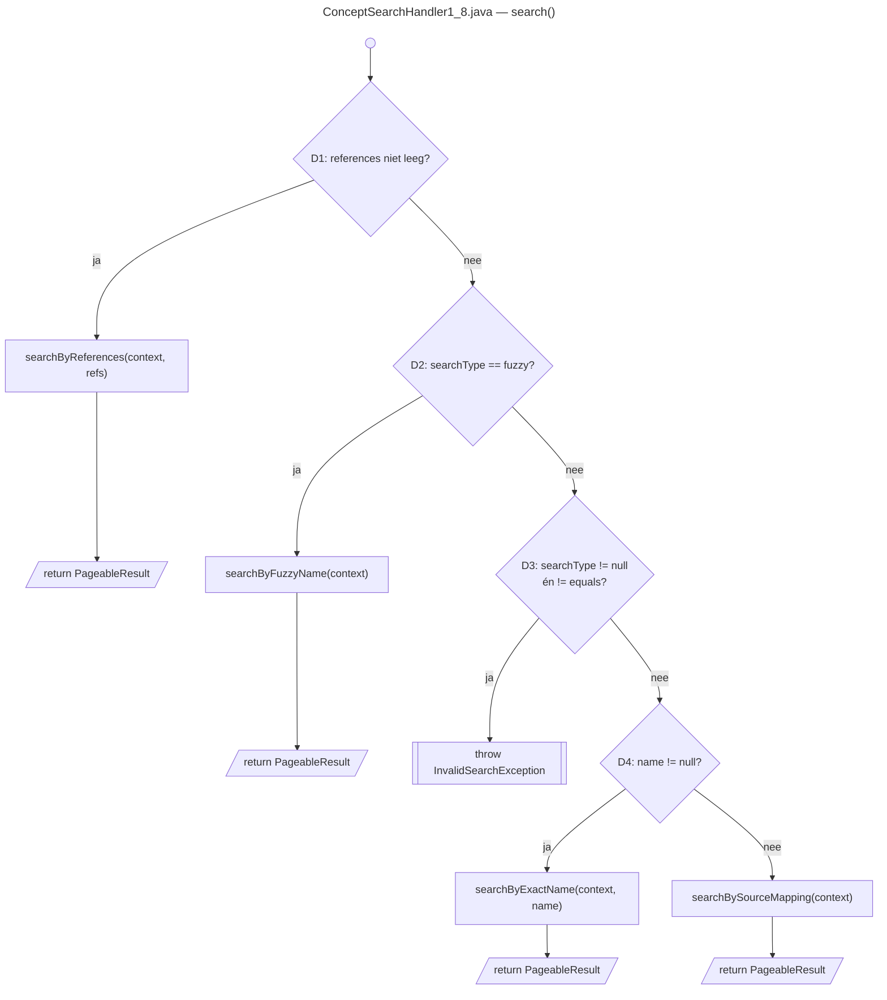
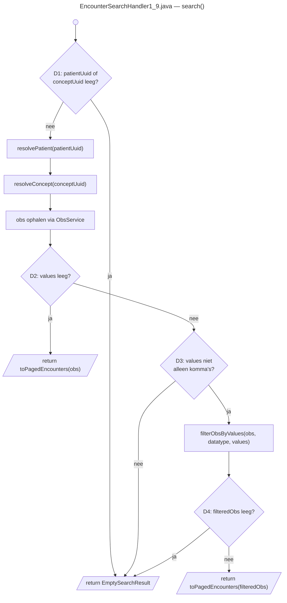
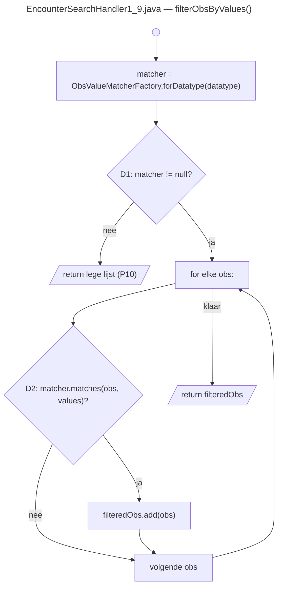

# Realisatie (PoC) & verantwoording

Rubric: *"Verbeteronderzoek onderhoudbaarheid"* — **Realisatie (PoC) & verantwoording** (10 pt).

De twee verbeteringen uit [`04-aangepast-ontwerp`](../04-aangepast-ontwerp/04.md) zijn volledig gerealiseerd in twee afzonderlijke commits:

| Commit | Handler | Omschrijving |
|---|---|---|
| `c85bf58` | `EncounterSearchHandler1_9` | Strategy pattern + Extract Method voor obsmatching en resolutie |
| `0c889b3` | `ConceptSearchHandler1_8` | Extract Method per zoekmodus, dispatcher met guard clauses |

---

## 1. Realisatie `ConceptSearchHandler1_8`

### Wat er gedaan is

`search()` is omgebouwd tot een dunne **dispatcher** met guard clauses die direct returnt zodra een parameter herkend wordt. De vier zoekmodi leven elk in een eigen `private`-methode:

| Methode | Basispad(en) |
|---|---|
| `searchByReferences(context, conceptReferences)` | P1/P2 |
| `searchByFuzzyName(context)` | P3 |
| `searchByExactName(context, name)` | P5/P6/P7 |
| `searchBySourceMapping(context)` | P8/P9/P10 |

De gerealiseerde dispatcher (zie [ConceptSearchHandler1_8.java:74–95](../../../../omod/src/main/java/org/openmrs/module/webservices/rest/web/v1_0/search/openmrs1_8/ConceptSearchHandler1_8.java#L74)):

```java
@Override
public PageableResult search(RequestContext context) throws ResponseException {
    String conceptReferences = context.getParameter("references");
    if (StringUtils.isNotBlank(conceptReferences)) {
        return searchByReferences(context, conceptReferences);
    }

    String searchType = context.getParameter("searchType");
    if ("fuzzy".equals(searchType)) {
        return searchByFuzzyName(context);
    }
    if (searchType != null && !"equals".equals(searchType)) {
        throw new InvalidSearchException("Invalid searchType: " + searchType
                + ". Allowed values: \"equals\" and \"fuzzy\"");
    }

    String name = context.getParameter("name");
    if (name != null) {
        return searchByExactName(context, name);
    }

    return searchBySourceMapping(context);
}
```

### Control-flow graaf (na)

Onderstaande graaf toont `search()` na de refactoring — vergelijk met [Figuur 2 in 02.md](../02-testopzet-en-testresultaten/02.md#stap-1--control-flow-graaf-1) (CC ≈ 28 vóór).



*Figuur 3: `search()` na refactoring — CC ≈ 5 (laag risico). Elke geëxtraheerde methode bevat de bijbehorende interne logica en heeft zijn eigen beperkte complexity (zie tabel in [04.md §1](../04-aangepast-ontwerp/04.md#verwachte-impact-op-cognitive-complexity)).*

### Overeenkomst met het ontwerp

De gerealiseerde code is **identiek** aan de code in [04.md §1](../04-aangepast-ontwerp/04.md#1-ontwerp-conceptsearchhandler1_8). Geen afwijkingen.

---

## 2. Realisatie `EncounterSearchHandler1_9`

### Wat er gedaan is

Drie wijzigingen zijn doorgevoerd conform het ontwerp:

**A. Extract Method voor resolutie** — `resolvePatient` en `resolveConcept` zijn geëxtraheerd. Beide gooien een `ObjectNotFoundException` als de UUID niet gevonden wordt (P2/P3). Zie [EncounterSearchHandler1_9.java:102–118](../../../../omod/src/main/java/org/openmrs/module/webservices/rest/web/v1_0/search/openmrs1_9/EncounterSearchHandler1_9.java#L102).

**B. Strategy pattern voor obs-matching** — Vijf nieuwe klassen toegevoegd aan het pakket `openmrs1_9`:

| Klasse/interface | Rol |
|---|---|
| [`ObsValueMatcher`](../../../../omod/src/main/java/org/openmrs/module/webservices/rest/web/v1_0/search/openmrs1_9/ObsValueMatcher.java) | Strategy-interface: `boolean matches(Obs obs, String[] values)` |
| [`NumericObsValueMatcher`](../../../../omod/src/main/java/org/openmrs/module/webservices/rest/web/v1_0/search/openmrs1_9/NumericObsValueMatcher.java) | Predicaat voor numerieke obs |
| [`TextObsValueMatcher`](../../../../omod/src/main/java/org/openmrs/module/webservices/rest/web/v1_0/search/openmrs1_9/TextObsValueMatcher.java) | Predicaat voor tekst-obs |
| [`CodedObsValueMatcher`](../../../../omod/src/main/java/org/openmrs/module/webservices/rest/web/v1_0/search/openmrs1_9/CodedObsValueMatcher.java) | Predicaat voor gecodeerde obs (UUID-vergelijking) |
| [`ObsValueMatcherFactory`](../../../../omod/src/main/java/org/openmrs/module/webservices/rest/web/v1_0/search/openmrs1_9/ObsValueMatcherFactory.java) | Factory: `forDatatype(ConceptDatatype)` → juiste matcher of `null` voor onbekende datatypes |

**C. Extract Method voor filtering en paginering** — `filterObsByValues` en `toPagedEncounters` zijn geëxtraheerd; `getEncountersForObs` en `containsEncounter` bleven ongewijzigd.

**D. Null-hardening (na de SonarCloud-analyse, commit `46cd46b`)** — de Strategy-extractie maakte drie potentiële null-dereferences expliciet zichtbaar, die SonarCloud als reliability-issues (`java:S2259`) flagde: `obs.getValueCoded()`, `obs.getValueNumeric()` (waar de `Double`→`double` auto-unboxing een NPE gaf) en `obs.getEncounter()` in `getEncountersForObs`. Alle drie zijn voorzien van een null-guard. Dit is geen ontwerpwijziging maar defensieve hardening die het externe gedrag per basispad ongemoeid laat; ze worden expliciet getest door [`ObsValueMatcherTest`](../../../../omod/src/test/java/org/openmrs/module/webservices/rest/web/v1_0/search/openmrs1_9/ObsValueMatcherTest.java).

### Kleine afwijking ten opzichte van het ontwerp

Het ontwerp (04.md §2) noemde `getEncountersForObs`/`containsEncounter` als "ongewijzigd". In de realisatie is `toPagedEncounters` als extra Extract Method-stap toegevoegd die `getEncountersForObs` aanroept — dat staat niet expliciet in het ontwerp maar valt volledig binnen de Extract-Method-toepassing die het ontwerp beschrijft. Het externe gedrag per basispad is ongewijzigd.

### Control-flow grafen (na)

Onderstaande grafen tonen `search()` en `filterObsByValues()` na de refactoring — vergelijk met [Figuur 1 in 02.md](../02-testopzet-en-testresultaten/02.md#stap-1--control-flow-graaf) (CC ≈ 17 vóór).



*Figuur 4: `search()` na refactoring — CC ≈ 6 (gemiddeld risico). `resolvePatient` en `resolveConcept` gooien elk een `ObjectNotFoundException` bij `null`; hun interne CC ≈ 2.*



*Figuur 5: `filterObsByValues()` — CC ≈ 3 (laag risico). Het datatype-specifieke predicaat zit volledig in de `ObsValueMatcher`-implementatie; `filterObsByValues` zelf hoeft daar niets van te weten.*

### Overeenkomst met het ontwerp

`search()`, `filterObsByValues`, de `ObsValueMatcher`-hiërarchie en `ObsValueMatcherFactory.forDatatype()` zijn identiek aan het ontwerp. De publieke `search(RequestContext)`-signatuur en het gedrag per pad zijn ongewijzigd, waardoor de basis-path tests uit [02](../02-testopzet-en-testresultaten/02.md) zonder aanpassing als regressievangnet werken.

---

## 3. Gebruik van (AI-)tooling

We hebben **Claude Code** gebruikt als hulpmiddel bij het ontwerp en de review van de code — niet om de implementatie te schrijven. Voordat we de refactoring uitvoerden hebben we het Extract Method + Strategy-ontwerp besproken, met name of losse Spring-beans voor `ConceptSearchHandler1_8` een beter idee zouden zijn. De conclusie was van niet (zie [04.md §4](../04-aangepast-ontwerp/04.md#4-alternatieven-en-motivatie)). Na de implementatie hebben we de code nog een keer laten nakijken op afwijkingen van het ontwerp; daaruit kwam naar voren dat `toPagedEncounters` als aparte stap niet expliciet in 04.md stond.

De code zelf — de refactoring, de Strategy-klassen en de testcases — hebben we handmatig geschreven. De commits hebben dan ook geen `Co-Authored-By`-trailer.

---

## 4. Kritische reflectie op toolinggebruik

Het grootste voordeel was dat we ontwerpkeuzes direct konden bespreken met de codebase erbij. Als we twijfelden of iets een goed idee was kregen we concreet antwoord in plaats van een generiek verhaal. Dat hielp vooral bij de alternatieven in 04.

Minder handig was dat de output bij documentatietaken altijd te uitgebreid was. Je moet zelf bepalen wat er echt in moet en de rest eruit halen — anders lees je het zelf ook niet meer. Dat kost tijd, maar je denkt er wel door na over wat je eigenlijk wil zeggen.

Als we het opnieuw zouden doen, zouden we de tool eerder inzetten bij de analyse (01), specifiek voor de SIG/TÜViT-drempelwaarden. Die koppeling moesten we later in 03 alsnog uitleggen, wat makkelijker was geweest als we dat meteen goed hadden opgezet.

---

## 5. Bewijsartefacten

| Artefact | Locatie |
|---|---|
| Refactoring `ConceptSearchHandler1_8` | [`omod/.../openmrs1_8/ConceptSearchHandler1_8.java`](../../../../omod/src/main/java/org/openmrs/module/webservices/rest/web/v1_0/search/openmrs1_8/ConceptSearchHandler1_8.java) |
| Refactoring `EncounterSearchHandler1_9` | [`omod/.../openmrs1_9/EncounterSearchHandler1_9.java`](../../../../omod/src/main/java/org/openmrs/module/webservices/rest/web/v1_0/search/openmrs1_9/EncounterSearchHandler1_9.java) |
| Strategy-klassen | [`omod/.../openmrs1_9/Obs*.java`](../../../../omod/src/main/java/org/openmrs/module/webservices/rest/web/v1_0/search/openmrs1_9/) |
| Unit tests Strategy-klassen (`ObsValueMatcherTest`, 9 cases) | [`omod/.../openmrs1_9/ObsValueMatcherTest.java`](../../../../omod/src/test/java/org/openmrs/module/webservices/rest/web/v1_0/search/openmrs1_9/ObsValueMatcherTest.java) |
| Commit realisatie EncounterSearchHandler | `c85bf58` |
| Commit realisatie ConceptSearchHandler | `0c889b3` |
| Commit NPE-hardening matchers + handler (`java:S2259`) | `46cd46b` |
| Commit unit tests Strategy-klassen | `f8d3b70` |
| Validatie (metrieken + regressietests) | [`06-validatie-verbeteringen`](../06-validatie-verbeteringen/06.md) |
