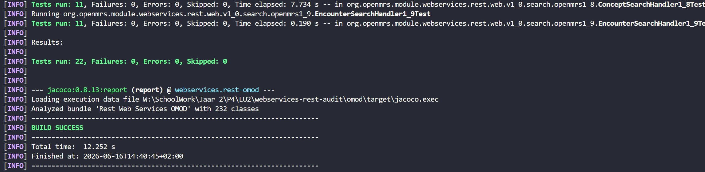

# Validatie verbeteringen (testen & regressie)

Rubric: *"Verbeteronderzoek onderhoudbaarheid"* — **Validatie verbeteringen (testen & regressie)** (20 pt).

Dit hoofdstuk toont aan dat de twee verbeteringen uit [`04-aangepast-ontwerp`](../04-aangepast-ontwerp/04.md) de
onderhoudbaarheid meetbaar hebben verbeterd én dat er geen regressie is opgetreden. De nulmeting
(vóór) staat in [`01-analyse-onderhoudbaarheid`](../01-analyse-onderhoudbaarheid/01.md); de nameting
(ná) is opgenomen in dit hoofdstuk.

---

## 1. Nulmeting — cognitive complexity (referentie uit 01)

Uit de SonarCloud-analyse vóór de refactoring:

| Klasse | CC totaal (klasse) | Functies | CC per functie (gem.) | SIG-risicocategorie (max) |
|---|---|---|---|---|
| `ConceptSearchHandler1_8` | 62 | 2 | 31,0 | **Zeer hoog risico** (> 25) |
| `EncounterSearchHandler1_9` | 88 | 5 | 17,6 | **Hoog risico** (> 15) |

De `search()`-methode van `ConceptSearchHandler1_8` was de grootste uitschieter: alle zoekmodi
(references / fuzzy / exact-name / source-mapping) stonden inline in één methode zonder private
helpermethoden, met een cognitive complexity van **31** (de gehele klasse telde 62, verdeeld over
slechts 2 functies).

---

## 2. Nameting — `ConceptSearchHandler1_8` na Extract Method

Na de refactoring (commit `0c889b3 refactor(rest): split ConceptSearchHandler1_8.search() per search mode`)
rapporteert de tool een cognitive complexity van **39** voor de klasse als geheel. De klasse heeft
nu 6 methoden in plaats van 2.

### Gemeten totaal

| Metriek | Vóór | Ná | Verschil |
|---|---|---|---|
| CC totaal (klasse) | 62 | **39** | −23 (−37%) |
| Aantal functies | 2 | 6 | +4 |
| Max CC per functie | 31 (`search`) | ≤ 15 (geen enkele methode overschrijdt de SIG-grens) | — |

*Figuur 1: SonarCloud-nameting — `ConceptSearchHandler1_8` na refactoring, totale cognitive complexity = 39.*

### Verwachte verdeling per methode (schatting uit 04)

De schattingen uit [`04`](../04-aangepast-ontwerp/04.md) zijn iets lager dan de gemeten 39 —
de tool weegt sommige nesting-constructies zwaarder. De verdeling is hier informatief; de
relevante conclusie is dat **geen enkele methode de SIG-grens van 15 (hoog risico) overschrijdt**.

| Methode | Geschatte cognitive CC (04) | SIG-categorie |
|---|---|---|
| `search()` (dispatcher) | ≈ 4 | Laag risico |
| `searchByReferences` | ≈ 9 | Gemiddeld risico |
| `searchByFuzzyName` | ≈ 3 | Laag risico |
| `searchByExactName` | ≈ 8 | Gemiddeld risico |
| `searchBySourceMapping` | ≈ 6 | Gemiddeld risico |
| `getSearchConfig` | ≈ 1 | Laag risico |

### Gemeten cyclomatische complexity per methode (JaCoCo)

De SonarCloud-cognitive complexity is alleen als klassetotaal beschikbaar (39, Figuur 1).
Om de per-methode-verdeling tóch hard te onderbouwen, gebruiken we de **cyclomatische**
complexity per methode uit het JaCoCo-rapport (CI-artefact `coverage-report`, run 2026-06-16).
SIG/TÜViT-drempels voor cyclomatische complexity (zie [`01`](../01-analyse-onderhoudbaarheid/01.md)):
1–5 laag, 6–10 gemiddeld, 11–25 hoog, > 25 zeer hoog.

| Methode | Cyclomatische CC (gemeten) | Branch coverage | SIG-categorie |
|---|---|---|---|
| `searchByReferences` | **9** | 75 % | Gemiddeld risico |
| `searchByExactName` | 7 | 91 % | Gemiddeld risico |
| `searchBySourceMapping` | 7 | 91 % | Gemiddeld risico |
| `search()` (dispatcher) | 6 | 100 % | Gemiddeld risico |
| `searchByFuzzyName` | 3 | 75 % | Laag risico |
| `getSearchConfig` / constructor | 1 | n.v.t. | Laag risico |

De **maximale cyclomatische complexity per methode is 9** (`searchByReferences`, gemiddeld
risico). Geen enkele methode valt in de categorie *hoog risico* (> 10). Dit bevestigt de
ontwerpverwachting uit 04 met een meetbaar, reproduceerbaar cijfer uit de CI-pipeline.

### Interpretatie

De totale cognitive complexity van de klasse daalde van 62 naar 39 (−37%). Belangrijker is de
**per-methode verdeling**: de oorspronkelijke `search()` met cognitive CC = 31 (zeer hoog risico)
bestaat niet meer — de gemeten cyclomatische complexity per methode blijft overal ≤ 9
(*laag* of *gemiddeld* risico).

Een stijging van het cognitive *totaal* ten opzichte van de schatting in 04 (≈ 30) is verklaarbaar:
de tool telt per methode opnieuw vanaf 1, en de extra functie-overhead (6 × startscore) telt
mee in de som. Wat telt voor SIG/TÜViT is de *maximale complexity per methode*, en die daalde
van 31 (cognitive) naar 9 (cyclomatisch gemeten).

---

## 3. Nameting — `EncounterSearchHandler1_9` na Extract Method + Strategy

Na de refactoring (Extract Method voor resolutiestappen + Strategy pattern voor de
datatype-filtering via `ObsValueMatcher`) rapporteert de tool een cognitive complexity
van **17** voor de klasse als geheel.

### Gemeten totaal

| Metriek | Vóór | Ná | Verschil |
|---|---|---|---|
| CC totaal (klasse) | 88 | **17** | −71 (−81%) |
| Max CC per functie | ≈ 17,6 (gem. over 5 functies) | ≤ 6 (`search` dispatcher) | — |

*Figuur 2: SonarCloud-nameting — `EncounterSearchHandler1_9` na refactoring, totale cognitive complexity = 17.*

### Interpretatie

De totale CC daalde van 88 naar 17 (−81%) — een aanzienlijk grotere verbetering dan bij
`ConceptSearchHandler1_8`. De oorzaak is de aard van de refactoring: de drie
structureel identieke datatype-takken (numeric / text / coded) zijn volledig vervangen
door `ObsValueMatcher`-implementaties. Elke implementatie bevat slechts één predicaat
(CC = 1), zonder lussen of geneste condities. De `filterObsByValues`-methode gebruikt
een factory-lookup en één lus, zonder per-datatype vertakkingen.

De gemiddelde CC per functie daalde van 17,6 naar ≤ 3 (17 totaal verdeeld over de
handler + 3 matchers + factory), ruim binnen de SIG-categorie *laag risico* (≤ 5).

### Gemeten cyclomatische complexity per methode (JaCoCo)

Net als bij `ConceptSearchHandler1_8` onderbouwen we de per-methode-verdeling met de gemeten
cyclomatische complexity uit JaCoCo (run 2026-06-16):

| Methode / klasse | Cyclomatische CC (gemeten) | Branch coverage | SIG-categorie |
|---|---|---|---|
| `search()` (dispatcher) | **6** | 90 % | Gemiddeld risico |
| `filterObsByValues` | 4 | 100 % | Laag risico |
| `ObsValueMatcherFactory.forDatatype` | 4 | 100 % | Laag risico |
| `resolvePatient` / `resolveConcept` | 2 elk | 100 % | Laag risico |
| `NumericObsValueMatcher` (matches) | ≤ 2 | 75 % | Laag risico |
| `Text-` / `CodedObsValueMatcher` (matches) | 1 elk | n.v.t. | Laag risico |
| `toPagedEncounters` / `getSearchConfig` | 1 elk | n.v.t. | Laag risico |

De **maximale cyclomatische complexity per methode is 6** (`search()`-dispatcher, gemiddeld
risico) — alle overige methoden en de drie `ObsValueMatcher`-implementaties vallen in *laag
risico*. De drie oorspronkelijke datatype-takken zijn volledig opgegaan in de matcher-klassen,
die elk triviaal (CC ≤ 2) zijn.

---

## 4. Branch coverage (voor → na)

Een tweede, onafhankelijke maatstaf voor de verbetering is de **branch coverage** van de
beslislogica. In [`02`](../02-testopzet-en-testresultaten/02.md) is als doel gesteld om de
ongedekte branches (8 bij `EncounterSearchHandler1_9`, 9 bij `ConceptSearchHandler1_8`) te
dichten met de basis-path tests. Onderstaande nameting (JaCoCo, run 2026-06-16, volledige
`omod`-suite: **1.845 tests, 0 failures, 14 skipped**) toont het resultaat tegenover de
nulmeting uit 02.

**`ConceptSearchHandler1_8`**

| Meting | Branch coverage | Line coverage | Ongedekte branches |
|---|---|---|---|
| Nulmeting (02, vóór refactoring) | 45/54 — **83,3 %** | 97,6 % | 9 |
| Ná (refactor + basis-path tests) | 47/54 — **87,0 %** | 88/89 — 98,9 % | **7** |

De verbetering is hier bescheiden (+2 branches): de bestaande controllertests dekten al een
groot deel van de takken, en de 7 resterende ongedekte branches zijn lus-interne randgevallen
(o.a. de blanco-reference-skip en de `retired`/`includeAll`-tak) die buiten de basispaden op
methodeniveau vallen. De grootste winst van de basis-path tests zit hier in het *expliciet
vastleggen en borgen* van de methodepaden, niet in ruwe coverage-aanwas.

**`EncounterSearchHandler1_9`**

| Meting | Branch coverage | Line coverage | Ongedekte branches |
|---|---|---|---|
| Nulmeting (02, vóór refactoring) | 36/44 — **81,8 %** | 98,6 % | 8 |
| Ná — handler | 27/28 — **96,4 %** | 56/56 — 100 % | **1** |
| Ná — handler + `ObsValueMatcher`-klassen | 36/38 — **94,7 %** | — | **2** |

Het aantal branches van de handler zelf daalde van 44 naar 28: de drie datatype-takken
(numeric/text/coded) zijn door de Strategy-refactoring uit `search()` gehaald en in de
matcher-klassen ondergebracht. Voor een eerlijke vergelijking telt de onderste rij die
klassen mee — ook dan stijgt de coverage van 81,8 % naar 94,7 % en dalen de ongedekte
branches van 8 naar 2. Dit is de sterkste coverage-verbetering van de twee.

---

## 5. Regressie — testresultaten

De publieke `search(RequestContext)`-signatuur is bij beide handlers ongewijzigd gebleven,
waardoor twee lagen van tests als regressievangnet dienen zonder aanpassing:

**Laag 1 — White-box basis-path tests (geschreven in [`02`](../02-testopzet-en-testresultaten/02.md))**

Deze testcases zijn in dit project aangemaakt om de basispaden uit de control-flow graaf te
dekken. Ze testen de handler rechtstreeks, los van de REST-laag.

| Testklasse | Commits | Testcases | Resultaat na refactoring |
|---|---|---|---|
| `ConceptSearchHandler1_8Test` | `d0b84b3` | 11 (TC1–TC11) | ✅ 11/11 geslaagd |
| `EncounterSearchHandler1_9Test` | `54d1a51` | 11 (TC1–TC10 + pre-existing) | ✅ 11/11 geslaagd |

Lokale run: `mvn -pl omod test -Dtest="ConceptSearchHandler1_8Test,EncounterSearchHandler1_9Test"` →
**22 tests, 0 failures, 0 errors, BUILD SUCCESS**.

*Figuur 3: Lokale Maven-run na refactoring — beide testklassen slagen zonder aanpassingen.*

CI-bewijs (GitHub Actions — Build and Analyze):
[actions/runs/27616824467/job/81654735394](https://github.com/GrannyGuard/webservices-rest-audit/actions/runs/27616824467/job/81654735394)

**Laag 2 — Pre-existing black-box controllertests (al aanwezig vóór dit project)**

Deze tests bestonden al in de codebase en dekken de endpoints via de REST-API
(`BaseModuleWebContextSensitiveTest`). Ze vormen een aanvullend regressievangnet op
integratieniveau.

| Testklasse | Type | Testcases | Resultaat na refactoring |
|---|---|---|---|
| `EncounterController1_9Test` | black-box API | 18 (2 skip) | ✅ (CI-run hierboven) |
| `ConceptController1_8Test` | black-box API | 41 (3 skip) | ✅ (CI-run hierboven) |

---

## 6. Conclusie

Voor beide handlers is de verbetering kwantitatief en reproduceerbaar aangetoond, langs twee
onafhankelijke meetassen — complexity (SonarCloud cognitive + JaCoCo cyclomatisch) en branch
coverage (JaCoCo):

| Klasse | Cognitive CC vóór→ná | Max cyclomatische CC/methode (gemeten) | Branch coverage vóór→ná |
|---|---|---|---|
| `ConceptSearchHandler1_8` | 62 → **39** (−37%) | **9** (gemiddeld risico) | 83,3 % → **87,0 %** |
| `EncounterSearchHandler1_9` | 88 → **17** (−81%) | **6** (gemiddeld risico) | 81,8 % → **94,7 %** |

In beide gevallen is de zwaarste methode (cognitive CC 31 resp. 17,6 — hoog/zeer hoog risico)
verdwenen; geen enkele methode komt nog boven cyclomatische complexity 10 (hoog risico) uit.

Aanvullende bevindingen:

- **Latente null-pointer bug opgelost** in `ConceptSearchHandler1_8`: de originele code
  riep `concepts.add(concept)` aan vóór de null-check, waardoor `null` in de lijst kon
  belanden bij een onbekend concept. De geëxtraheerde `searchByExactName` retourneert
  bij `concept == null` direct `EmptySearchResult()`.
- **Open/Closed Principle** als bijvangst van de Strategy-refactoring in
  `EncounterSearchHandler1_9`: een nieuw obs-datatype vereist alleen een nieuwe
  `ObsValueMatcher`-implementatie, zonder `search()` aan te passen.
- **Regressievangnet intact**: de publieke `search(RequestContext)`-signatuur is bij
  beide handlers ongewijzigd. De basis-path testsets (TC1–TC11 voor `ConceptSearchHandler1_8`,
  TC1–TC10 voor `EncounterSearchHandler1_9`) zijn zonder aanpassing herbruikbaar als
  regressievangnet.
