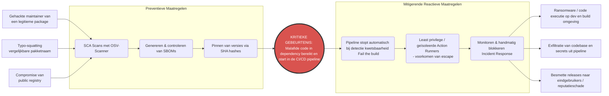

# Risico-evaluatie CI/CD-proces

In dit document wordt een risico-evaluatie uitgevoerd voor het Continuous Integration en Continuous Deployment (CI/CD) proces. Het doel is om potentiële bedreigingen te identificeren, te beoordelen en visueel weer te geven.

## 1. Geïdentificeerde Risico's

*   **R1: Gecompromitteerde externe dependencies (Supply Chain Attack)** - Een door de applicatie gebruikte externe bibliotheek bevat malafide code.
*   **R2: Lekkage van secrets (Secret / Credential Leakage)** - Het per ongeluk committen of loggen van API-keys of wachtwoorden.
*   **R3: Ongeautoriseerde toegang tot de repository / pipeline** - Een kwaadwillende verkrijgt toegang (bijv. via gestolen sessies of gebrek aan MFA) en past de code of pipeline-configuratie aan.
*   **R4: Foutieve beveiligingsconfiguratie (Misconfiguration)** - Beveiligingscontroles (zoals SAST of SCA) zijn verkeerd geconfigureerd of falen stil, waardoor kwetsbare code ongemerkt doorgaat.
*   **R5: Uitval van de CI/CD-omgeving (Downtime)** - De build server (GitHub Actions of Bamboo) of een externe registry is onbereikbaar.
*   **R6: Malifide code contributor** - Een code contributor voegt expres malifide code toe aan het project. 

---

## 2. Risicomatrix

De risico's worden gescoord op basis van **Kans** (1 = Zeer onwaarschijnlijk, 5 = Zeer waarschijnlijk) en **Impact** (1 = Zeer laag, 5 = Zeer hoog).  
*Formule: Risicoscore = Kans × Impact*

| ID | Omschrijving Risico | Kans (1-5) | Impact (1-5) | Risicoscore | Classificatie |
| :--- | :--- | :---: | :---: | :---: | :--- |
| **R1** | Gecompromitteerde externe dependencies (Supply Chain Attack) | 3 | 5 | **15** | 🔴 **Hoog** |
| **R2** | Lekkage van secrets (Secret / Credential Leakage) | 3 | 4 | **12** | 🔴 **Hoog** |
| **R3** | Malifide code contributor | 2 | 5 | **10** | 🟠 **Midden** |
| **R4** | Ongeautoriseerde toegang tot de repository / pipeline | 2 | 5 | **10** | 🟠 **Midden-Hoog** |
| **R5** | Foutieve beveiligingsconfiguratie (Misconfiguration) | 3 | 3 | **9** | 🟠 **Midden** |
| **R6** | Uitval van de CI/CD-omgeving (Downtime) | 4 | 2 | **8** | 🟡 **Laag-Midden** |

*Het meest kritieke risico in dit proces is **R1: Gecompromitteerde externe dependencies (Supply chain attack)**.*

---

## 3. Bow-Tie Analyse (Meest Kritieke Risico: R1)

De Bow-Tie analyse is een visuele of gestructureerde weergave van een risico. Aan de linkerkant staan de oorzaken en preventieve barrières, in het midden de kritieke gebeurtenis, en aan de rechterkant de reactieve maatregelen en de uiteindelijke gevolgen.

### Toelichting op de Bow-Tie

**Oorzaken (Links):**
1. Aanvallers bemachtigen de inloggegevens van een legitieme open-source ontwikkelaar en pushen een update met een backdoor.
2. Typosquatting: een pakket met een net verkeerd gespelde naam wordt toegevoegd in de `pom.xml`.
3. Aanval op de package-infrastructuur (zoals Maven Central of een interne registry).

**Preventieve Maatregelen (Barrières links):**
1. **SCA (Software Composition Analysis):** Scannen van alle dependencies (zoals OSV-Scanner) op bekende kwetsbaarheden voordat de code wordt gemerged.
2. **SBOM (Software Bill of Materials):** Altijd transparant inzichteel houden exact welke libraries in de build worden gebruikt via CycloneDX.
3. **Versie & Hash pinning:** Prik specifieke versies of en commit SHA hashes vast (zoals onlangs ook toegepast in de GitHub Actions), zodat niet ongemerkt een nieuwere malafide versie wordt ingeladen.

**Kritieke Gebeurtenis (Midden):**
De besmette open-source dependency wordt gedownload tijdens de build, waardoor aanvallerscode stiekem wordt uitgevoerd.

**Mitigerende/Reactieve Maatregelen (Barrières rechts):**
1. **Zachte/Harde stop CI:** Zodra een nieuwe scan-regel de kwetsbaarheid vindt, blokkeert de pipeline verdere deployments.
2. **Isolatie van CI/CD runner:** Zelfs áls de code start op de runner, werkt de runner in een kortlevende container en zonder netwerktoegang tot interne productie, waardoor laterale verplaatsing onmogelijk is.
3. **Incident Response:** Direct afvoeren van de release-artifact(s).

**Gevolgen (Uiterst rechts if measures fail):**
Diefstal van geheimen via de runner, encryptie van processen, of erger: het doorgeven van malafide updates naar de eindklanten van het webrepository project.