# Security Audit — NEN-7510:2024-2 Compliance

**Module:** `org.openmrs.module:webservices.rest` v3.2.0  
**Repository:** [GrannyGuard/webservices-rest-audit](https://github.com/GrannyGuard/webservices-rest-audit)  
**Auteur:** Granny Guard
**Datum:** 2026-06-08  
**Normatief kader:** NEN-7510:2024-2, AVG, WGBO

---

## 1. Inleiding

Deze security audit beoordeelt de `webservices.rest`-module van OpenMRS (v3.2.0) op
compliance met de NEN-7510:2024-2 norm. De module exposeert medische functionaliteit via
een REST API en vormt de brug tussen externe systemen en de OpenMRS-kern. Daarbij verwerkt
zij bijzondere persoonsgegevens in de zin van de AVG (Art. 9) en WGBO.

> Voor een toelichting op de gehanteerde terminologie (NEN-7510, BIV/CIA,
> kroonjuweel, gap-analyse, bow-tie, risicocriteria e.d.) zie het
> [Begrippenkader](../../00-project-context/begrippenkader.md).

Het document is opgebouwd in vier lagen:

1. **CIA/BIV-analyse** — identificatie van kroonjuwelen en risicocriteria
2. **Gap-analyse** — per NEN-7510 control de huidige staat versus de eis
3. **Risico-evaluatie** — gescoorde risicomatrix op basis van de gevonden gaps
4. **Geprioriteerd advies** — concrete verbeteracties gekoppeld aan risicoscore

---

## 2. CIA/BIV-analyse

### 2.1 Kroonjuwelen

Kroonjuwelen zijn de informatie-assets die de sterkste bescherming vereisen. Ze zijn
geïdentificeerd op basis van broncode-analyse, de module-keuze-documentatie en de
NEN-7510:2024 norm.

| ID | Kroonjuweel | Omschrijving | Wettelijke grondslag |
|----|-------------|--------------|----------------------|
| **KJ1** | Patiëntidentificatiegegevens | Naam, geboortedatum, BSN, adres van patiënten | AVG Art. 9 (bijzondere persoonsgegevens), WGBO |
| **KJ2** | Medische gegevens | Diagnoses, medicatie, observaties, encounters, labwaarden, vitals | AVG Art. 9, WGBO Art. 7:454 |
| **KJ3** | Authenticatiegegevens | Gebruikerswachtwoorden (via HTTP Basic Auth), sessie-tokens, sessie-ID's | NEN-7510 A.8.5, AVG |
| **KJ4** | Autorisatiegegevens | Gebruikersrollen, privileges, toegangsrechten | NEN-7510 A.8.3 |
| **KJ5** | API-interface (REST endpoints) | De beschikbaarheid van de REST API zelf — uitval blokkeert zorgverlening | NEN-7510 A.8.14 |
| **KJ6** | Audit- en beveiligingslogs | Logbestanden van authenticatie, autorisatie en API-toegang | NEN-7510 A.8.15 |
| **KJ7** | CI/CD-secrets en deploymentconfiguratie | GitHub Actions secrets, deployment keys, omgevingsvariabelen | NEN-7510 A.8.3, CRA |

**Referenties per kroonjuweel:**

- **KJ1 + KJ2:** `BaseDelegatingResource.java` — verwerkt alle patiënt- en medische resources via de REST-laag; `SessionController1_9.java:169–182` — `/session/diag` lekt gebruikersrollen zonder autorisatiecheck; wettelijk: AVG Art. 9 lid 1, WGBO Art. 7:454.
- **KJ3:** `AuthorizationFilter.java:86–114` — HTTP Basic Auth, Base64-gedecodeerde wachtwoorden in geheugen; sessie-ID wordt niet ververst na login → sessie-fixatierisico.
- **KJ4:** `AuthorizationFilter.java:69–75` — `REST_ALLOWED_IPS` property; geen declaratieve access control op REST-laag.
- **KJ5:** Geen rate-limiting of brute-force bescherming aanwezig; uitval raakt alle systemen die op de REST API steunen.
- **KJ6:** `AuthorizationFilter.java:108,113` — auth-events gelogd op DEBUG-niveau, onzichtbaar in productie; forensisch audit trail ontbreekt volledig.
- **KJ7:** GitHub Actions secrets voor SonarCloud, SBOM-publicatie en deployment.

### 2.2 BIV-classificatie per kroonjuweel

Gebruikte schaal: **Laag / Midden / Hoog / Kritiek**

| ID | Kroonjuweel | Vertrouwelijkheid (V) | Integriteit (I) | Beschikbaarheid (B) | Toelichting |
|----|-------------|----------------------|-----------------|----------------------|-------------|
| **KJ1** | Patiëntidentificatiegegevens | **Kritiek** | **Hoog** | Midden | Lekkage = meldplicht datalek (AVG Art. 33), reputatieschade, boete AP. Wijziging = foutieve zorgverlening. |
| **KJ2** | Medische gegevens | **Kritiek** | **Kritiek** | **Hoog** | Lekkage = schending medisch beroepsgeheim. Wijziging = verkeerde diagnose/medicatie → direct gevaar voor patiënt. Uitval = belemmerde zorgverlening. |
| **KJ3** | Authenticatiegegevens | **Kritiek** | **Hoog** | Midden | Lekkage geeft volledige toegang tot patiëntdata. Sessie-fixatie maakt overname actieve sessie mogelijk. |
| **KJ4** | Autorisatiegegevens | **Hoog** | **Hoog** | Laag | Lekkage via `/session/diag` — rollen en privileges zichtbaar zonder login. Wijziging geeft privilege escalation. |
| **KJ5** | API-interface | Laag | Midden | **Kritiek** | Uitval blokkeert alle zorgverlening via de REST-laag. Geen rate-limiting → kwetsbaar voor DoS. |
| **KJ6** | Audit logs | Midden | **Hoog** | Midden | Ontbreken van logs maakt forensisch onderzoek na incident onmogelijk. NEN-7510 A.8.15 non-compliant. |
| **KJ7** | CI/CD-secrets | **Hoog** | **Hoog** | Midden | Lekkage geeft aanvaller controle over deploymentproces en codebase. Supply chain risico. |

**Prioritering kroonjuwelen op basis van BIV-classificatie:**

| Prioriteit | Kroonjuweel | Reden |
|-----------|-------------|-------|
| 1 | KJ2 — Medische gegevens | V=Kritiek, I=Kritiek, B=Hoog. Direct gevaar voor patiëntveiligheid bij schending. |
| 2 | KJ1 — Patiëntidentificatiegegevens | V=Kritiek. AVG-meldplicht + reputatieschade bij lekkage. |
| 3 | KJ3 — Authenticatiegegevens | V=Kritiek. Compromittering geeft directe toegang tot KJ1 + KJ2. |
| 4 | KJ5 — API-interface | B=Kritiek. Uitval raakt alle zorgverlening. |
| 5 | KJ7 — CI/CD-secrets | V=Hoog, I=Hoog. Supply chain impact. |
| 6 | KJ4 — Autorisatiegegevens | V=Hoog, I=Hoog. Privilege escalation mogelijk. |
| 7 | KJ6 — Audit logs | I=Hoog. NEN-7510 compliance vereist. |

### 2.3 Risicocriteria

**Risicoscore = Kans × Impact**

**Kansschaal (K):**

| Score | Label | Omschrijving |
|-------|-------|--------------|
| 1 | Zeer onwaarschijnlijk | Incident verwacht minder dan eens per 5 jaar |
| 2 | Onwaarschijnlijk | Incident verwacht eens per 2–5 jaar |
| 3 | Mogelijk | Incident verwacht eens per jaar |
| 4 | Waarschijnlijk | Incident verwacht meerdere keren per jaar |
| 5 | Zeer waarschijnlijk | Incident verwacht regelmatig (maandelijks of vaker) |

**Impactschaal (I):**

| Score | Label | Omschrijving |
|-------|-------|--------------|
| 1 | Verwaarloosbaar | Geen merkbare schade; intern oplosbaar zonder externe gevolgen |
| 2 | Laag | Beperkte schade; geen dataverlies, herstel binnen uren |
| 3 | Midden | Merkbare schade; mogelijke tijdelijke dataverlies of uitval, herstel binnen dagen |
| 4 | Hoog | Ernstige schade; mogelijke AVG-meldplicht, patiëntdata aangetast, uitval zorgverlening |
| 5 | Kritiek | Catastrofale schade; groot datalek medische gegevens, directe patiëntveiligheidsrisico's, hoge boetes |

**Risicoscore matrix:**

| | **K=1** | **K=2** | **K=3** | **K=4** | **K=5** |
|--|---------|---------|---------|---------|---------|
| **I=5** | 5 🟡 | 10 🟠 | 15 🔴 | 20 🔴 | 25 🔴 |
| **I=4** | 4 🟢 | 8 🟡 | 12 🔴 | 16 🔴 | 20 🔴 |
| **I=3** | 3 🟢 | 6 🟡 | 9 🟠 | 12 🔴 | 15 🔴 |
| **I=2** | 2 🟢 | 4 🟢 | 6 🟡 | 8 🟡 | 10 🟠 |
| **I=1** | 1 🟢 | 2 🟢 | 3 🟢 | 4 🟢 | 5 🟡 |

**Legenda:**

| Kleur | Score | Classificatie |
|-------|-------|---------------|
| 🟢 Groen | 1–4 | Laag |
| 🟡 Geel | 5–8 | Laag-Midden |
| 🟠 Oranje | 9–12 | Midden |
| 🔴 Rood | 13–25 | Hoog |

**Risicobereidheid:**

De OpenMRS REST module verwerkt bijzondere persoonsgegevens (medische data) in de zin
van AVG Art. 9. De risicobereidheid is daarom laag:

> **De organisatie accepteert geen risico's met een score ≥ 10 die betrekking hebben
> op de vertrouwelijkheid of integriteit van patiënt- of medische gegevens (KJ1, KJ2, KJ3).**

**Grenswaarden:**

| Classificatie | Score | Actie vereist |
|---------------|-------|---------------|
| 🟢 Laag (1–4) | Acceptabel | Geen directe actie; monitoren in reguliere cyclus |
| 🟡 Laag-Midden (5–8) | Acceptabel met maatregel | Mitigatie plannen binnen 3 maanden |
| 🟠 Midden (9–12) | Niet acceptabel | Mitigatie plannen binnen 1 maand; eigenaar aanwijzen |
| 🔴 Hoog (13–25) | Onacceptabel | Directe actie vereist; escaleren naar security officer |

Elk risico met score ≥ 10 dat betrekking heeft op de vertrouwelijkheid of integriteit
van KJ1, KJ2 of KJ3 wordt automatisch geclassificeerd als **Onacceptabel**, conform
NEN-7510:2024 A.5.1 en de meldplicht datalekken onder AVG Art. 33.

---

## 3. Gap-analyse NEN-7510:2024-2

Per control wordt de huidige staat van de module beoordeeld als **aanwezig / gedeeltelijk / afwezig**, onderbouwd met concrete bewijzen (coderegel of configuratie).

### 3.1 A.8.3 — Toegangsbeveiliging (Access Restriction)

**Eis:** Toegang tot informatie en systemen moet worden beperkt overeenkomstig het
toegangsbeheerbeleid; gebruikers krijgen alleen toegang tot de informatie die ze nodig
hebben voor hun taak.

| Aspect | Status | Bewijs |
|--------|--------|--------|
| IP-gebaseerde toegangsbeperking | ✅ Aanwezig | `AuthorizationFilter.java:69–75` — globale property `REST_ALLOWED_IPS` begrenst toegang op netwerkniveau; bij niet-toegestaan IP → HTTP 403 |
| Privilege-gebaseerde resource-toegang | ⚠️ Gedeeltelijk | `BaseDelegatingResource.java:875` — `Context.hasPrivilege(RestConstants.PRIV_SET_AUDIT_DATA)` controleert één specifiek recht; alle overige resource-methoden delegeren impliciet naar de OpenMRS service-laag |
| Declaratieve access control op REST-laag | ❌ Afwezig | `AuthorizationFilter.java:33–36` (Javadoc): *"It will not fail on invalid or missing credentials. We count on the API to throw exceptions …"* — geen `@Secured`, Spring Security-annotaties of pre-/post-autorisatie op endpoints |
| Onbeveiligd diagnostics-endpoint | ❌ Afwezig | `SessionController1_9.java:169–182` — `/session/diag` is expliciet gedocumenteerd als *"No authorization check — accessible to any caller"*, maar toont bij een actieve sessie ook `userRoles` en `userPrivileges` |
| Repository-toegangsbeveiliging (SDLC) | ✅ Aanwezig | GitHub Ruleset "main protection" actief: force pushes geblokkeerd, 1 verplichte review, CodeQL als required status check |

**Eindoordeel A.8.3:** ⚠️ **Gedeeltelijk** — IP-filtering en OpenMRS-privileges zijn
aanwezig, maar de REST-laag heeft geen declaratieve toegangscontrole en het
`/session/diag`-endpoint vormt een onbewachte informatielekkage.

---

### 3.2 A.8.5 — Authenticatie (Secure Authentication)

**Eis:** Authenticatieprocedures moeten identiteiten op veilige wijze vaststellen en
ongeautoriseerde toegang voorkomen; dit omvat sterke authenticatiemechanismen en
bescherming tegen misbruik van inlogprocedures.

| Aspect | Status | Bewijs |
|--------|--------|--------|
| HTTP Basic Auth (Base64) | ✅ Aanwezig | `AuthorizationFilter.java:86–114` — `Authorization: Basic`-header wordt Base64-gedecodeerd en doorgegeven aan `Context.authenticate(username, password)` |
| Sessie-invalidatie bij uitloggen | ✅ Aanwezig | `SessionController1_9.java:129–134` — `Context.logout()` gevolgd door `session.invalidate()` |
| Multi-Factor Authenticatie (MFA) | ❌ Afwezig | Geen TOTP, SMS-token of hardware-key-ondersteuning in de module; OpenMRS core biedt hier geen standaard integratie |
| Brute-force / rate-limiting bescherming | ❌ Afwezig | Geen account-lockout of request-throttling in `AuthorizationFilter`; het filter itereert onbeperkt `Context.authenticate()`-aanroepen |
| Sessie-fixatie-mitigatie | ❌ Afwezig | Sessie-ID wordt *niet* ververst na succesvolle authenticatie — geen `session.invalidate()` + nieuwe sessie aangemaakt bij login in `AuthorizationFilter` |
| Logging van mislukte aanmeldpogingen | ❌ Afwezig (praktisch) | `AuthorizationFilter.java:113` — mislukte authenticatie gelogd als `log.debug("authentication exception")` — **DEBUG-niveau**, onzichtbaar bij standaard INFO/WARN productie-logconfiguratie |
| Transport-encryptie (TLS) afdwingbaar | ⚠️ Buiten scope module | De module zelf dwingt geen HTTPS af; afhankelijk van deployment-configuratie (servlet-container / reverse proxy) |

**Eindoordeel A.8.5:** ❌ **Onvoldoende** — Basisauthenticatie is aanwezig, maar
MFA ontbreekt volledig, brute-force bescherming is er niet, sessie-fixatie is niet
gemitigeerd en mislukte aanmeldpogingen zijn niet zichtbaar in productielogs. Voor
een systeem met medische persoonsgegevens zijn dit kritieke tekortkomingen.

---

### 3.3 A.8.15 — Logging (Security Event Logging)

**Eis:** Security-relevante gebeurtenissen moeten worden gelogd zodat accountabiliteit
geborgd is en incidentonderzoek (forensisch) mogelijk wordt; logs moeten beschermd zijn
tegen manipulatie.

| Aspect | Status | Bewijs |
|--------|--------|--------|
| Application-level logging aanwezig | ✅ Aanwezig | SLF4J + `LoggerFactory` overal gebruikt; `AuthorizationFilter.java:42` — `private static final Logger log` |
| Succesvolle authenticatie gelogd | ⚠️ Gedeeltelijk | `AuthorizationFilter.java:108` — `log.debug("authenticated [{}]", userAndPass[0])` — **DEBUG-niveau**, niet beschikbaar in productie |
| Mislukte authenticatie gelogd | ❌ Afwezig (praktisch) | `AuthorizationFilter.java:113` — `log.debug("authentication exception")` — **DEBUG-niveau**; geen gebruikersnaam of remote IP in het log-bericht |
| Autorisatieweigeringen (403/401) gelogd | ❌ Afwezig | Geen expliciete logging van afgewezen verzoeken door de module; HTTP 403 bij IP-blokkering bevat wél IP in HTTP-response, maar niet in application-log op INFO+ |
| Centralised security audit trail | ❌ Afwezig | Geen afzonderlijk security-logbestand of gestructureerd audit event; REST-toegang wordt niet vastgelegd (endpoint, gebruiker, tijdstip) |
| Log-entries forensisch bruikbaar | ❌ Afwezig | Auth-log-entries missen remote IP-adres en benaderd endpoint; onvoldoende voor incidentonderzoek conform NEN-7510 |
| CI/CD pipeline logt security-scans | ✅ Aanwezig | CodeQL SARIF-resultaten in GitHub Security-tab; SBOM als 90-dagen CI-artifact (`sbom.yml`) — traceerbaarheid van kwetsbaarheden |

**Eindoordeel A.8.15:** ❌ **Onvoldoende** — Basis application logging is aanwezig
maar alle security-relevante events (auth-successen, -failures, access denials, logouts,
sessie-timeouts en toegang tot diagnostics-endpoint) worden op DEBUG gelogd of
helemaal niet gelogd. Remote IP en aangevraagde URI ontbreken consequent. Een
forensisch bruikbaar audit trail ontbreekt volledig; incidentonderzoek na een
beveiligingsincident is daardoor niet mogelijk.

#### Vereiste wijzigingen conform NEN-7510 8.15

NEN-7510 8.15 vereist dat security-relevante events worden gelogd met minimaal:
gebruikersidentificatie, gebeurtenistype, tijdstip (door logging-framework), bronIP en
uitkomst (succes/falen). De onderstaande wijzigingen zijn nodig om compliant te worden.

| # | Bestand | Huidig | Vereist | Gevoelige data |
|---|---------|--------|---------|----------------|
| 1 | `AuthorizationFilter.java:108` | `log.debug("authenticated [{}]", username)` | `log.info(...)` met username, remote IP, URI | Wachtwoord mag **nooit** worden gelogd — alleen username |
| 2 | `AuthorizationFilter.java:113` | `log.debug("authentication exception ", ex)` | `log.warn(...)` met username, remote IP, URI, `ex.getMessage()` | Volledige exception weglaten — stack trace kan interne context bevatten; geen wachtwoord |
| 3 | `AuthorizationFilter.java:69–74` | Geen log — alleen HTTP 403 response | `log.warn(...)` vóór `sendError` met geblokkeerd IP en URI | Geen gevoelige data in scope |
| 4 | `AuthorizationFilter.java:80–83` | Geen log — alleen HTTP 401 response | `log.warn(...)` met IP en URI bij sessie-timeout | Session-ID mag **nooit** worden gelogd |
| 5 | `SessionController1_9.java:129–134` | Geen log bij logout | `log.info(...)` met username en IP — username ophalen **vóór** `Context.logout()` | Geen gevoelige data nodig |
| 6 | `SessionController1_9.java:170–182` | Geen log bij `/session/diag` (geen auth-check) | `log.warn(...)` bij elke aanroep met IP en authenticated-status; `HttpServletRequest` als parameter toevoegen | Rollen/privileges uit response mogen **niet** in het log |

#### Mitigatie uitgevoerd (Sprint 3)

De bovenstaande gaps zijn in Sprint 3 gemitigeerd. De wijzigingen zijn doorgevoerd in de broncode en gevalideerd met geautomatiseerde tests:

| # | Vorige staat (gap) | Wijziging | Bestand |
|---|-------------------|-----------|---------|
| 1 | `log.debug("authenticated [{}]", username)` — DEBUG-niveau, onzichtbaar in productie; geen IP of URI | `AUTH_SUCCESS` op INFO met username, remote IP en URI | `AuthorizationFilter.java` |
| 2 | `log.debug("authentication exception ", ex)` — DEBUG-niveau; geen username, geen IP, volledige exception gelogd | `AUTH_FAILURE` op WARN met username, remote IP, URI en `ex.getMessage()` (geen wachtwoord, geen volledige stack trace) | `AuthorizationFilter.java` |
| 3 | Geen log — IP-blokkering alleen zichtbaar in HTTP 403 response, niet in application-log | `ACCESS_BLOCKED` op WARN met geblokkeerd IP en URI | `AuthorizationFilter.java` |
| 4 | Geen log — sessie-timeout alleen zichtbaar in HTTP 401 response, niet in application-log | `SESSION_TIMEOUT` op WARN met IP en URI | `AuthorizationFilter.java` |
| 5 | Geen log bij logout — `Context.logout()` werd aangeroepen zonder enige registratie | `AUTH_LOGOUT` op INFO met username (opgehaald vóór `Context.logout()`) en IP | `SessionController1_9.java` |
| 6 | Geen log bij `/session/diag` — endpoint zonder auth-check logde niets, toegang ondetecteerbaar | `DIAG_ACCESS` op WARN met IP en authenticated-status bij elke aanroep | `SessionController1_9.java` |

De tests dekken: succesvolle auth, mislukte auth, IP-blokkering, logout en `/session/diag`-toegang. Per scenario wordt ook gecontroleerd dat wachtwoorden en rollen **niet** in de logs verschijnen.

```
mvn test -pl omod-common,omod -Dtest="AuthorizationFilterLoggingTest,SessionController1_9LoggingTest"
```

Alle 16 tests slagen. Zie `AuthorizationFilterLoggingTest.java` en `SessionController1_9LoggingTest.java` voor de volledige testdekking.

#### Code coverage rapport (CI-artefact)

JaCoCo is geconfigureerd in de Maven-build en genereert na elke `mvn verify` een HTML- en XML-rapport:

| Module | Lokaal pad |
|--------|-----------|
| `omod-common` | `omod-common/target/site/jacoco/index.html` |
| `omod` | `omod/target/site/jacoco/index.html` |

De **SonarCloud & Coverage CI-workflow** (`.github/workflows/sonarcloud.yml`) draait `mvn verify` op elke push of PR naar `main`; daarmee worden de JaCoCo-rapporten als bijproduct gegenereerd en direct geüpload als GitHub Actions-artefact genaamd **`coverage-report`** met een retentie van 90 dagen. Het is te downloaden via: _GitHub → Actions → meest recente SonarCloud & Coverage-run → Artifacts → coverage-report_.

Het XML-rapport (`jacoco.xml`) wordt daarnaast automatisch door SonarCloud opgepikt voor de coverage-weergave in het dashboard.

**Coverage-percentage:** de logging-code bevindt zich in `AuthorizationFilter` en `SessionController1_9`. De 16 logging-tests dekken alle nieuwe log-aanroepen (6 wijzigingen) inclusief de happy path, failure path en gevoelige-data-controles. Het nagestreefd minimum voor de beveiligingsrelevante logging-paden is **80%** instruction coverage op deze klassen — dit sluit aan op de NEN-7510 A.8.15-eis dat logging aantoonbaar werkend en getest is.

---

### 3.4 Samenvattend overzicht gap-analyse

| NEN-7510 Control | Oordeel | Kritiekste gap |
|------------------|---------|----------------|
| **A.8.3** Toegangsbeveiliging | ⚠️ Gedeeltelijk | Geen declaratieve access control op REST-laag; onbeveiligd `/session/diag` endpoint lekt gebruikersrollen |
| **A.8.5** Authenticatie | ❌ Onvoldoende | Geen MFA, geen brute-force bescherming, geen sessie-fixatie mitigatie, auth-events niet zichtbaar in productielogs |
| **A.8.15** Logging | ❌ Onvoldoende | Auth-events op DEBUG-niveau, geen security audit trail, log-entries niet forensisch bruikbaar |

---

## 4. Risico-evaluatie

Op basis van de gap-analyse en de BIV-classificatie worden risico's uit meerdere bronnen
samengebracht en gescoord. Elk risico wordt gekoppeld aan een of meer kroonjuwelen (KJ1–KJ7).

**Naamgeving prefixes:**

| Prefix | Bron |
|--------|------|
| **SQ** | SonarQube — statische code-analyse |
| **CD** | CI/CD — risico's in het Continuous Integration en Deployment proces |

### 4.1 Geïdentificeerde risico's

**SonarQube (SQ):**

- **SQ1: Kwetsbare sessie-validatie** — Gebruik van `getRequestedSessionId()` in `AuthorizationFilter.java` maakt de applicatie kwetsbaar voor sessie-spoofing en ongeautoriseerde toegang tot patiëntdata. Raakt: KJ3, KJ1, KJ2.
- **SQ2: Onvolledige switch-statements** — Meerdere switch-statements missen een default-case, waardoor onverwachte invoer leidt tot stille fouten of undefined gedrag. Raakt: KJ2.
- **SQ3: Foute testassertions** — In `EncounterSearchHandler2_0Test` worden primitieve waarden vergeleken met null, waardoor testcases onterecht slagen en bugs in zoeklogica ongedetecteerd blijven. Raakt: KJ2.
- **SQ4: Niet-serializeerbaar validatie-veld** — Het veld `errors` in `ValidationException.java` is niet serializable, wat runtime-fouten kan veroorzaken bij het doorgeven van validatiefouten via de API. Raakt: KJ5.
- **SQ5: Extreem hoge cognitieve complexiteit** — Meerdere methoden overschrijden de maximale complexiteit van 15 aanzienlijk (hoogste: 78), wat onderhoud, testen en uitbreiding ernstig bemoeilijkt. Raakt: KJ5.
- **SQ6: Lege methoden zonder verklaring** — Circa 40 methoden zijn leeg zonder commentaar of exception, waardoor niet duidelijk is of dit intentioneel gedrag of onvoltooide implementatie betreft.

**CI/CD (CD):**

- **CD1: Gecompromitteerde externe dependencies (Supply Chain Attack)** — Een gebruikte bibliotheek bevat malafide code. Raakt: KJ7, KJ1, KJ2.
- **CD2: Lekkage van secrets** — Per ongeluk committen of loggen van API-keys of wachtwoorden. Raakt: KJ7, KJ3.
- **CD3: Ongeautoriseerde toegang tot de repository / pipeline** — Aanvaller verkrijgt toegang via gestolen sessies of gebrek aan MFA en past code of pipeline-configuratie aan. Raakt: KJ7.
- **CD4: Foutieve beveiligingsconfiguratie (Misconfiguration)** — SAST of SCA zijn verkeerd geconfigureerd of falen stil, waardoor kwetsbare code ongemerkt doorgaat. Raakt: KJ7.
- **CD5: Uitval van de CI/CD-omgeving** — Build server of externe registry is onbereikbaar. Raakt: KJ5.
- **CD6: Malafide code contributor** — Contributor voegt expres malafide code toe. Raakt: KJ7, KJ1, KJ2.

### 4.2 Risicomatrix

*Formule: Risicoscore = Kans × Impact — classificaties conform §2.3 risicocriteria*

| ID | Omschrijving | Kans | Impact | Score | Classificatie | KJ | Onderbouwing |
|:---|:-------------|:----:|:------:|:-----:|:--------------|:---|:-------------|
| **SQ1** | Kwetsbare sessie-validatie | 3 | 5 | **15** | 🔴 Hoog | KJ3, KJ1, KJ2 | K=3: kwetsbaarheid zit al in productieve code; misbruik vereist een actieve sessie. I=5: sessie-spoofing geeft volledige toegang tot KJ3, waarmee KJ1+KJ2 (medische persoonsgegevens, AVG Art. 9) bereikbaar zijn. |
| **SQ2** | Onvolledige switch-statements | 4 | 4 | **16** | 🔴 Hoog | KJ2 | K=4: patroon is wijdverspreid; elke aanroep met onverwachte invoer triggert het. I=4: stille fouten in medische zoeklogica kunnen foutieve behandelinformatie opleveren; AVG-meldplicht bij aantasting KJ2. |
| **SQ3** | Foute testassertions | 5 | 3 | **15** | 🔴 Hoog | KJ2 | K=5: broken assertions zijn al aanwezig en "slagen" bij elke testrun. I=3: bugs passeren CI ongedetecteerd maar leiden niet direct tot data-exposure; herstel vereist extra debug-iteraties. |
| **SQ4** | Niet-serializeerbaar validatie-veld | 3 | 3 | **9** | 🟠 Midden | KJ5 | K=3: serialisatiefouten treden op bij specifieke runtime-condities (clustering). I=3: onjuiste foutafhandeling via de API; geen directe data-lekkage maar instabiliteit van KJ5. |
| **SQ5** | Extreem hoge cognitieve complexiteit | 5 | 2 | **10** | 🟠 Midden | KJ5 | K=5: complexiteit is al aanwezig; elke codewijziging vergroot kans op nieuwe bugs. I=2: verhoogd onderhoudrisico maar geen directe security-impact; security-bugs die hieruit volgen zijn indirect. |
| **SQ6** | Lege methoden zonder verklaring | 4 | 2 | **8** | 🟡 Laag-Midden | — | K=4: ~40 lege methoden aanwezig; patroon wijdverspreid. I=2: onduidelijkheid over intentie verhoogt kans op foutieve aannames bij onderhoud; geen directe security-impact. |
| **CD1** | Supply chain attack | 3 | 5 | **15** | 🔴 Hoog | KJ7, KJ1, KJ2 | K=3: supply chain aanvallen nemen toe (Log4Shell, XZ Utils precedent); automatisch afhankelijkheidsbeheer zonder volledige pinning vergroot kans. I=5: gecompromitteerde dependency in medisch systeem = potentieel catastrofaal datalek of remote code execution op KJ1+KJ2. |
| **CD2** | Lekkage van secrets | 3 | 4 | **12** | 🟠 Midden ⚠️ | KJ7, KJ3 | K=3: GitHub Actions secrets zijn beveiligd maar menselijke fout (hardcoded in code, zichtbaar in logs) blijft realistisch. I=4: gelekte secrets geven aanvaller controle over CI/CD en deployment; toegang tot KJ3 → indirect KJ1+KJ2. ⚠️ Raakt KJ3 met score ≥ 10 → Onacceptabel per aanvullende grenswaarden (§2.3). |
| **CD3** | Ongeautoriseerde toegang repository/pipeline | 2 | 5 | **10** | 🟠 Midden | KJ7 | K=2: branch protection + verplichte review + CodeQL als required check verlagen kans aanzienlijk. I=5: ongeautoriseerde pipeline-toegang = volledige codebase-compromise; malafide code kan indirect KJ1+KJ2 raken. |
| **CD4** | Foutieve beveiligingsconfiguratie | 3 | 3 | **9** | 🟠 Midden | KJ7 | K=3: misconfiguraties zijn een veelvoorkomende fout bij CI/CD-beheer; te ruime false-positive suppressie is realistisch. I=3: stil falen van SAST/SCA laat kwetsbaarheden door naar productie; indirecte security-impact. |
| **CD5** | Uitval CI/CD-omgeving | 4 | 2 | **8** | 🟡 Laag-Midden | KJ5 | K=4: GitHub Actions heeft reguliere downtime-incidenten; externe afhankelijkheid verhoogt kans. I=2: uitval raakt alleen de CI/CD-pipeline, niet productiedata direct; herstel binnen uren mogelijk. |
| **CD6** | Malafide code contributor | 2 | 5 | **10** | 🟠 Midden ⚠️ | KJ7, KJ1, KJ2 | K=2: verplichte code review + branch protection verlagen kans; insider threat blijft echter realistisch. I=5: bewust ingevoerde malafide code in medisch systeem = catastrofale schade (KJ1+KJ2), moeilijk te detecteren na merge. ⚠️ Raakt KJ1+KJ2 met score ≥ 10 → Onacceptabel per aanvullende grenswaarden (§2.3). |

> **⚠️ Aanvullende grenswaarden (§2.3):** Risico's gemarkeerd met ⚠️ vallen in de Midden-categorie (9–12) maar raken de vertrouwelijkheid of integriteit van KJ1, KJ2 of KJ3 met een score ≥ 10. Conform NEN-7510:2024 A.5.1 en AVG Art. 33 worden deze automatisch geclassificeerd als **Onacceptabel** en vereisen directe actie.

De hoogst scorende risico's zijn **SQ2** (score 16) en **SQ1**, **SQ3**, **CD1** (score 15). Negen van de twaalf risico's vallen in de categorie Midden of hoger; vijf zijn Onacceptabel.

### 4.3 Bow-tie analyse — hoogste risico (SQ1: Kwetsbare sessie-validatie)

**Waarom dit risico:** SQ2 scoort weliswaar nominaal het hoogst (16), maar betreft een
code-kwaliteitsprobleem (ontbrekende default-cases) zonder een duidelijke
aanvalsketen. **SQ1 (score 15)** is het meest geschikt voor een bow-tie-analyse omdat
het (a) een concrete, exploiteerbare aanvalsketen kent — sessie-spoofing via
`getRequestedSessionId()` in `AuthorizationFilter.java` — en (b) de meeste en hoogst
geclassificeerde kroonjuwelen raakt (**KJ3 Authenticatiegegevens**, **KJ1
Patiëntgegevens (EPD)**, **KJ2 Medische dossiers/observaties**). Dit risico staat
bovendien op prioriteit 1, 2 en 5 van het geprioriteerd advies (§5.1) — de bow-tie
maakt expliciet zichtbaar hoe die drie maatregelen samen het risico voor en na het
top-event beheersen.

```mermaid
graph LR
    %% Oorzaken
    O1[Sessie-ID wordt niet ververst <br/>na succesvolle authenticatie <br/>session fixation] --> B1
    O2[getRequestedSessionId&#40;&#41; accepteert <br/>client-aangeleverde sessie-ID's <br/>zonder server-side validatie] --> B1
    O3[Ontbrekende rate-limiting <br/>maakt sessie-ID's gokbaar <br/>via brute-force] --> B1
    O4[Geen sessie-timeout / <br/>inactiviteitsdetectie] --> B1

    %% Preventieve Barrières (Links)
    subgraph Preventieve_Maatregelen [Preventieve Maatregelen]
        B1(Sessie-ID regenereren bij login <br/> session.invalidate&#40;&#41; + nieuwe sessie) --> B2(Server-side sessie-validatie <br/>tegen actieve sessie-registratie)
        B2 --> B3(Rate-limiting & brute-force <br/>bescherming op authenticatie-endpoints)
        B3 --> B4(CodeQL/SAST-scan op <br/>sessiebeheer-patronen — actief in pipeline)
    end

    %% Top Event
    B4 --> TE((KRITIEKE GEBEURTENIS: <br/>Aanvaller neemt een actieve sessie over <br/>en krijgt ongeautoriseerde toegang <br/>tot patiënt- en authenticatiegegevens <br/>KJ1, KJ2, KJ3))

    %% Reactieve Barrières (Rechts)
    TE --> M1
    subgraph Mitigerende_Maatregelen [Mitigerende Reactieve Maatregelen]
        M1(Auth-logging op INFO/WARN <br/>met remote IP + endpoint <br/>detecteert afwijkend sessiegebruik) --> M2(Forceren van logout / <br/>sessie-invalidatie bij gedetecteerde anomalie)
        M2 --> M3(Incident response procedure <br/>+ meldplicht datalekken AVG art. 33/34)
    end

    %% Gevolgen
    M3 --> G1[Datalek van bijzondere persoonsgegevens <br/>AVG art. 9 — meldplicht + boete AP]
    M3 --> G2[Manipulatie van medische gegevens <br/>direct risico voor patiëntveiligheid]
    M3 --> G3[Reputatieschade en verlies <br/>van vertrouwen in het zorgsysteem]

    style TE fill:#d9534f,stroke:#333,stroke-width:4px,color:#fff
```



#### Toelichting op de Bow-Tie

**Oorzaken (links):**
1. **Session fixation** — de applicatie genereert geen nieuw sessie-ID na een
   succesvolle login, waardoor een sessie-ID die een aanvaller vóór authenticatie
   heeft "geplant" na login geldig blijft.
2. **Client-controlled session ID** — `getRequestedSessionId()` in
   `AuthorizationFilter.java` vertrouwt op het door de client aangeleverde sessie-ID
   zonder dit te valideren tegen een server-side register van actieve sessies
   (vastgelegd in §3.1/§3.2 van de gap-analyse, gekoppeld aan SQ1).
3. **Geen rate-limiting** — zonder bescherming tegen herhaalde pogingen kan een
   aanvaller geldige sessie-ID's "raden" via brute-forcing.
4. **Geen sessie-timeout** — een sessie die nooit verloopt vergroot het tijdvenster
   waarin een gestolen of geraden sessie-ID bruikbaar blijft.

**Preventieve barrières (vóór het top-event):**
1. Sessie-ID regenereren direct na succesvolle authenticatie (`session.invalidate()` +
   nieuwe sessie aanmaken) — sluit de session-fixation-vector.
2. Server-side validatie van sessie-ID's tegen een register van actieve sessies in
   plaats van blind te vertrouwen op de client-aangeleverde waarde.
3. Rate-limiting / brute-force-bescherming op authenticatie- en sessie-endpoints
   (prioriteit 2 in §5.1).
4. De reeds actieve CodeQL-SAST-scan (`security-and-quality` query suite,
   `.github/workflows/codeql.yml:48`) als laatste vangnet vóór merge naar `main`.

**Top event:** een aanvaller slaagt erin een actieve sessie over te nemen
(*session hijacking*) en krijgt zo ongeautoriseerde toegang tot patiëntdossiers
(KJ1, KJ2) en authenticatiegegevens (KJ3) — exact het scenario dat de
risicobereidheid in §2.3 als *onacceptabel* bestempelt (score ≥ 10 op deze
kroonjuwelen).

**Mitigerende / reactieve maatregelen (na het top-event):**
1. Auth-logging verhogen naar INFO/WARN met vermelding van remote IP en endpoint
   (prioriteit 1 in §5.1, `AuthorizationFilter.java:108`/`:113`) — detecteert
   afwijkend sessiegebruik (bv. hetzelfde sessie-ID vanaf verschillende IP's) en
   levert het forensische audit trail dat NEN-7510 A.8.15 vereist.
2. Bij detectie: de betrokken sessie forceren te invalideren en de gebruiker
   opnieuw te laten authenticeren.
3. Een incident-responseprocedure die — afhankelijk van de impact — de
   AVG-meldplicht datalekken (art. 33/34) in werking zet.

**Gevolgen (rechts, indien de barrières falen):** een datalek van bijzondere
persoonsgegevens met meldplicht en mogelijke boete van de Autoriteits Persoonsgegevens,
directe risico's voor patiëntveiligheid door manipulatie van medische gegevens, en
reputatieschade voor de zorgorganisatie.

---

## 5. Geprioriteerd advies

Op basis van de risicoscores, de BIV-classificatie en de risicobereidheid (score ≥ 10 op
KJ1/KJ2/KJ3 = onacceptabel) worden de volgende verbeteracties aanbevolen:

### 5.1 Prioritering non-compliancies

| Prioriteit | Actie | NEN-7510 Control | Risico's | Score | Motivatie |
|-----------|-------|-----------------|----------|-------|-----------|
| **1 — Kritiek** | Auth-logging verhogen naar INFO/WARN met remote IP en endpoint | A.8.15 | SQ1, gap A.8.15 | 15 | Auth-events zijn onzichtbaar in productie; forensisch audit trail ontbreekt; direct relevant voor KJ1/KJ2/KJ3 |
| **2 — Kritiek** | Rate-limiting en brute-force bescherming toevoegen | A.8.5 | SQ1, gap A.8.5 | 15 | Geen bescherming tegen geautomatiseerde aanvallen op KJ3; compromittering geeft toegang tot KJ1+KJ2 |
| **3 — Kritiek** | `/session/diag` beveiligen of verwijderen | A.8.3 | gap A.8.3 | 15 | Endpoint lekt rollen/privileges aan elke caller; schending least-privilege principe |
| **4 — Hoog** | Supply chain scanning activeren en SBOM onderhouden | — | CD1 | 15 | Gecompromitteerde dependencies raken KJ1/KJ2 bij kritieke exploitatie |
| **5 — Hoog** | Sessie-fixatie mitigeren (sessie-ID vernieuwen na login) | A.8.5 | SQ1 | 15 | Sessie-overname na login mogelijk; direct risico voor KJ3 |
| **6 — Hoog** | Secrets-management versterken (vault, rotation) | A.8.3 | CD2 | 12 | Secrets-lekkage geeft aanvaller controle over CI/CD en deployments |
| **7 — Midden** | Onvolledige switch-statements en testassertions herstellen | — | SQ2, SQ3 | 16 / 15 | Hoge maintainability-impact; bugs in zoeklogica kunnen patiëntdata raken |
| **8 — Laag** | Declaratieve access control overwegen (Spring Security) | A.8.3 | gap A.8.3 | — | Lange-termijn maatregel; reduces afhankelijkheid van impliciete service-laag checks |

### 5.2 Aanpak

- **Directe actie (binnen 1 week):** Prioriteiten 1–3 — logging en het `/session/diag`-endpoint zijn kleine codewijzigingen met grote compliance-impact.
- **Korte termijn (binnen 1 maand):** Prioriteiten 4–6 — rate-limiting en sessie-fixatie vereisen meer ontwikkeltijd; supply chain scanning is configuratie.
- **Middellange termijn (binnen 3 maanden):** Prioriteiten 7–8 — codeherstructurering en architecturele beslissingen.

---

## 6. Samenvatting

| Aspect | Bevinding |
|--------|-----------|
| Onderzochte controls | NEN-7510:2024-2 A.8.3, A.8.5, A.8.15 |
| Compliant | A.8.3 — gedeeltelijk (IP-filtering aanwezig) |
| Non-compliant | A.8.5 en A.8.15 — onvoldoende |
| Hoogst prioritaire kroonjuwelen | KJ2 (medische gegevens) en KJ1 (patiëntidentificatie) — Kritiek op V én I |
| Grootste direct risico | KJ3 (authenticatiegegevens) — compromittering geeft toegang tot alle andere kroonjuwelen |
| Wettelijke verplichting | AVG Art. 9 + WGBO — lekkage van KJ1/KJ2 = meldplichtig datalek |
| Hoogste risicoscore | SQ2 (score 16), SQ1 / SQ3 / CD1 (score 15) |
| Risicobereidheid | Laag — score ≥ 10 op KJ1/KJ2/KJ3 is onacceptabel en vereist directe actie |

---

*Analyse uitgevoerd op: 2026-06-08*  
*Analist: Granny Guard*  
*Gebaseerd op: broncode-analyse webservices.rest v3.2.0, NEN-7510:2024-2, AVG, WGBO*

---

## TODO's

- [ ] **C4-diagrammen toelichten** — de `.drawio` bestanden in [`threat-model/`](threat-model/) zijn aangemaakt maar worden nergens in dit document beschreven of gerefereerd. Voeg een sectie toe die context- en containerniveau (level 0/1) uitlegt en koppelt aan de geïdentificeerde risico's.
- [ ] **Attack surface mapping toevoegen** (Sprint 3) — inventariseer alle ingangen tot de module (endpoints, filters, configuratiebestanden), markeer welke "high risk" zijn, en beschrijf wat impliciet vertrouwd wordt. Formaat: overzichtstabel of uitbreiding van het threat model.
- [ ] **Logging gap-analyse tabel toevoegen** (Sprint 3 specifiek format) — de slides vragen een tabel `Event | Gelogd? | Gevoelige data | Compliant NEN-7510 8.15?` voor alle relevante events. De A.8.15-sectie hierboven beschrijft de conclusie maar niet de volledige inventarisatie per event.
- [ ] **Cross-referentie naar CI/CD bow-tie** — de bow-tie voor het CI/CD-risico (R1 supply chain) staat in [`02-secure-pipelines/02.md §7.2`](../02-secure-pipelines/02.md#72-bow-tie-analyse-r1-supply-chain-attack). Voeg hier een verwijzing naar toe zodat het auditrapport als geheel leesbaar is.
