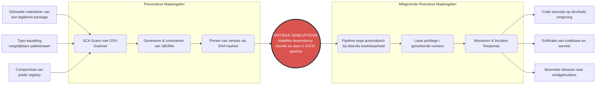

# Secure Pipelines — Gecombineerd overzicht

*Versie: 1.0 — 2026-06-08 | Auteurs: Wouter Saab, Daniël, Wassim Balouda*

---

## 1. Scope en doelstelling

Dit document beschrijft hoe de CI/CD-pipeline van het OpenMRS REST-module project
beveiligd is ingericht, hoe de OTAP-omgevingen gescheiden zijn, en hoe
niet-herleidbare (geanonimiseerde) data in de testomgeving wordt gewaarborgd.
De maatregelen worden per NEN-7510:2024-2 control onderbouwd.

---

## 2. Omgevingsscheiding (OTAP / GitHub Environments)

✅ **Aangemaakt en bevestigd** (`gh api repos/.../environments`, 2026-06-10):
de repository heeft de GitHub Environments **`test`** en **`prod`**, plus `dev`
(lokale ontwikkelomgeving, zie [docker/dev](../../../docker/dev/)) en `copilot`
(automatisch door GitHub aangemaakt voor de Copilot coding agent).

| Omgeving | GitHub Environment | Deployment trigger | Goedkeuring vereist | Protection rules |
|---|---|---|---|---|
| **Dev** | `dev` | Lokaal (`docker/dev`) | n.v.t. | Geen |
| **Test** | `test` | Push naar `develop` | Geen (automatisch) | Geen |
| **Productie** | `prod` | Push naar `main` na PR + review | ✅ Handmatige approval | `required_reviewers`: DanielvG-IT, BaasW |

> **Keuzeonderbouwing:** Door scheiding op GitHub Environment-niveau worden
> secrets, deployment targets en protection rules per omgeving beheerd.
> Een mislukte of kwaadaardige build op `develop` kan de productieomgeving
> niet bereiken zonder expliciete goedkeuring — `prod` vereist een approval
> van één van de twee geregistreerde reviewers (vier-ogen-principe,
> **NEN-7510 A.8.3**) voordat een job met dit environment start.

> **Restpunt:** `test` en `dev` hebben nog geen eigen `protection_rules` of
> environment-secrets ingericht — er is dus nog geen technisch afgedwongen
> scheiding van *secrets* tussen test en productie, alleen van *deployment-
> goedkeuring*. Zie ook §3 voor de scheiding van data.

---

## 3. Niet-herleidbare data in OTAP-omgevingen

OpenMRS verwerkt medische patiëntdata (BSN, diagnoses, medicatie). Om te voldoen
aan NEN-7510 en AVG mogen testomgevingen **geen echte patiëntidentificatoren**
bevatten.

| Omgeving | Datasource | Aanpak |
|---|---|---|
| **Ontwikkeling / Test** | OpenMRS demo-dataset (`demo_1.2.x.sql`) | Synthetische, niet-herleidbare fictieve patiënten — geen echte BSN/namen |
| **Productie** | Echte patiëntdata | Toegang alleen via goedgekeurde accounts + audit-logging |

De demo-dataset bevat geen echte patiënten; dit is de standaard OpenMRS testdataset
met fictieve records. CI-pipelines draaien uitsluitend tegen deze dataset; er is
geen mechanisme om productiedata te exporteren naar de testomgeving.

> **TODO:** Expliciete verklaring + bewijs toevoegen (bv. welke dataset de CI-run
> gebruikt). Vastleggen in README. Zie §8.

---

## 4. Repository-beveiliging

### 4.1 Branch protection — `main`

`main` is beveiligd via een GitHub **Ruleset** ("main protection") conform
**NEN-7510 A.8.3 (Toegangsbeveiliging)**. Niemand kan rechtstreeks pushen;
elke wijziging vereist een reviewde pull request.

| Regel | Waarde | Motivatie |
|---|---|---|
| Required approving reviews | **1** | Vier-ogen-principe; voorkomt eenzijdige wijzigingen |
| Dismiss stale reviews on push | ✅ | Nieuwe push maakt oude goedkeuring ongeldig |
| Required review thread resolution | ✅ | Alle opmerkingen moeten opgelost zijn voor merge |
| `non_fast_forward` | ✅ | Force pushes geblokkeerd; git-history onveranderbaar |
| `deletion` | ✅ | `main` kan niet verwijderd worden |
| Required status check: `Analyze Java (java)` | ✅ | Falende CodeQL-scan blokkeert de merge |
| Required status check: SonarCloud Quality Gate | ❌ (nog niet) | Eerst 3 open hotspots oplossen, daarna verplichten |
| CODEOWNERS | ❌ (nog niet) | Geen `CODEOWNERS`-bestand aanwezig |

**Bypass actor:** de `Admin`-rol heeft een bypass (`bypass_mode: always`) om
te voorkomen dat het 2-persoonsteam zichzelf buitensluit. Voor een striktere
policy zou deze bypass verwijderd moeten worden.

### 4.2 MFA voor alle leden

✅ **Afgedwongen op organisatieniveau.** MFA (2FA) is verplicht voor toegang tot
de repository en pipeline conform **NEN-7510 A.8.5 (Authenticatie)**:
`gh api orgs/GrannyGuard` → `two_factor_requirement_enabled: true` (geverifieerd
2026-06-10). GitHub past dit organisatiebreed af — leden zonder actieve 2FA
worden automatisch uit de organisatie verwijderd, dus lidmaatschap is op zich
al het bewijs.

> **TODO:** Screenshot van Settings → Authentication security (org-niveau) met
> "Require two-factor authentication" toevoegen als visueel bewijs. Zie §8.

### 4.3 Secret scanning & push protection

GitHub **secret scanning** en **push protection** zijn actief op de repository.
Hiermee worden credentials en API-tokens tegengehouden voordat ze gecommit worden
(**NEN-7510 A.8.5**). Huidige status: **0 open alerts**.

---

## 5. SAST-tooling

We zetten twee complementaire SAST-tools in:

### 5.1 CodeQL — security SAST

Diepe dataflow/taint-analyse voor Java/Maven. Resultaten verschijnen in de
**GitHub Security-tab** (Code scanning alerts).

- Workflow: [`.github/workflows/codeql.yml`](../../../.github/workflows/codeql.yml)
- Triggers: push/PR op `main` + wekelijkse schedule
- Queries: `security-extended` — detecteert hardcoded credentials, zwakke
  hash-algoritmen, onveilige authenticatiepatronen, log-injection, XSS en
  tainted-data-flows. Bewust gescoped op security (niet `security-and-quality`):
  zie [ADR-001](./adr-001-codeql-query-suite-scope.md) voor de afweging
  (~739 alerts → ~98% pure quality-noise, onderhoudbaarheid hoort bij SonarCloud §5.2)
- SARIF-resultaten worden opgeslagen in de Security-tab gekoppeld aan commit/PR
  (traceerbaarheid conform **NEN-7510 A.8.15**)

### 5.2 SonarCloud — SAST + maintainability / quality gate

Analyseert security-issues én onderhoudbaarheid (code smells, duplicatie, coverage).
Levert een **quality gate** op elke PR.

- Workflow: [`.github/workflows/sonarcloud-coverage.yml`](../../../.github/workflows/sonarcloud-coverage.yml)
- Org/project: `grannyguard` / `GrannyGuard_webservices-rest-audit`
- Vereiste secret: `SONAR_TOKEN` (opgeslagen als GitHub secret, niet in code)
- Status: quality gate faalt momenteel op `main` (3 hotspots + D reliability) —
  SonarCloud nog niet als required status check ingesteld

---

## 6. Dependency-beheer en SBOM

### 6.1 Dependabot

GitHub **Dependabot alerts** (dependency-graph + security-advisory matching) staan
repository-breed aan (`vulnerability-alerts: enabled`) en vormen één van de twee
SCA-bronnen voor de CVE/CVSS-analyse in [03-sbom-en-cve-advies](../03-sbom-en-cve-advies/03.md)
— **264 open alerts** op 2026-06-08 (**NEN-7510 A.8.8**).

- Een eerdere `.github/dependabot.yml` voor **automatische version-update PR's**
  is in commit `e724ba1` ("revert(deps): pin openmrs-api back to 2.8.3 and drop
  dependabot") verwijderd: een dependabot-bump van `openmrs.version` 2.8.3→2.8.6
  brak 6 `omod`-tests via upstream `standardTestDataset`-validatie.
- **Bewuste keuze:** `.github/dependabot.yml` wordt **niet** opnieuw toegevoegd.
  Automatische update-PR's wegen voor dit project niet op tegen het risico dat
  Dependabot opnieuw een platformbump (`openmrs.version` of een transitieve
  `org.openmrs.*`-dependency) voorstelt en `main` breekt zoals in `e724ba1`. De
  *alerts* (zie hieronder) geven al het benodigde A.8.8-signaal; updates worden
  handmatig doorgevoerd en getest (zie de `snakeyaml`/`spring-web` "quick win"-
  patches in [03-sbom-en-cve-advies §7](../03-sbom-en-cve-advies/03.md#7-kostenraming-indicatief)).
- **Gevolg:** de *alerts* (kwetsbaarhedenbeheer, A.8.8) blijven actief — dit
  staat los van `dependabot.yml` en draait via de repository-instelling
  `vulnerability-alerts: enabled` — en zijn de basis voor §1/§4 van de
  CVE-analyse.

> **TODO:** Screenshot van Security-tab (Dependabot alerts, 264 open) toevoegen
> als bewijs. Zie §8.

### 6.2 SBOM (CycloneDX)

Op elke push naar `main`/`develop` wordt een CycloneDX SBOM gegenereerd — een
volledige dependency-inventaris voor CVE-tracking (**NEN-7510 A.8.8**).

- Workflow: [`.github/workflows/sbom.yml`](../../../.github/workflows/sbom.yml)
- Artefact: `sbom-cyclonedx` (bewaard 90 dagen)
- Output: [`docs/security/03-sbom-en-cve-advies/sbom.cdx.json`](../03-sbom-en-cve-advies/sbom.cdx.json)

---

## 7. Risico-evaluatie CI/CD-proces

### 7.1 Risicomatrix

| ID | Risico | Kans (1-5) | Impact (1-5) | Score | Classificatie |
|---|---|:---:|:---:|:---:|---|
| R1 | Gecompromitteerde externe dependencies (supply chain) | 3 | 5 | **15** | 🔴 Hoog |
| R2 | Lekkage van secrets (credential leakage) | 3 | 4 | **12** | 🔴 Hoog |
| R3 | Malafide code contributor | 2 | 5 | **10** | 🟠 Midden |
| R4 | Ongeautoriseerde toegang tot repository/pipeline | 2 | 5 | **10** | 🟠 Midden-Hoog |
| R5 | Foutieve beveiligingsconfiguratie (misconfiguration) | 3 | 3 | **9** | 🟠 Midden |
| R6 | Uitval CI/CD-omgeving (downtime) | 4 | 2 | **8** | 🟡 Laag-Midden |

Meest kritiek: **R1 — Supply Chain Attack**.

### 7.2 Bow-Tie analyse (R1: Supply Chain Attack)

**Preventieve maatregelen:** SCA (OSV-Scanner), SBOM via CycloneDX, SHA-hash pinning van GitHub Actions-stappen.  
**Reactieve maatregelen:** pipeline-stop bij kwetsbaarheid, geïsoleerde kortlevende runners, incident response procedure.

---

## 8. NEN-7510 compliance-overzicht

| NEN-7510 control | Categorie | Maatregel | Bewijs |
|---|---|---|---|
| **A.8.3** Toegangsbeveiliging | Repository | Branch protection ruleset `main` — directe pushes geblokkeerd, 1 verplichte PR-review | GitHub Settings → Rules → Rulesets → *"main protection"* |
| **A.8.3** Toegangsbeveiliging | SAST gate | CodeQL als required status check — merge naar `main` geblokkeerd bij falende scan | `.github/workflows/codeql.yml` — `required_status_checks` in ruleset |
| **A.8.5** Authenticatie | SAST | CodeQL detecteert hardcoded credentials, zwakke hash-algoritmen | `.github/workflows/codeql.yml:55` — `queries: security-extended` ([ADR-001](./adr-001-codeql-query-suite-scope.md)) |
| **A.8.5** Authenticatie | Dependencies | Dependabot alerts (dependency graph) bewaken Maven-afhankelijkheden op CVE's — 264 open alerts | GitHub Security-tab → Dependabot alerts (zie [§6.1](#61-dependabot)) |
| **A.8.5** Authenticatie | Secret scanning | GitHub secret scanning + push protection actief; 0 open alerts | GitHub Settings → Code security |
| **A.8.8** Kwetsbaarheidsbeheer | Dependencies | Dependabot-alerts (`vulnerability-alerts: enabled`) dekken het Maven-ecosysteem; automatische update-PR's via `dependabot.yml` zijn bewust **niet** geconfigureerd (risico op herhaling van de `e724ba1`-platformbreuk) — updates verlopen handmatig, zie [§6.1](#61-dependabot) | GitHub Security-tab → Dependabot alerts |
| **A.8.8** Kwetsbaarheidsbeheer | SBOM | CycloneDX SBOM op elke push naar `main`/`develop` | `.github/workflows/sbom.yml` — artefact `sbom-cyclonedx` |
| **A.8.15** Logging | Traceerbaarheid | CodeQL SARIF-resultaten in GitHub Security-tab — gekoppeld aan commit/PR | `.github/workflows/codeql.yml:55–58` — `codeql-action/analyze` |
| **A.8.15** Logging | Kwaliteitscontrole | SonarCloud analyseert elke push/PR op security hotspots en code smells | `.github/workflows/sonarcloud-coverage.yml` |
| **A.8.25** Softwareontwikkeling | SDLC | Commits alleen via PR naar `main`; vier-ogen-principe via verplichte review | GitHub Ruleset `required_approving_review_count: 1` |

---