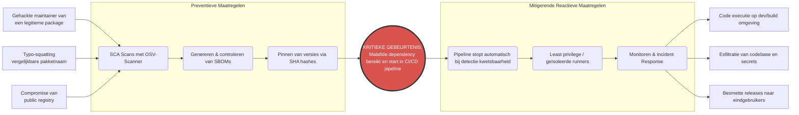

# Secure Pipelines — Gecombineerd overzicht

*Versie 1.0, 2026-06-08. Auteurs: Wouter Saab, Daniël, Wassim Balouda*

---

## 1. Scope en doelstelling

Dit document legt vast hoe we de CI/CD-pipeline van de OpenMRS REST-module hebben
dichtgezet: de scheiding tussen de OTAP-omgevingen, de beveiliging van de pipeline
zelf, en de garantie dat er geen herleidbare patiëntdata in de testomgeving belandt.
Elke maatregel koppelen we aan de NEN-7510:2024-2 control waar die bij hoort.

---

## 2. Omgevingsscheiding (OTAP / GitHub Environments)

✅ **Aangemaakt en bevestigd** (`gh api repos/.../environments`, 2026-06-10):
de repository heeft de GitHub Environments **`test`** en **`prod`**, plus `dev`
(lokale ontwikkelomgeving, zie [docker/dev](../../../docker/dev/)) en `copilot`
(automatisch door GitHub aangemaakt voor de Copilot coding agent).

| Omgeving | GitHub Environment | Deployment trigger | Goedkeuring vereist | Protection rules |
|---|---|---|---|---|
| **Dev** | `dev` | Lokaal (`docker/dev`) | n.v.t. | Geen |
| **Test** | `test` | Push naar `develop` | Geen (automatisch) | Geen |
| **Productie** | `prod` | Push naar `main` na PR + review | ✅ Handmatige approval | `required_reviewers`: DanielvG-IT, BaasW |

> **Keuzeonderbouwing:** doordat de scheiding op het niveau van GitHub Environments
> ligt, staan secrets, deployment targets en protection rules per omgeving los van
> elkaar. Een mislukte of kwaadaardige build op `develop` komt zo niet zomaar in
> productie. Een job die het `prod`-environment gebruikt, start pas nadat één van de
> twee geregistreerde reviewers het heeft goedgekeurd (vier-ogen-principe,
> **NEN-7510 A.8.3**).

> **Afdwinging (niet alleen geconfigureerd):** het `prod`-environment hangt vast aan
> de release-pipeline. De job `build-sign-attest` in
> [`release-sign.yml`](../../../.github/workflows/release-sign.yml) draait met
> `environment: prod` en levert het gesigneerde, productie-gebonden artefact. De
> approval-gate (required reviewers `DanielvG-IT` / `BaasW`) en de
> `protected_branches`-policy (alleen runs vanaf `main`) gaan dus echt af vóórdat er
> iets getekend of gepubliceerd wordt. De scheiding zit daarmee in de techniek, niet
> alleen op papier. De scan- en quality-workflows (CodeQL, SonarCloud, SBOM) laten we
> juist *zonder* environment draaien: dat zijn read-only analyses op elke push en PR,
> en die horen niet achter een approval-gate thuis.

> **Restpunt:** voor `test` en `dev` hebben we nog geen eigen `protection_rules` of
> environment-secrets ingesteld. De scheiding tussen test en productie geldt op dit
> moment dus alleen voor *deployment-goedkeuring*, nog niet voor *secrets*. De
> scheiding van de data zelf staat in §3.

---

## 3. Niet-herleidbare data in OTAP-omgevingen

OpenMRS verwerkt medische patiëntdata (BSN, diagnoses, medicatie). Om te voldoen
aan NEN-7510 en AVG mogen testomgevingen **geen echte patiëntidentificatoren**
bevatten.

| Omgeving | Datasource | Aanpak |
|---|---|---|
| **Ontwikkeling / Test** | OpenMRS demo-dataset (`demo_1.2.x.sql`) | Synthetische, niet-herleidbare fictieve patiënten — geen echte BSN/namen |
| **Productie** | Echte patiëntdata | Toegang alleen via goedgekeurde accounts + audit-logging |

Die demo-dataset is de standaard OpenMRS-testset en bevat alleen fictieve records,
geen echte patiënten. De CI-pipelines draaien uitsluitend tegen deze dataset, en er
bestaat geen route om productiedata naar de testomgeving te exporteren.

---

## 4. Repository-beveiliging

### 4.1 Branch protection — `main`

`main` is dichtgezet met een GitHub **Ruleset** ("main protection"), conform
**NEN-7510 A.8.3 (Toegangsbeveiliging)**. Direct pushen kan niet; elke wijziging
loopt via een pull request die eerst beoordeeld wordt.

| Regel | Waarde | Motivatie |
|---|---|---|
| Required approving reviews | **1** | Vier-ogen-principe; voorkomt eenzijdige wijzigingen |
| Dismiss stale reviews on push | ✅ | Nieuwe push maakt oude goedkeuring ongeldig |
| Required review thread resolution | ✅ | Alle opmerkingen moeten opgelost zijn voor merge |
| `non_fast_forward` | ✅ | Force pushes geblokkeerd; git-history onveranderbaar |
| `deletion` | ✅ | `main` kan niet verwijderd worden |
| Required status check: `Analyze Java (java)` | ✅ | Falende CodeQL-scan blokkeert de merge |
| Required status check: SonarCloud Quality Gate | ❌ (nog niet) | Hotspots staan inmiddels op 0, maar de gate faalt nog op de reliability-rating (D); als verplichte check zou dat elke merge blokkeren |
| CODEOWNERS | ❌ (nog niet) | Geen `CODEOWNERS`-bestand aanwezig |

**Bypass actor:** de `Admin`-rol mag de ruleset omzeilen (`bypass_mode: always`).
Dat staat er bewust in, zodat een team van twee zichzelf niet kan buitensluiten. Wie
strenger wil, haalt deze bypass eruit.

### 4.2 MFA voor alle leden

✅ **Afgedwongen op organisatieniveau.** 2FA is verplicht om bij de repository en de
pipeline te komen, conform **NEN-7510 A.8.5 (Authenticatie)**: `gh api orgs/GrannyGuard`
geeft `two_factor_requirement_enabled: true` (geverifieerd 2026-06-10). GitHub
handhaaft dit voor de hele organisatie en zet leden zonder actieve 2FA er automatisch
uit. Lidmaatschap is daarmee op zichzelf al het bewijs.

### 4.3 Secret scanning & push protection

Op de repository staan **secret scanning** en **push protection** aan. Credentials
en API-tokens worden zo tegengehouden nog vóór ze in een commit belanden
(**NEN-7510 A.8.5**). Stand op dit moment: **0 open alerts**.

---

## 5. SAST-tooling

We draaien twee SAST-tools die elkaar aanvullen:

### 5.1 CodeQL — security SAST

Diepe dataflow/taint-analyse voor Java/Maven. Resultaten verschijnen in de
**GitHub Security-tab** (Code scanning alerts).

- Workflow: [`.github/workflows/codeql.yml`](../../../.github/workflows/codeql.yml)
- Triggers: push/PR op `main` + wekelijkse schedule
- Queries: `security-extended`. Die vangt hardcoded credentials, zwakke
  hash-algoritmen, onveilige authenticatiepatronen, log-injection, XSS en
  tainted-data-flows. Bewust gescoped op security (niet `security-and-quality`):
  zie [ADR-001](./adr-001-codeql-query-suite-scope.md) voor de afweging
  (~739 alerts → ~98% pure quality-noise, onderhoudbaarheid hoort bij SonarCloud §5.2)
- SARIF-resultaten worden opgeslagen in de Security-tab gekoppeld aan commit/PR
  (traceerbaarheid conform **NEN-7510 A.8.15**)

### 5.2 SonarCloud — SAST + maintainability / quality gate

Analyseert security-issues én onderhoudbaarheid (code smells, duplicatie, coverage).
Levert een **quality gate** op elke PR.

- Workflow: [`.github/workflows/sonarcloud-coverage.yml`](../../../.github/workflows/sonarcloud-coverage.yml)
- Org/project: `grannyguard` / `GrannyGuard_webservices-rest-audit`
- Vereiste secret: `SONAR_TOKEN` (opgeslagen als GitHub secret, niet in code)
- Status: de Security Hotspots staan op 0 (Security Review Rating A) en de
  Security Rating is van E naar C verbeterd; de quality gate faalt op `main` nu
  nog op één conditie — de reliability-rating (D, 74 issues). SonarCloud staat
  daarom nog niet als required status check ingesteld (dat zou elke merge
  blokkeren)

---

## 6. Dependency-beheer en SBOM

### 6.1 Dependabot

GitHub **Dependabot alerts** (dependency-graph + security-advisory matching) staan
repository-breed aan (`vulnerability-alerts: enabled`) en vormen één van de twee
SCA-bronnen voor de CVE/CVSS-analyse in [03-sbom-en-cve-advies](../03-sbom-en-cve-advies/03.md):
**264 open alerts** op 2026-06-08 (**NEN-7510 A.8.8**).

- Een eerdere `.github/dependabot.yml` voor **automatische version-update PR's**
  is in commit `e724ba1` ("revert(deps): pin openmrs-api back to 2.8.3 and drop
  dependabot") verwijderd: een dependabot-bump van `openmrs.version` 2.8.3→2.8.6
  brak 6 `omod`-tests via upstream `standardTestDataset`-validatie.
- **Bewuste keuze:** `.github/dependabot.yml` wordt **niet** opnieuw toegevoegd.
  Automatische update-PR's wegen voor dit project niet op tegen het risico dat
  Dependabot opnieuw een platformbump (`openmrs.version` of een transitieve
  `org.openmrs.*`-dependency) voorstelt en `main` breekt zoals in `e724ba1`. De
  *alerts* (zie hieronder) geven al het benodigde A.8.8-signaal; updates worden
  handmatig doorgevoerd en getest (zie de `snakeyaml`/`spring-web` "quick win"-
  patches in [03-sbom-en-cve-advies §7](../03-sbom-en-cve-advies/03.md#7-kostenraming-indicatief)).
- **Gevolg:** de *alerts* (kwetsbaarhedenbeheer, A.8.8) blijven gewoon werken. Ze
  staan los van `dependabot.yml` en draaien via de repository-instelling
  `vulnerability-alerts: enabled`, en vormen de basis voor §1/§4 van de CVE-analyse.

### 6.2 SBOM (CycloneDX)

Bij elke push naar `main` of `develop` rolt er een CycloneDX SBOM uit: een volledige
dependency-inventaris voor CVE-tracking (**NEN-7510 A.8.8**).

- Workflow: [`.github/workflows/sbom.yml`](../../../.github/workflows/sbom.yml)
- Artefact: `sbom-cyclonedx` (bewaard 90 dagen)
- Output: [`docs/security/03-sbom-en-cve-advies/sbom.cdx.json`](../03-sbom-en-cve-advies/sbom.cdx.json)

---

## 7. Risico-evaluatie CI/CD-proces

### 7.1 Risicomatrix

| ID | Risico | Kans (1-5) | Impact (1-5) | Score | Classificatie |
|---|---|:---:|:---:|:---:|---|
| R1 | Gecompromitteerde externe dependencies (supply chain) | 3 | 5 | **15** | 🔴 Hoog |
| R2 | Lekkage van secrets (credential leakage) | 3 | 4 | **12** | 🔴 Hoog |
| R3 | Malafide code contributor | 2 | 5 | **10** | 🟠 Midden |
| R4 | Ongeautoriseerde toegang tot repository/pipeline | 2 | 5 | **10** | 🟠 Midden-Hoog |
| R5 | Foutieve beveiligingsconfiguratie (misconfiguration) | 3 | 3 | **9** | 🟠 Midden |
| R6 | Uitval CI/CD-omgeving (downtime) | 4 | 2 | **8** | 🟡 Laag-Midden |

Veruit het zwaarst weegt **R1 (de supply-chain-aanval)**.

### 7.2 Bow-Tie analyse (R1: Supply Chain Attack)

```mermaid
graph LR
    O1[Gehackte maintainer van<br/>een legitieme package] --> B1
    O2[Typo-squatting<br/>vergelijkbare pakketnaam] --> B1
    O3[Compromise van<br/>public registry] --> B1

    subgraph Preventieve_Maatregelen [Preventieve Maatregelen]
        B1(SCA Scans met OSV-Scanner) --> B2(Genereren & controleren van SBOMs)
        B2 --> B3(Pinnen van versies via SHA hashes)
    end

    B3 --> TE((KRITIEKE GEBEURTENIS:<br/>Malafide dependency bereikt en start in CI/CD pipeline))

    TE --> M1
    subgraph Mitigerende_Maatregelen [Mitigerende Reactieve Maatregelen]
        M1(Pipeline stopt automatisch bij detectie kwetsbaarheid) --> M2(Least privilege / geïsoleerde runners)
        M2 --> M3(Monitoren & Incident Response)
    end

    M3 --> G1[Code executie op dev/build omgeving]
    M3 --> G2[Exfiltratie van codebase en secrets]
    M3 --> G3[Besmette releases naar eindgebruikers]

    style TE fill:#d9534f,stroke:#333,stroke-width:4px,color:#fff
```

**Preventieve maatregelen:** SCA (OSV-Scanner), SBOM via CycloneDX, SHA-hash pinning van GitHub Actions-stappen.  
**Reactieve maatregelen:** pipeline-stop bij kwetsbaarheid, geïsoleerde kortlevende runners, incident response procedure.

---

## 8. NEN-7510 compliance-overzicht

| NEN-7510 control | Categorie | Maatregel | Bewijs |
|---|---|---|---|
| **A.8.3** Toegangsbeveiliging | Repository | Branch protection ruleset `main` — directe pushes geblokkeerd, 1 verplichte PR-review | GitHub Settings → Rules → Rulesets → *"main protection"* |
| **A.8.3** Toegangsbeveiliging | SAST gate | CodeQL als required status check — merge naar `main` geblokkeerd bij falende scan | `.github/workflows/codeql.yml` — `required_status_checks` in ruleset |
| **A.8.3** Toegangsbeveiliging | OTAP prod-gate | Release-pipeline draait in het `prod`-environment → vier-ogen-approval (`DanielvG-IT`/`BaasW`) + protected-branch-policy vóór signing/publish | `.github/workflows/release-sign.yml` — `environment: prod` (zie [§2](#2-omgevingsscheiding-otap--github-environments)) |
| **A.8.5** Authenticatie | SAST | CodeQL detecteert hardcoded credentials, zwakke hash-algoritmen | `.github/workflows/codeql.yml:55` — `queries: security-extended` ([ADR-001](./adr-001-codeql-query-suite-scope.md)) |
| **A.8.5** Authenticatie | Dependencies | Dependabot alerts (dependency graph) bewaken Maven-afhankelijkheden op CVE's — 264 open alerts | GitHub Security-tab → Dependabot alerts (zie [§6.1](#61-dependabot)) |
| **A.8.5** Authenticatie | Secret scanning | GitHub secret scanning + push protection actief; 0 open alerts | GitHub Settings → Code security |
| **A.8.8** Kwetsbaarheidsbeheer | Dependencies | Dependabot-alerts (`vulnerability-alerts: enabled`) dekken het Maven-ecosysteem; automatische update-PR's via `dependabot.yml` zijn bewust **niet** geconfigureerd (risico op herhaling van de `e724ba1`-platformbreuk) — updates verlopen handmatig, zie [§6.1](#61-dependabot) | GitHub Security-tab → Dependabot alerts |
| **A.8.8** Kwetsbaarheidsbeheer | SBOM | CycloneDX SBOM op elke push naar `main`/`develop` | `.github/workflows/sbom.yml` — artefact `sbom-cyclonedx` |
| **A.8.15** Logging | Traceerbaarheid | CodeQL SARIF-resultaten in GitHub Security-tab — gekoppeld aan commit/PR | `.github/workflows/codeql.yml:55–58` — `codeql-action/analyze` |
| **A.8.15** Logging | Kwaliteitscontrole | SonarCloud analyseert elke push/PR op security hotspots en code smells | `.github/workflows/sonarcloud-coverage.yml` |
| **A.8.25** Softwareontwikkeling | SDLC | Commits alleen via PR naar `main`; vier-ogen-principe via verplichte review | GitHub Ruleset `required_approving_review_count: 1` |

---