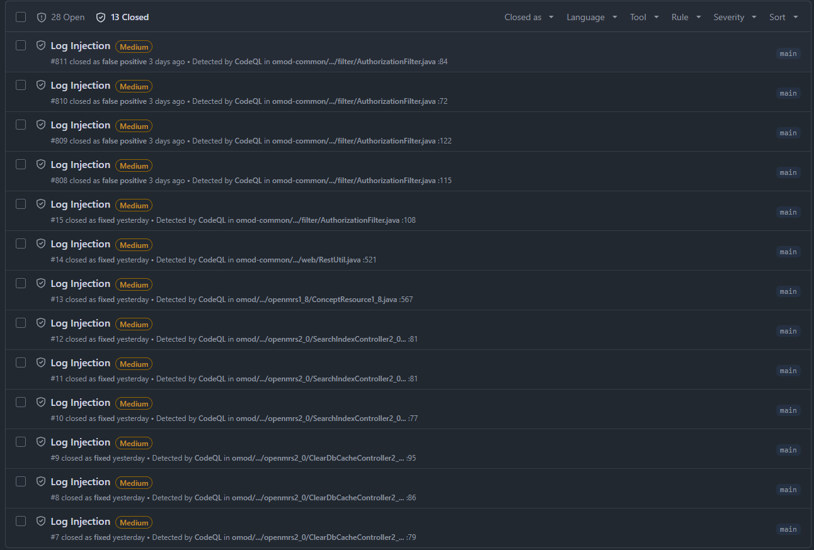
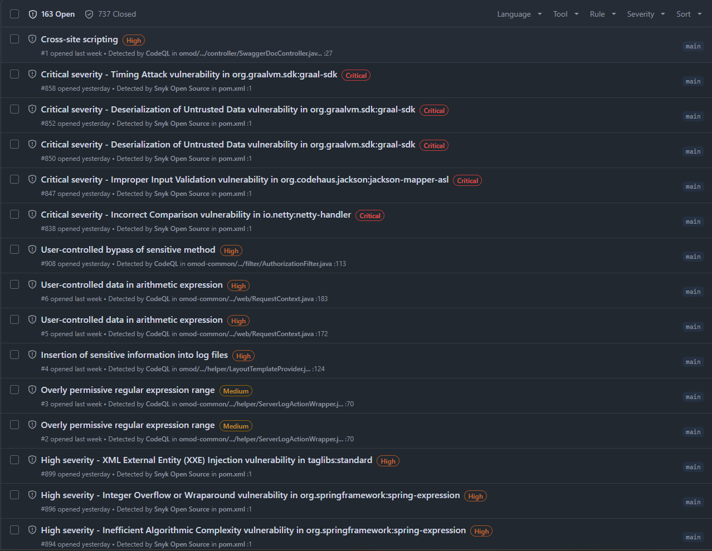

# Security code review & kwetsbaarheden

Rubric: *"Verbeteronderzoek security"* — **Security code review & kwetsbaarheden** (15 pt).
NEN-7510 controls: **A.8.25** (veilige ontwikkelcyclus), **A.8.28** (veilig coderen), **A.8.29** (beveiligingstests).

---

## 1. Methodologie

De code review is gelaagd opgezet: geautomatiseerde tooling vormt de eerste verdedigingslinie en menselijke beoordeling vormt de laatste poort vóór merge.

### Geautomatiseerde tooling

**SonarCloud (SAST)**
Elke pull request triggert een SonarCloud-analyse. De pipeline is geconfigureerd als *quality gate*: een pull request waarop de quality gate faalt (bv. een nieuw security hotspot of een reliability-issue met rating slechter dan A) kan niet gemerged worden totdat het probleem handmatig is opgelost of expliciet gedocumenteerd afgewogen. Dit dwingt af dat bevindingen niet stilzwijgend passeren.

**CodeQL (SAST, query-suite `security-extended`)**
GitHub Advanced Security voert bij elke push een CodeQL-scan uit met de `security-extended` query-suite (zie [ADR-001](../02-secure-pipelines/adr-001-codeql-query-suite-scope.md) voor de keuzeonderbouwing). Alerts verschijnen als *code scanning alerts* in de GitHub Security-tab. De organisatie-instelling blokkeert merge bij nieuwe hoog-risico-alerts totdat deze worden opgelost of als `false positive` gedismisst met onderbouwing.

**SBOM & CVE-check (SCA)**
Bij elke pull request wordt een CycloneDX SBOM gegenereerd en gecontroleerd op bekende CVE's (via Dependency-Review Action / Snyk). Een pull request met afhankelijkheden die een CVE bevatten boven de drempelwaarde faalt automatisch. Dit vereist handmatige actie — updaten van de afhankelijkheid of een gedocumenteerde risicoafweging — voordat merge mogelijk is.

**GitHub Advanced Security — AI-ondersteunde review (Copilot Autofix)**
GitHub's ingebouwde AI-tooling (Copilot Autofix) analyseert CodeQL-alerts en genereert suggesties voor mitigatie rechtstreeks als PR-commentaar. Deze suggesties zijn niet blindelings overgenomen: elke autofix-suggestie is handmatig beoordeeld op correctheid en contextrelevantie voordat deze werd toegepast of verworpen.

### Verplichte menselijke review

Op organisatieniveau is *required reviewers* afgedwongen: elke pull request vereist minimaal één goedkeuring van een ander teamlid voordat merge is toegestaan. Dit voorkomt dat bevindingen van de geautomatiseerde tooling worden omzeild zonder bewust menselijk oordeel. De combinatie van automatische gate (SonarCloud, CodeQL, SBOM) én menselijke goedkeuring zorgt dat kwetsbaarheden die door tooling worden gevlagd altijd een expliciete beslissing vereisen.

### Handmatig onderzochte bestanden

Naast de geautomatiseerde scans zijn de volgende klassen handmatig gereviewed, op basis van het aanvalsoppervlak-overzicht (Sprint 3) en de risicomatrix (Sprint 2):

- `AuthorizationFilter.java` — toegangscontrole en authenticatieverwerking
- `SessionController1_9.java` — sessiebeheer en inlogstroom
- `BaseDelegatingResource.java` — centrale resource-routing met brede rechtenimpact

---

## 2. Bevindingen

### 2.1 Bevinding 1 — Log injection (CWE-117) via REST-request-parameters

- **Bron:** CodeQL `java/log-injection`, query-suite `security-extended` (zie
  [ADR-001](../02-secure-pipelines/adr-001-codeql-query-suite-scope.md))
- **Bestanden + regels (vóór fix, commit `8521cdc`):**
  - `omod-common/.../web/RestUtil.java:521`
  - `omod/.../v1_0/controller/openmrs2_0/ClearDbCacheController2_0.java:79,86,95`
  - `omod/.../v1_0/controller/openmrs2_0/SearchIndexController2_0.java:77,81 (×2)`
  - `omod/.../v1_0/resource/openmrs1_8/ConceptResource1_8.java:567`
- **Beschrijving:** de REST-controllers loggen request-afgeleide waarden
  (`resource`, `subResource`, `uuid`, query-parameters) direct in `log.debug()`/
  `log.info()`/`log.error()`-statements zonder neutralisatie. Een aanvaller kan
  CR/LF-tekens (`\r\n`) in deze velden opnemen om extra, valse logregels te
  injecteren ("log forging") — bv. een nep `INFO`-regel die een succesvolle login
  suggereert, om forensisch onderzoek te misleiden.
- **OWASP Top 10 (2021):** A09:2021 – Security Logging and Monitoring Failures
  (gecombineerd met A03:2021 – Injection als onderliggend mechanisme).
  Referentie: [OWASP — Log Injection](https://owasp.org/www-community/attacks/Log_Injection),
  [CWE-117](https://cwe.mitre.org/data/definitions/117.html).
- **NEN-7510 control:** A.8.15 (Logging) — de integriteit van het audit-logbestand
  (KJ6, zie [01-security-audit §2.1](../01-security-audit/01.md)) is een
  voorwaarde voor bruikbaarheid van logging als bewijs/forensisch middel.
- **Risico bij niet-oplossen:** een vervalst auditlog ondermijnt elk forensisch
  onderzoek na een incident — precies het scenario dat NEN-7510 A.8.15 en de
  audit-trail-eis (zie kroonjuweel KJ6) moeten voorkomen. CWE-117 wordt door
  OWASP geclassificeerd binnen A09, een categorie die volgens de OWASP Top 10
  2021 in >90% van de onderzochte applicaties aanwezig was.
- **Risicoscore:** **CQL1** in risicomatrix — score **12** 🟠 Midden, KJ6. Zie [01.md §4.2](../01-security-audit/01.md#42-risicomatrix).
- **Status:** ✅ **Gemitigeerd** in commit `831dafb`
  ("fix(security): sanitize user input before logging (CWE-117 log injection)").
  Zie [Mitigatie & validatie §1](../06-mitigatie-en-validatie/README.md#1-cwe-117-log-injection)
  voor de mitigatie en validatie-status.
- **Restpunt:** alert #15 (`AuthorizationFilter.java`, oorspronkelijk regel 108) is
  niet door deze commit aangepakt — dat bestand is in een eerdere commit
  (`8521cdc`, issue #65 logging-gap-fix) al herschreven met `log.warn(...,
  attemptedUser, ...)`. Of die nieuwe code nog steeds als `log-injection` flagt
  (de gebruikersnaam uit Basic Auth is ook user-controlled) moet na de
  eerstvolgende CodeQL-scan geverifieerd worden — zie
  [ADR-001 §Validatie](../02-secure-pipelines/adr-001-codeql-query-suite-scope.md#validatie-na-eerstvolgende-scan-op-main).

### 2.2 Bevinding 2 — Session Fixation (CWE-384) via ontbrekende sessie-regeneratie na login

- **Bron:** Handmatige review van `AuthorizationFilter.java` (SonarQube security hotspot SQ1 —
  zie [01-security-audit §4.1](../01-security-audit/01.md#41-geïdentificeerde-risicos))
- **Bestanden + regels:**
  - `omod-common/.../web/filter/AuthorizationFilter.java:82` —
    `getRequestedSessionId()` geeft het door de *client* aangeleverde sessie-ID terug;
    dit wordt gebruikt in een beveiligingsbeslissing (geldigheidscheck) zonder
    server-side validatie tegen een register van actieve sessies.
  - `AuthorizationFilter.java:113` — na een succesvolle `Context.authenticate()` wordt
    het bestaande sessie-object *niet* geïnvalideerd en een nieuw sessie-ID aangemaakt;
    een sessie-ID die een aanvaller vóór authenticatie heeft "geplant" blijft na
    login geldig (klassieke session fixation).
- **Beschrijving:** Session fixation stelt een aanvaller in staat om een bekende
  sessie-ID vóór het inloggen van het slachtoffer te planten — via een gedeeld
  netwerk, XSS of een kwaadaardige link. Zodra het slachtoffer inlogt en de
  sessie-ID niet wordt ververst, kan de aanvaller met diezelfde ID de
  geauthenticeerde sessie overnemen zonder ooit een wachtwoord te kennen. Het
  gebruik van `getRequestedSessionId()` versterkt dit risico doordat de applicatie
  de sessie-identiteit volledig van de client overneemt in plaats van een
  server-gegenereerde waarde te handhaven.
- **OWASP Top 10 (2021):** A07:2021 – Identification and Authentication Failures.
  Referentie: [OWASP — Session Fixation](https://owasp.org/www-community/attacks/Session_fixation),
  [CWE-384](https://cwe.mitre.org/data/definitions/384.html).
- **NEN-7510 control:** A.8.5 (Secure Authentication) — authenticatieprocedures moeten
  identiteiten op veilige wijze vaststellen en bescherming bieden tegen misbruik van
  inlogprocedures.
- **Risico bij niet-oplossen:** een aanvaller die een sessie overneemt krijgt
  volledige toegang tot de OpenMRS REST API met de rechten van het slachtoffer.
  Bij een klinische gebruiker betekent dit onbeperkte leestoegang tot patiëntdossiers
  (KJ1, KJ2) en de mogelijkheid om medische gegevens te muteren — met direct gevaar
  voor de patiëntveiligheid. OWASP categoriseert session fixation binnen A07:2021 en
  CWE-384 als een kwetsbaarheid met hoge exploiteerbaarheid bij systemen die Basic
  Auth via HTTP(S) combineren met server-side sessies.
- **Relatie met systeemgebruik:** OpenMRS is een medisch dossier-systeem dat
  bijzondere persoonsgegevens verwerkt in de zin van AVG Art. 9 en WGBO Art. 7:454.
  Elke geauthenticeerde sessie geeft toegang tot diagnoses, medicatie, observaties en
  patiëntidentificatie. Sessie-overname in dit systeem is daarmee een direct
  datalek met AVG Art. 33 meldplicht bij de Autoriteit Persoonsgegevens en een
  reëel risico op verkeerde zorgbeslissingen door gemanipuleerde dossiers.
- **Status:** ❌ **Open** — geen mitigatie doorgevoerd; zie prioriteit 5 in
  [01-security-audit §5.1](../01-security-audit/01.md#51-prioritering-non-compliancies).

---

### 2.3 Bevinding 3 — Ontbrekende brute-force bescherming op authenticatie-endpoint (A.8.5)

- **Bron:** Handmatige review van `AuthorizationFilter.java`; gap A.8.5 in
  [01-security-audit §3.2](../01-security-audit/01.md#32-a85--authenticatie-secure-authentication)
- **Bestanden + regels:**
  - `omod-common/.../web/filter/AuthorizationFilter.java:113` —
    `Context.authenticate(userAndPass[0], userAndPass[1])` wordt aangeroepen zonder
    enige rate-limiting, account-lockout of throttling rondom de aanroep.
    Een aanvaller kan onbeperkt authenticatiepogingen doen.
- **Beschrijving:** de `AuthorizationFilter` accepteert elke inkomende HTTP Basic
  Auth-aanvraag en stuurt deze direct door naar `Context.authenticate()` zonder een
  mechanisme dat het aantal pogingen beperkt of vertraagt. Er is geen implementatie
  van account-lockout (tijdelijk blokkeren na N mislukte pogingen), request-throttling
  (minimale vertraging tussen pogingen) of IP-gebaseerde rate-limiting specifiek voor
  authenticatieverzoeken. Dit maakt geautomatiseerde wachtwoord-aanvallen
  (credential stuffing, dictionary attack, brute force) triviaal uitvoerbaar.
- **OWASP Top 10 (2021):** A07:2021 – Identification and Authentication Failures.
  Referentie: [OWASP Testing Guide — Testing for Weak Lock Out Mechanism (OTG-AUTHN-003)](https://owasp.org/www-project-web-security-testing-guide/latest/4-Web_Application_Security_Testing/04-Authentication_Testing/03-Testing_for_Weak_Lock_Out_Mechanism),
  [CWE-307](https://cwe.mitre.org/data/definitions/307.html).
- **NEN-7510 control:** A.8.5 (Secure Authentication) — authenticatieprocedures moeten
  bescherming bieden tegen misbruik van inlogprocedures, waaronder geautomatiseerde
  aanvallen.
- **Risico bij niet-oplossen:** een aanvaller kan geautomatiseerd wachtwoorden
  uitproberen tot een geldig credential gevonden is. In combinatie met veelgebruikte
  zorgwachtwoorden (naam + geboortejaar, standaard ziekenhuis-credentials) of
  gelekte credential-lijsten is dit een realistisch aanvalspad. OWASP ASVS Level 1
  vereist account-lockout als minimumvereiste; het ontbreken hiervan is een
  bekende oorzaak van succesvolle inbreuken op webapplicaties (OWASP Top 10
  A07:2021-toelichting).
- **Relatie met systeemgebruik:** als een klinisch account wordt gecompromitteerd,
  heeft een aanvaller via de OpenMRS REST API toegang tot alle patiëntdossiers waarvoor
  dat account rechten heeft — inclusief diagnoses, medicatiehistorie en persoons-
  gegevens (KJ1, KJ2, AVG Art. 9). In een ziekenhuisomgeving waar meerdere
  verpleegkundigen en artsen op hetzelfde systeem werken, vergroot het ontbreken van
  brute-force bescherming de kans op een omvangrijk datalek met meldplicht
  (AVG Art. 33) en directe impact op patiëntveiligheid.
- **Status:** ❌ **Open** — geen mitigatie doorgevoerd; zie prioriteit 2 in
  [01-security-audit §5.1](../01-security-audit/01.md#51-prioritering-non-compliancies).

---

### 2.4 Bevinding 4 — Unauthenticated `/session/diag` endpoint lekt rollen en privileges (A.8.3)

- **Bron:** Handmatige review van `SessionController1_9.java`; gap A.8.3 in
  [01-security-audit §3.1](../01-security-audit/01.md#31-a83--toegangsbeveiliging-access-restriction)
- **Bestanden + regels:**
  - `omod/.../v1_0/controller/openmrs1_9/SessionController1_9.java:172–187` —
    `@RequestMapping(value = "/diag", method = RequestMethod.GET)` zonder enige
    autorisatiecheck. De Javadoc luidt expliciet:
    *"NOTE: No authorization check — accessible to any caller (authenticated or not)."*
    Bij een actieve sessie retourneert het endpoint `userRoles` (regel 184) en
    `userPrivileges` (regel 185) van de ingelogde gebruiker.
- **Beschrijving:** het `/ws/rest/v1/session/diag`-endpoint is bedoeld als
  diagnostisch hulpmiddel maar heeft geen authenticatie- of autorisatiecontrole.
  Elke caller — ook volledig anoniem — kan het aanroepen. Bij een actieve sessie
  (bv. via een sessie-cookie) retourneert het endpoint de volledige rol- en
  privilege-set van de ingelogde gebruiker. Deze informatie is direct bruikbaar
  voor privilege-escalatie: een aanvaller leert welke rechten een account heeft
  vóórdat hij een gerichte aanval uitvoert. In combinatie met bevinding F2
  (session fixation) geeft dit endpoint een aanvaller bevestiging dat de
  gecompromitteerde sessie de gewenste rechten bevat. Toegang tot het endpoint
  wordt wel gelogd (Sprint 3 mitigatie: `log.warn("DIAG_ACCESS ...")`), maar de
  endpoint zelf is niet beveiligd.
- **OWASP Top 10 (2021):** A01:2021 – Broken Access Control.
  Referentie: [OWASP — Broken Access Control](https://owasp.org/Top10/A01_2021-Broken_Access_Control/),
  [CWE-200](https://cwe.mitre.org/data/definitions/200.html) (Exposure of Sensitive
  Information to an Unauthorized Actor).
- **NEN-7510 control:** A.8.3 (Toegangsbeveiliging) — toegang tot informatie en
  systemen moet worden beperkt overeenkomstig het toegangsbeheerbeleid; gebruikers
  (en anonieme callers) mogen alleen toegang krijgen tot de informatie die ze nodig
  hebben voor hun taak.
- **Risico bij niet-oplossen:** een aanvaller die toegang heeft tot de OpenMRS-instantie
  (ook zonder geldige credentials) kan vooraf de rechten-structuur van accounts
  verkennen. Dit verlaagt de drempel voor gerichte aanvallen op hoog-geprivilegieerde
  accounts (bv. artsen met schrijfrecht op diagnoses). CWE-200 is door OWASP
  geclassificeerd als een Broken Access Control-variant — de meest voorkomende
  kwetsbaarheidscategorie in de Top 10 2021, aanwezig in 94% van de geteste
  applicaties.
- **Relatie met systeemgebruik:** in een ziekenhuisomgeving zijn rollen en
  privileges directe informatie over de organisatiestructuur en bevoegdheden van
  medewerkers. Blootstelling van deze informatie (KJ4 — autorisatiegegevens) aan
  anonieme callers schendt het principle of least privilege en biedt aanvallers
  een blauwdruk voor privilege-escalation-aanvallen op het medisch dossier-systeem.
  Het uitschakelen of beperken van dit endpoint is een kleine codewijziging
  (voeg `@RequiredPrivilege` of een sessie-check toe) met grote compliance-impact.
- **Status:** ⚠️ **Gedeeltelijk gemitigeerd** — logging toegevoegd in Sprint 3
  (`log.warn("DIAG_ACCESS ...")` in commit `8521cdc`), maar het endpoint zelf heeft
  nog geen autorisatiecheck. Zie prioriteit 3 in
  [01-security-audit §5.1](../01-security-audit/01.md#51-prioritering-non-compliancies).

---

## 3. Prioriteringsoverzicht

| ID | Bevinding | OWASP | Ernst | NEN-7510 control | Status |
|----|-----------|-------|-------|-----------------|--------|
| F1 | Log injection (CWE-117) — 9× in REST-controllers | A09:2021 | Medium | A.8.15 | ✅ Gemitigeerd (`831dafb`) |
| F2 | Session Fixation (CWE-384) — geen sessie-regeneratie na login | A07:2021 | Hoog | A.8.5 | ❌ Open |
| F3 | Ontbrekende brute-force bescherming op `Context.authenticate()` | A07:2021 | Hoog | A.8.5 | ❌ Open |
| F4 | `/session/diag` lekt rollen/privileges zonder auth-check (CWE-200) | A01:2021 | Medium | A.8.3 | ⚠️ Gedeeltelijk (logging toegevoegd, endpoint onbeveiligd) |

---

## 4. Bijlagen

De onderstaande bijlagen zijn vereist als bewijsmateriaal dat de geautomatiseerde
tooling daadwerkelijk is ingezet en resultaten heeft opgeleverd.

### 4.1 GitHub Security-tab — CodeQL alerts

Open:

Closed:

### 4.2 SonarCloud-dashboard

> **TODO (handmatig):**
> Navigeer naar: **sonarcloud.io → jouw project → Security**
> - Screenshot van Security Hotspots overzicht + overall Security Rating
>
> Sla op als `bijlage-sonarcloud-security.png` in deze map en vervang dit blok door:
> ``
