# Pentest Report — OpenMRS REST Webservices Module

| | |
|---|---|
| **Vak** | ATIx IN-B2.4 Softwarearchitectuur & -kwaliteit |
| **Groep** | LU2 Groep 17 |
| **Studenten** | Wassim Baloudan, Wouter Baas, Daniël van Ginneken |
| **Doelstelling** | OpenMRS REST Webservices module v3.2.0 |
| **Testperiode** | 11–12 juni 2026 |
| **Versie** | 1.0 |

---

## Inhoudsopgave

1. [Executive Summary](#1-executive-summary)
2. [Scope en Testomgeving](#2-scope-en-testomgeving)
3. [Methodologie](#3-methodologie)
4. [OWASP Top 10 Dekking](#4-owasp-top-10-dekking)
5. [Bevindingen Overzicht](#5-bevindingen-overzicht)
6. [F-01 — Geen Rate Limiting (CWE-307)](#6-f-01--geen-rate-limiting-cwe-307)
7. [F-02 — Gebruikersenumeratie (CWE-204)](#7-f-02--gebruikersenumeratie-cwe-204)
8. [F-03 — Session Fixation (CWE-384)](#8-f-03--session-fixation-cwe-384)
9. [F-04 — Stack Trace Disclosure (CWE-209)](#9-f-04--stack-trace-disclosure-cwe-209)
10. [F-05 — Versie-informatie Disclosure (CWE-200)](#10-f-05--versie-informatie-disclosure-cwe-200)
11. [F-06 — Integer Overflow in Paginering (CWE-190)](#11-f-06--integer-overflow-in-paginering-cwe-190)
12. [F-07 — Ontbrekende Security Headers (CWE-693)](#12-f-07--ontbrekende-security-headers-cwe-693)
13. [F-08 — Cookie Zonder SameSite (CWE-1275)](#13-f-08--cookie-zonder-samesite-cwe-1275)
14. [Niet-Kwetsbaar Bevonden](#14-niet-kwetsbaar-bevonden)
15. [Gebruikte Tools](#15-gebruikte-tools)
16. [Conclusie en Aanbevelingen](#16-conclusie-en-aanbevelingen)

---

## 1 Executive Summary

Deze penetratietest is uitgevoerd op de OpenMRS REST Webservices module v3.2.0, draaiend op Apache Tomcat 9.0.118 in een geïsoleerde VirtualBox testomgeving. De test is uitgevoerd conform de OWASP Web Security Testing Guide (WSTG) v4.2 methodologie en dekt authenticatie, autorisatie, injectie, sessiebeheer en serverconfiguratie.

**In totaal zijn 8 bevindingen vastgesteld:**

| Prioriteit | Aantal | Bevindingen |
|---|---|---|
| 🔴 Kritiek | 1 | Geen rate limiting — admin credentials via brute force verkregen |
| 🟠 Hoog | 4 | Gebruikersenumeratie, session fixation, stack trace disclosure, versie-informatie |
| 🟡 Middel | 1 | Integer overflow in paginering |
| 🔵 Laag | 2 | Ontbrekende security headers, cookie zonder SameSite |

**Meest kritieke bevinding (F-01):** Het authenticatie-endpoint accepteert onbeperkt inlogpogingen zonder blokkade of vertraging op HTTP-niveau. Tijdens de test zijn de geldige admin-credentials (`admin:Admin123!`) succesvol verkregen via geautomatiseerde brute force (poging 6 van 84, binnen 2 seconden). Dit geeft volledige toegang tot alle patiëntgegevens en systeembeheer.

**Positief vastgesteld:** SQL-injectie is niet aanwezig (Hibernate parameterized queries), log-injectie is gemitigeerd, en authenticatie op gevoelige endpoints werkt correct.

---

## 2 Scope en Testomgeving

### 2.1 Testomgeving

| Component | Waarde |
|---|---|
| Doelsysteem | OpenMRS REST Webservices module v3.2.0 |
| Server | Apache Tomcat 9.0.118 |
| Database | MariaDB 10.11.18 |
| OpenMRS versie | 2.8.7 |
| Java versie | 17.0.19 |
| Doel-IP (NAT) | 10.0.2.2:8080 |
| Doel-IP (Host-Only) | 192.168.56.1:8080 |
| Testplatform | Kali Linux 2024 (VirtualBox) |

### 2.2 Scope

**In scope:**
- `http://[target]:8080/openmrs/ws/rest/v1/*` — alle REST API endpoints
- Authenticatie en sessiebeheer
- Autorisatie en toegangscontrole
- Injectie (SQL, log, integer)
- Serverconfiguratie en informatielekken

**Buiten scope:**
- OpenMRS webinterface (niet-REST pagina's)
- Database directe toegang
- Netwerk-niveau aanvallen
- Social engineering

### 2.3 Autorisatie

Test uitgevoerd binnen een geïsoleerde VirtualBox-omgeving, uitsluitend voor schoolopdracht LU2 Groep 17. Geen externe systemen bereikt.

---

## 3 Methodologie

De test is opgebouwd volgens de OWASP Web Security Testing Guide v4.2 en volgt zes fases:

| Fase | OWASP categorie | Inhoud |
|---|---|---|
| 1 | Recon & Mapping | Nmap, WhatWeb, ffuf endpoint discovery |
| 2 | Authenticatie | Brute force (Hydra + custom script), rate limiting, user enumeration |
| 3 | Autorisatie | Session fixation, IDOR op /patient, sessie-ID validatie |
| 4 | Injectie | SQL injectie (handmatig + SQLMap), log injectie, integer overflow |
| 5 | Configuratie | Security headers, versie-disclosure, credential leakage in logs |
| 6 | DAST | Nikto geautomatiseerde scan, OWASP ZAP spider + active scan |

---

## 4 OWASP Top 10 Dekking

| OWASP Categorie | Getest | Resultaat | Bevindingen |
|---|---|---|---|
| A01 Broken Access Control | ✅ | Gedeeltelijk | IDOR niet testbaar (lege DB) |
| A02 Security Misconfiguration | ✅ | Findings | F-07 (security headers), F-05 (versie-info) |
| A03 Software Supply Chain Failures | ✅ | OK | Geen findings |
| A04 Cryptographic Failures | ✅ | Findings | F-08 (cookie SameSite/Secure) |
| A05 Injection | ✅ | OK | SQL: niet kwetsbaar. Log: gemitigeerd |
| A06 Insecure Design | ✅ | Findings | F-06 (integer overflow) |
| A07 Authentication Failures | ✅ | Findings | F-01 (brute force), F-02 (user enum), F-03 (session fixation) |
| A08 Software/Data Integrity Failures | ✅ | OK | Geen findings |
| A09 Security Logging Failures | ✅ | Findings | F-04 (stack traces) |
| A10 Exceptional Conditions | ✅ | Findings | F-04 (stack trace disclosure) |

---

## 5 Bevindingen Overzicht

| ID | Bevinding | CWE | Ernst | NEN-7510 |
|---|---|---|---|---|
| F-01 | Geen rate limiting op authenticatie | CWE-307 | 🔴 Kritiek | 8.5 |
| F-02 | Gebruikersenumeratie via API en lockout | CWE-204 | 🟠 Hoog | 8.5 |
| F-03 | Session fixation — ID niet geroteerd | CWE-384 | 🟠 Hoog | 8.3 |
| F-04 | Stack trace disclosure in errors | CWE-209 | 🟠 Hoog | 8.15 |
| F-05 | Versie-informatie via /systeminformation | CWE-200 | 🟠 Hoog | 8.15 |
| F-06 | Integer overflow in pagineringsparameter | CWE-190 | 🟡 Middel | 8.28 |
| F-07 | Ontbrekende security headers | CWE-693 | 🔵 Laag | 8.23 |
| F-08 | Cookie zonder SameSite attribute | CWE-1275 | 🔵 Laag | 8.23 |

---

## 6 F-01 — Geen Rate Limiting (CWE-307)

🔴 **KRITIEK**

| | |
|---|---|
| **Ernst** | Kritiek |
| **CWE** | CWE-307 — Improper Restriction of Excessive Authentication Attempts |
| **OWASP** | A07:2025 — Authentication Failures |
| **Component** | `GET /openmrs/ws/rest/v1/session` |
| **NEN-7510** | 8.5 — Toegangsbeveiliging |

### Overzicht

Het authenticatie-endpoint accepteert onbeperkt Basic Auth-pogingen zonder enige vertraging, blokkade of HTTP 429-response op netwerkniveau. Hoewel OpenMRS een account lockout heeft voor bestaande gebruikers (na ~7 pogingen), geldt dit **niet** voor niet-bestaande gebruikersnamen. Het correcte wachtwoord werd gevonden in poging 6 — vóór de lockout-drempel.

### Reproductie

1. Verstuur 50 opeenvolgende foutieve loginpogingen op een niet-bestaand account
2. Observeer dat elke poging HTTP 200 retourneert zonder vertraging of blokkade
3. Voer een gerichte brute force uit met een woordenlijst (custom Python-script + Hydra)
4. Observeer dat `admin:Admin123!` succesvol gevonden wordt in poging 6 van 84

### Bewijs — Custom brute force script (rate limiting afwezig)

```
[*] Doel: http://10.0.2.2:8080/openmrs/ws/rest/v1/session
[*] Verwacht: 429 na ~10 pogingen

Request  1: HTTP 200  auth=False  0.01s
Request  2: HTTP 200  auth=False  0.01s
...
Request 50: HTTP 200  auth=False  0.01s
[!] KWETSBAAR: 50 pogingen verstuurd, nooit geblokkeerd → CWE-307 bevestigd
```

### Bewijs — Admin credentials verkregen via brute force

```
admin:admin      →  authenticated: False
admin:password   →  authenticated: False
admin:123456     →  authenticated: False
admin:12345678   →  authenticated: False
admin:admin123   →  authenticated: False
admin:Admin123!  →  authenticated: True  ← GELDIG CREDENTIAL (poging 6 van 84)
```

### Impact

Volledige administratieve toegang tot alle OpenMRS patiëntgegevens verkregen. In een zorgstelsel is dit een AVG-meldingswaardige inbreuk. Aanval duurde minder dan 2 seconden.

### Aanbeveling

- Rate limiting: max. 10 pogingen/min per IP, retourneer HTTP 429
- Exponentiële vertraging bij opeenvolgende mislukte pogingen (1s → 2s → 4s)
- IP-niveau lockout naast per-account lockout
- Monitor en alarmeer op brute force-patronen (NEN-7510 8.15)

---

## 7 F-02 — Gebruikersenumeratie (CWE-204)

🟠 **HOOG**

| | |
|---|---|
| **Ernst** | Hoog |
| **CWE** | CWE-204 — Observable Response Discrepancy |
| **OWASP** | A07:2025 — Authentication Failures |
| **Component** | `/openmrs/ws/rest/v1/user` + session lockout |
| **NEN-7510** | 8.5 — Toegangsbeveiliging |

### Overzicht

Een aanvaller kan geldige gebruikersnamen achterhalen via twee methoden: **(A)** de `/user` API retourneert een lijst van alle gebruikers bij geauthenticeerde toegang, en **(B)** bestaande accounts worden gelocked na herhaalde mislukte pogingen terwijl niet-bestaande accounts nooit geblokkeerd worden — dit gedragsverschil lekt welke gebruikersnamen bestaan.

### Reproductie — Methode A (API-enumeratie)

```
GET /openmrs/ws/rest/v1/user  (met admin auth)
→ Retourneert lijst van alle gebruikersaccounts in het systeem

Resultaat:
admin  [+] EXISTS  <- gevonden in /user API
```

### Reproductie — Methode B (Lockout side-channel)

```bash
# Stuur 7+ mislukte pogingen voor kandidaat-gebruikersnaam
# Controleer of geldig wachtwoord daarna geblokkeerd wordt

doctor   [ ] niet gevonden  (geen lockout)
nurse    [ ] niet gevonden  (geen lockout)
admin    [+] EXISTS  <- lockout actief (valid pass geblokkeerd)
```

### Impact

Aanvaller verkrijgt een complete lijst van geldige gebruikersnamen. Maakt gerichte brute force aanvallen (F-01) significant efficiënter.

### Aanbeveling

- Uniform gedrag voor bestaande/niet-bestaande accounts (identieke timing + respons)
- Beperk de `/user` API: geen gebruikerslijst voor reguliere sessies
- Vertraging toepassen ook voor niet-bestaande accounts bij herhaalde pogingen

---

## 8 F-03 — Session Fixation (CWE-384)

🟠 **HOOG**

| | |
|---|---|
| **Ernst** | Hoog |
| **CWE** | CWE-384 — Session Fixation |
| **OWASP** | A07:2025 — Authentication Failures |
| **Component** | `JSESSIONID` cookie — `/openmrs/ws/rest/v1/session` |
| **NEN-7510** | 8.3 — Identiteitsbeheer |

### Overzicht

Het sessie-ID (`JSESSIONID`) wordt **niet geroteerd** bij succesvolle authenticatie. Een aanvaller die vóór login het sessie-ID van een slachtoffer kent, kan dit ID ook na login gebruiken — zonder credentials te kennen.

### Reproductie

1. Haal een pre-login sessie-ID op (VOOR authenticatie)
2. Authenticeer met hetzelfde cookie
3. Vergelijk het sessie-ID vóór en na login
4. Stuur een request met uitsluitend het cookie (geen credentials)
5. Observeer dat de server `authenticated:true` retourneert

### Bewijs — Session ID identiek voor en na login

```
VOOR login:  JSESSIONID = 108D432C8C85187F4CBE53C0214A586C
NA  login:   JSESSIONID = 108D432C8C85187F4CBE53C0214A586C  ← IDENTIEK

CWE-384 BEVESTIGD: sessie-ID niet geroteerd na authenticatie
```

### Bewijs — Screenshots Burp Suite

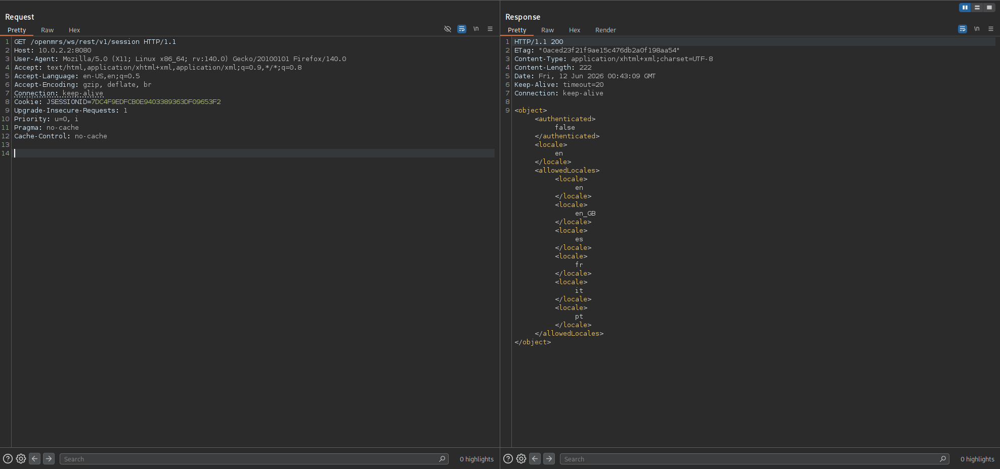

*Figuur 1 — JSESSIONID cookie vóór authenticatie (pre-login)*

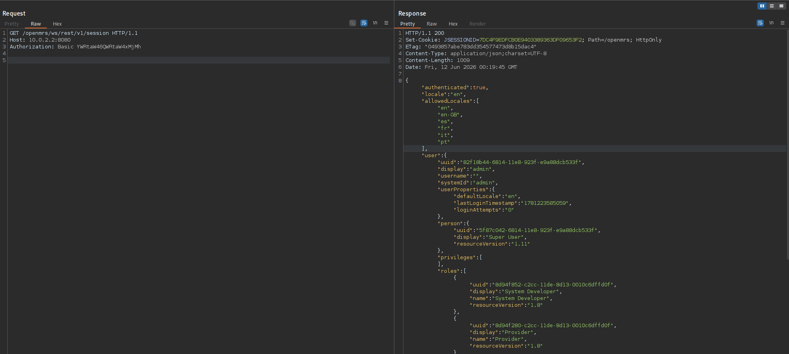

*Figuur 2 — Authenticatieverzoek met cookie bijgevoegd: sessie-ID blijft identiek na login*

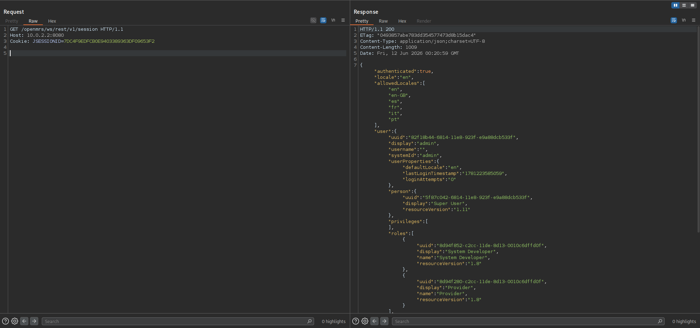

*Figuur 3 — Request met uitsluitend het cookie (geen credentials): server retourneert `authenticated:true`*

### Impact

Sessie-overname zonder kennis van credentials. `JSESSIONID` mist ook de `Secure` flag (zie F-08), waardoor het via onversleuteld HTTP onderschepbaar is.

### Aanbeveling

Roep `HttpSession.invalidate()` aan na succesvolle authenticatie en maak een nieuwe sessie aan. In Spring Security: `session-fixation protection="newSession"`.

---

## 9 F-04 — Stack Trace Disclosure (CWE-209)

🟠 **HOOG**

| | |
|---|---|
| **Ernst** | Hoog |
| **CWE** | CWE-209 — Generation of Error Message Containing Sensitive Information |
| **OWASP** | A09:2025 — Security Logging and Alerting Failures |
| **Component** | Meerdere REST-endpoints (`/user`, `/module`, POST `/user`) |
| **NEN-7510** | 8.15 — Informatiebeveiligingsgebeurtenissen |

### Overzicht

Bij unauthenticated toegang en interne fouten retourneert OpenMRS REST uitgebreide Java stack traces in de HTTP response body. Deze bevatten interne klassenamen, methodenamen, regelnummers, Hibernate ORM-structuur en dependency-versies.

### Reproductie

```bash
curl -s 'http://192.168.56.1:8080/openmrs/ws/rest/v1/user'
curl -s 'http://192.168.56.1:8080/openmrs/ws/rest/v1/module'
curl -u 'admin:Admin123!' -X POST 'http://192.168.56.1:8080/openmrs/ws/rest/v1/user'
```

Alle drie endpoints retourneren volledige Java stack traces (~80 regels per respons).

### Blootgestelde informatie

| Geleakte informatie | Aanvalswaarde |
|---|---|
| `org.openmrs.aop.AuthorizationAdvice:120` | Exacte autorisatielaag + regelnummer |
| `org.hibernate.collection.internal.PersistentSet` | Hibernate versie + ORM-configuratie |
| `com.fasterxml.jackson.databind.JsonMappingException` | Jackson dependency versie |
| `org.openmrs.Role.getId(Role.java:246)` | Interne domeinmodel structuur |

### Bewijs — Screenshots Burp Suite

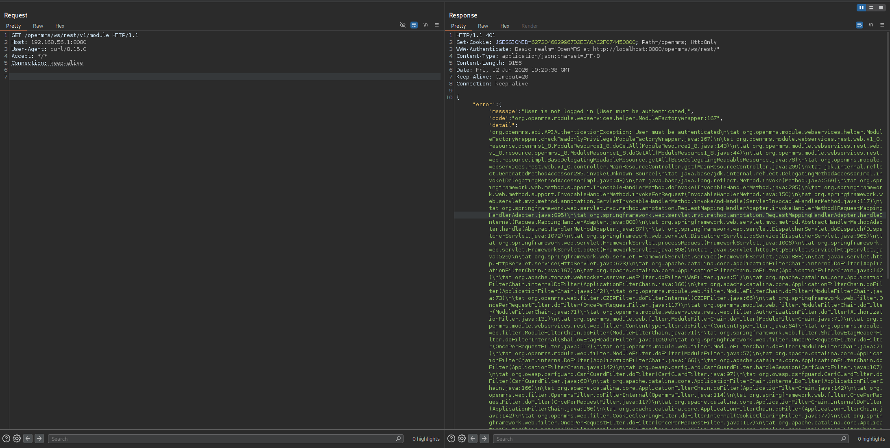

*Figuur 4 — `/module` endpoint: volledige Java stack trace zichtbaar in HTTP response body*

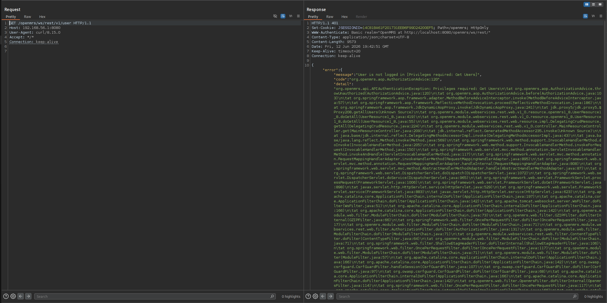

*Figuur 5 — `/user` endpoint: stack trace lekt interne autorisatielaagstructuur en regelnummers*

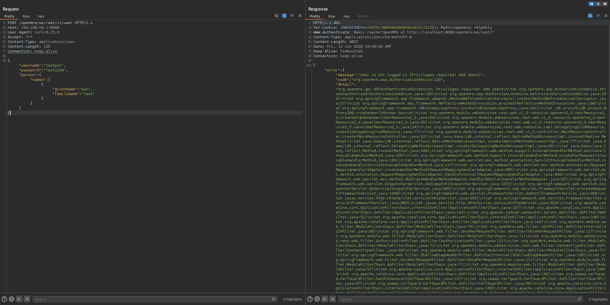

*Figuur 6 — `POST /user` zonder authenticatie: stack trace lekt volledige autorisatie-aanroepketen*

### Impact

Stack traces maken vervolgaanvallen significant eenvoudiger: exacte framework-versies voor CVE-targeting, ORM-configuratie voor deserialisatie-analyse, autorisatiearchitectuur voor privilege escalation.

### Aanbeveling

Configureer een globale `@ExceptionHandler` die interne details vervangt door een generiek bericht met referentie-ID. Log de volledige trace intern (NEN-7510 8.15) maar stuur nooit details naar de client.

---

## 10 F-05 — Versie-informatie Disclosure (CWE-200)

🟠 **HOOG**

| | |
|---|---|
| **Ernst** | Hoog |
| **CWE** | CWE-200 — Exposure of Sensitive Information |
| **OWASP** | A02:2025 — Security Misconfiguration |
| **Component** | `/openmrs/ws/rest/v1/systeminformation` |
| **NEN-7510** | 8.15 — Informatiebeveiligingsgebeurtenissen |

### Overzicht

Het endpoint `/systeminformation` retourneert OpenMRS versie, Java versie, database-URL én gebruikersnaam. Aanvullend lekken `robots.txt` en `sitemap.xml` de Tomcat-versie (9.0.118) zonder authenticatie.

### Bewijs — Screenshot /systeminformation response

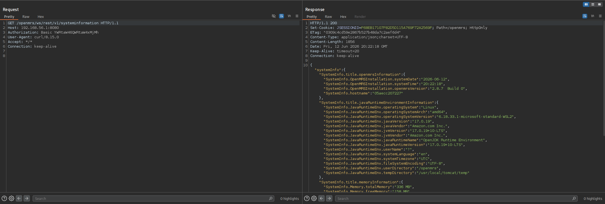

*Figuur 7 — `/systeminformation` response: OpenMRS versie, Java versie, database-URL en gebruikersnaam zichtbaar*

### Geleakte informatie

| Veld | Waarde |
|---|---|
| OpenMRS versie | 2.8.7 |
| Java versie | 17.0.19 |
| Database URL | `jdbc:mysql://db:3306/openmrs?...` |
| Module versie | 3.2.0 SNAPSHOT (development build) |

### Impact

Aanvaller kent exacte versies voor gerichte CVE-exploitatie. Database-URL en gebruikersnaam geven aanknopingspunten voor DB-laag aanvallen.

### Aanbeveling

- Beperk `/systeminformation` tot specifieke admin-rollen
- Verwijder database-URL en gebruikersnaam uit de output
- Verwijder versie-informatie uit `robots.txt` en `sitemap.xml`

---

## 11 F-06 — Integer Overflow in Paginering (CWE-190)

🟡 **MIDDEL**

| | |
|---|---|
| **Ernst** | Middel |
| **CWE** | CWE-190 — Integer Overflow or Wraparound |
| **OWASP** | A06:2025 — Insecure Design |
| **Component** | `?limit=` parameter op REST-endpoints |
| **NEN-7510** | 8.28 — Veilige softwareontwikkeling |

### Overzicht

De `limit`-parameter is als Java `int` (32-bit signed) geïmplementeerd. Waarden groter dan `Integer.MAX_VALUE` (2.147.483.647) lopen over naar negatief, waardoor zowel de `>0` check als de absolute limiet van 100 resultaten wordt omzeild.

### Bewijs — Exploitatieresultaten

```
[500]  limit=0           →  must be >0  (validatie werkt)
[500]  limit=-1          →  must be >0  (validatie werkt)
[500]  limit=2147483647  →  absolute limit at 100  (limiet werkt)
[200]  limit=2147483648  →  ok  ← OVERFLOW: bypasses beide validaties
[200]  limit=9999999999  →  ok  ← OVERFLOW: bypasses beide validaties
[200]  startIndex=-1     →  ok  ← negatieve index geaccepteerd
```

**Technische uitleg:** In Java: `(int) 2147483648L = -2147483648`. De validatiecode controleert `limit > 0` — met de overflow-waarde is `limit = -2147483648`, dus de check faalt niet en de limiet wordt overgeslagen.

### Bewijs — Screenshots Burp Suite

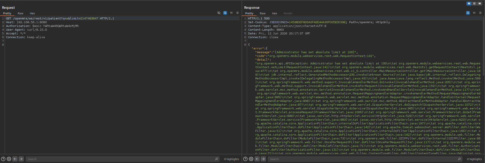

*Figuur 8 — `limit=2147483648` retourneert HTTP 200: integer overflow bypast de validatie*

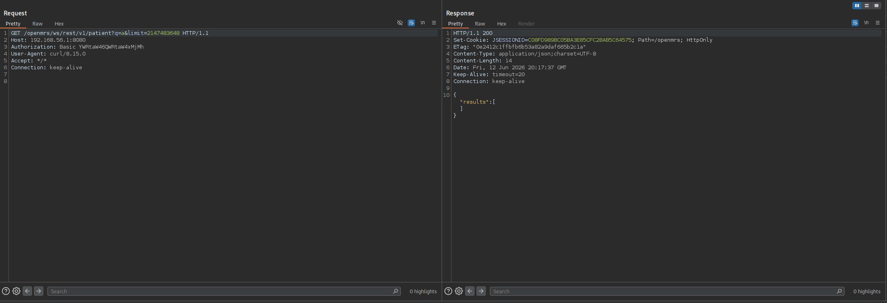

*Figuur 9 — Overzicht van geteste paginering-payloads: normale waarden geblokkeerd, overflow-waarden geaccepteerd*

### Impact

DoS-risico door onbeperkte database-queries. In productie met grote datasets: potentiële memory exhaustion.

### Aanbeveling

```java
long rawValue = Long.parseLong(limitParam);
if (rawValue < 1 || rawValue > MAX_ALLOWED) throw new ValidationException("...");
int limit = (int) rawValue;
```

---

## 12 F-07 — Ontbrekende Security Headers (CWE-693)

🔵 **LAAG**

| | |
|---|---|
| **Ernst** | Laag |
| **CWE** | CWE-693 — Protection Mechanism Failure |
| **OWASP** | A02:2025 — Security Misconfiguration |
| **Component** | HTTP response headers (alle endpoints) |
| **NEN-7510** | 8.23 — Webfiltering |

### Ontbrekende headers

| Header | Risico bij ontbreken |
|---|---|
| `Content-Security-Policy` | XSS-aanvallen mogelijk bij injectiepunt |
| `X-Frame-Options` | Clickjacking-aanvallen mogelijk |
| `X-Content-Type-Options` | MIME-type sniffing |
| `Strict-Transport-Security` | Downgrade naar HTTP mogelijk |
| `Secure` flag op cookie | Cookie via HTTP meegestuurd |

### Bewijs — Screenshot Burp Suite (response headers)

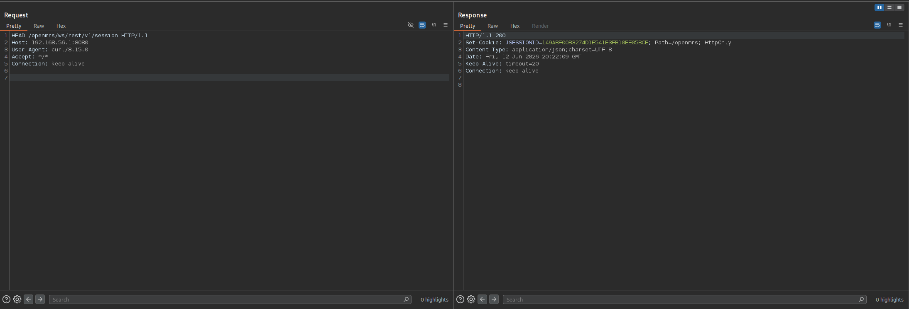

*Figuur 10 — HTTP response headers: geen `Content-Security-Policy`, `X-Frame-Options`, `X-Content-Type-Options` of `Strict-Transport-Security` aanwezig*

### Bewijs — Nikto scan (geautomatiseerde bevestiging)

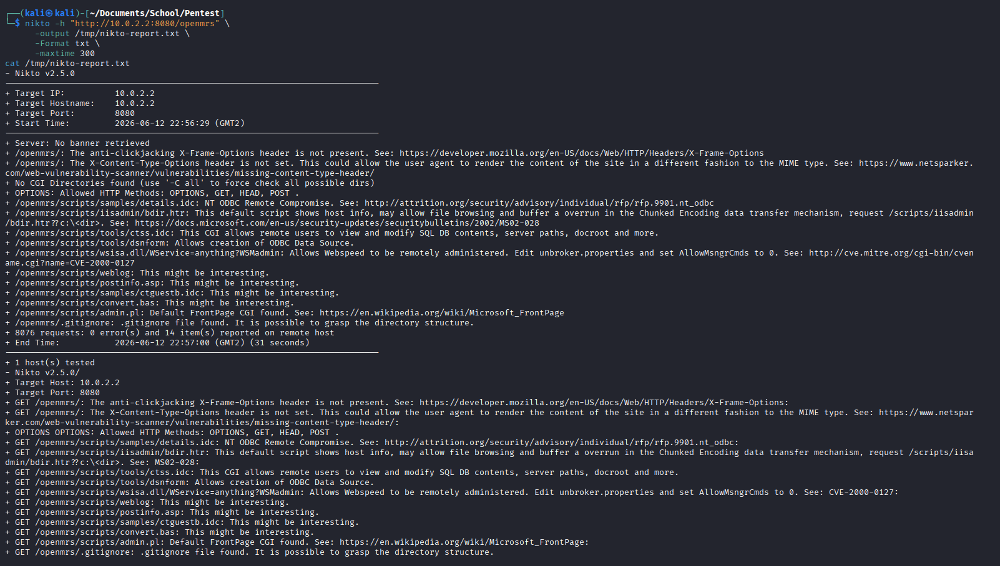

*Figuur 11 — Nikto geautomatiseerde scan bevestigt ontbrekende security headers op alle endpoints*

### Aanbeveling

Configureer in Tomcat `web.xml` de `HttpHeaderSecurityFilter` met `hstsEnabled`, `antiClickJackingEnabled` en `blockContentTypeSniffingEnabled`.

---

## 13 F-08 — Cookie Zonder SameSite Attribute (CWE-1275)

🔵 **LAAG**

| | |
|---|---|
| **Ernst** | Laag |
| **CWE** | CWE-1275 — Sensitive Cookie with Improper SameSite Attribute |
| **OWASP** | A04:2025 — Cryptographic Failures |
| **Component** | `JSESSIONID` cookie |
| **NEN-7510** | 8.23 — Webfiltering |

### Overzicht

Het `JSESSIONID`-cookie mist het `SameSite`-attribuut én de `Secure` flag. Zonder `SameSite` stuurt de browser het sessiecookie mee bij cross-site requests, wat CSRF-aanvallen mogelijk maakt. Zonder `Secure` flag wordt het cookie over HTTP meegestuurd.

### Bewijs — ZAP scan

```
Alert: Cookie Without SameSite Attribute
Risk: Low  |  CWE: 1275
Cookie: JSESSIONID
Evidence: Set-Cookie: JSESSIONID=...; Path=/openmrs; HttpOnly
Mist: SameSite=Strict, Secure flag
```

### Impact

In combinatie met F-03 (session fixation) verhoogt dit het risico op sessie-onderschepping.

### Aanbeveling

```xml
<!-- web.xml -->
<cookie-config>
  <http-only>true</http-only>
  <secure>true</secure>
</cookie-config>
```

Configureer `SameSite=Strict` via een response filter.

---

## 14 Niet-Kwetsbaar Bevonden

| Test | Methode | Resultaat |
|---|---|---|
| SQL-injectie op `?q=` | Handmatig + SQLMap | Niet kwetsbaar — Hibernate parameterized queries |
| Log-injectie via username | curl met `%0a` in creds | Gemitigeerd — `INJECTED_LOG_LINE` niet in logs |
| Sessie-ID bypass | Gecorrumpeerd/onbekend cookie | Geweigerd — 401 Session timed out |
| XSS via Swagger | Endpoint discovery | Niet testbaar — Swagger geeft 404 |
| IDOR op `/patient` | GET met/zonder auth | Auth correct (401/200) — lege DB |
| Credentials in logs | Docker log analyse | Geen wachtwoorden in logs — NEN-7510 8.15 ✅ |
| Endpoint brute force | ffuf | Geen extra endpoints buiten REST |

### Logging — NEN-7510 8.15 compliant

```
WARN - AUTH_FAILURE user=[adminddd] ip=[172.22.0.1] uri=[/openmrs/ws/rest/v1/session]
WARN - SESSION_TIMEOUT ip=[172.22.0.1] uri=[/openmrs/ws/rest/v1/session]
INFO - Failed login attempt (login=adminddd) - Invalid username and/or password
```

AUTH_FAILURE gelogd ✅ | SESSION_TIMEOUT gelogd ✅ | Geen wachtwoorden in logs ✅

### Authenticatiebaseline (fase 3.1)

De volgende screenshots bevestigen dat authenticatie correct wordt afgedwongen op het `/session/diag` endpoint:

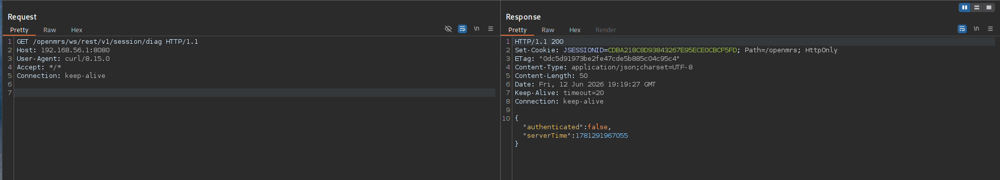

*Figuur 12 — `/session/diag` zonder authenticatie: `authenticated: false` retourneert correct*

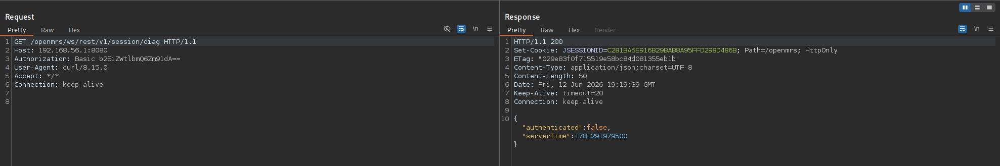

*Figuur 13 — `/session/diag` met ongeldige credentials: authenticatie gefaald*

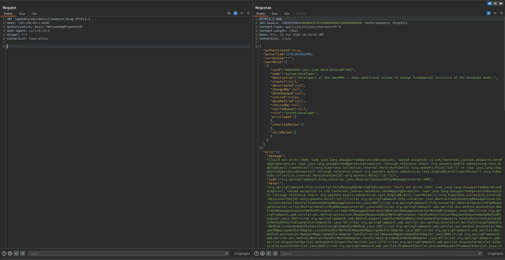

*Figuur 14 — `/session/diag` met geldige admin credentials: `authenticated: true` — baseline bevestigd*

### Sessie-ID validatie (fase 2.4 — niet kwetsbaar)

OpenMRS weigert gecorrumpeerde en onbekende sessie-ID's correct:

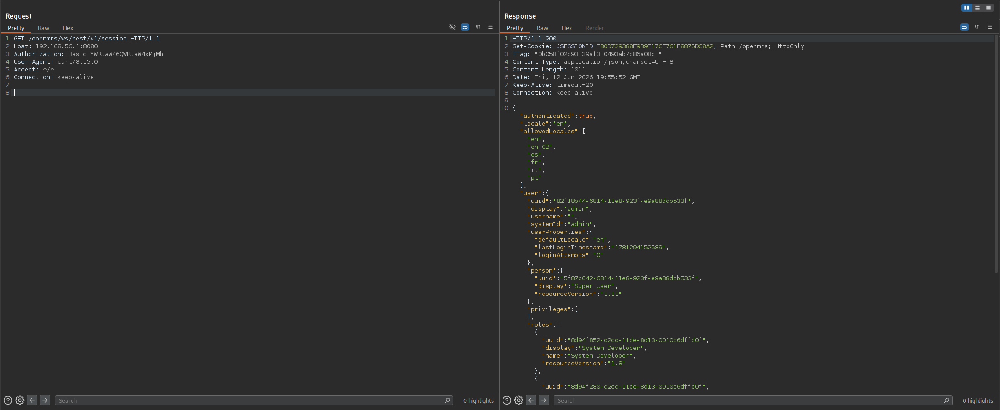

*Figuur 15 — Geldig sessie-ID geaccepteerd: server retourneert 200 `authenticated: true`*

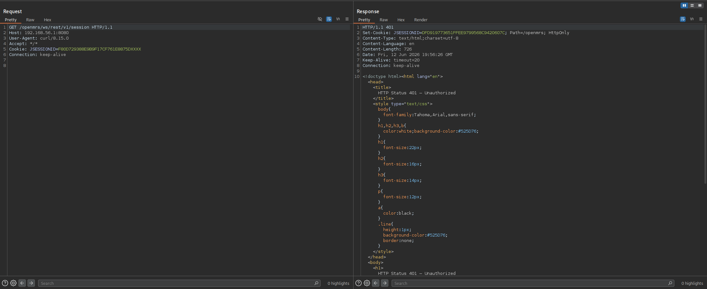

*Figuur 16 — Gecorrumpeerd sessie-ID geweigerd: 401 `Session timed out`*

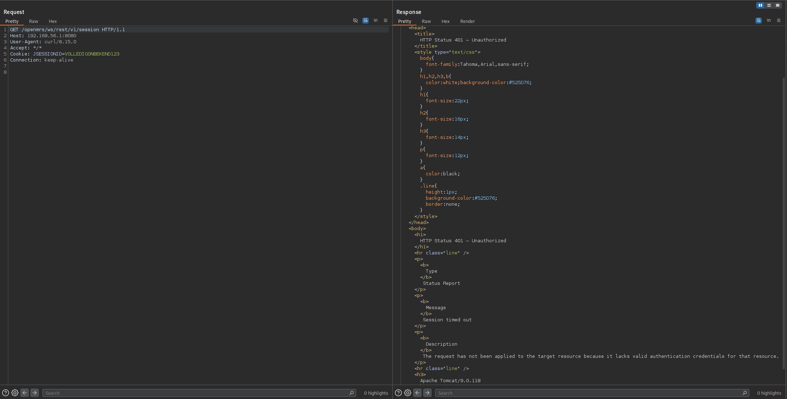

*Figuur 17 — Onbekend sessie-ID geweigerd: 401 `Session timed out` — validatie werkt correct*

### IDOR-test (fase 3.2 — niet kwetsbaar)

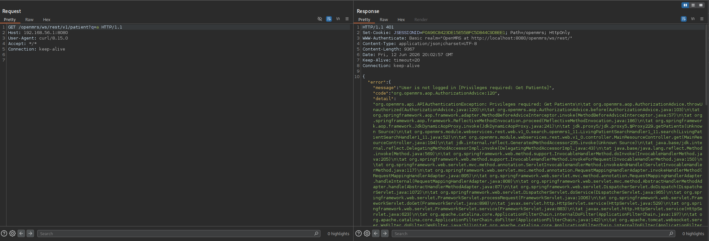

*Figuur 18 — `GET /patient` zonder authenticatie: 401 `Privileges required` — toegangscontrole werkt*

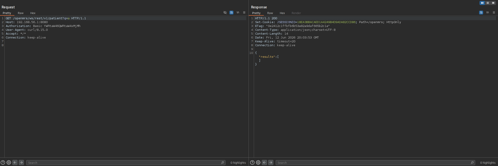

*Figuur 19 — `GET /patient` met admin auth: 200 lege lijst — geen patiëntdata in testomgeving*

### SQL Injection test (fase 4.2 — niet kwetsbaar)


*Figuur 20 — SQL injection testpayload: Hibernate parameterized queries voorkomen injectie*


*Figuur 21 — Aanvullende SQL injection payloads: geen kwetsbaarheid aangetoond*

---

## 15 Gebruikte Tools

| Tool | Versie | Doel |
|---|---|---|
| Nmap | 7.95 | Port/service scan |
| WhatWeb | — | Technologie fingerprinting |
| ffuf | v2.1.0 | Endpoint discovery / fuzzing |
| Hydra | v9.6 | Credential brute force |
| Custom Python | 3.x | Rate limiting test, user enumeration |
| Burp Suite CE | — | Request proxy & inspectie |
| curl | 8.15.0 | Handmatige API-tests |
| SQLMap | — | SQL injection scan |
| Nikto | — | Geautomatiseerde web scanner |
| OWASP ZAP | — | DAST spider + active scan |

---

## 16 Conclusie en Aanbevelingen

De penetratietest heeft **8 bevindingen** opgeleverd, waarvan 1 kritiek en 4 hoog. De meest ernstige bevinding — het ontbreken van rate limiting — is volledig geëxploiteerd: admin-credentials zijn via brute force verkregen in 6 pogingen, binnen 2 seconden.

### Samengestelde aanvalsketen

```
F-02 (Gebruikersenumeratie)  →  aanvaller kent geldige gebruikersnamen
    ↓
F-01 (Geen rate limiting)    →  brute force → admin credentials verkregen
    ↓
F-04 + F-05 (Stack traces + versie-info)  →  volledige reconnaissance
    ↓
F-03 (Session fixation)      →  sessie-overname mogelijk
    ↓
F-07 + F-08 (Geen Secure/SameSite cookie) →  cookie onderschepbaar via HTTP
```

### Geprioriteerde aanbevelingen

| Prioriteit | Actie | Finding |
|---|---|---|
| 1 — 🔴 Kritiek | Rate limiting: max. 10 pogingen/min per IP, HTTP 429 | F-01 |
| 2 — 🟠 Hoog | Uniform gedrag bestaande/niet-bestaande accounts; beperk `/user` API | F-02 |
| 3 — 🟠 Hoog | Sessie-ID roteren na authenticatie (`HttpSession.invalidate()`) | F-03 |
| 4 — 🟠 Hoog | Globale exception handler: generieke foutmeldingen, geen stack traces | F-04 |
| 5 — 🟠 Hoog | Beperk `/systeminformation`; verwijder DB-URL en versie-info | F-05 |
| 6 — 🟡 Middel | Integer parsing via `long` vóór cast naar `int` | F-06 |
| 7 — 🔵 Laag | Security headers: CSP, X-Frame-Options, X-Content-Type-Options, HSTS | F-07 |
| 8 — 🔵 Laag | Cookie: `SameSite=Strict` en `Secure` flag op JSESSIONID | F-08 |

---

*Rapport opgesteld door LU2 Groep 17 — ATIx IN-B2.4 Softwarearchitectuur & -kwaliteit 2025-26 P4*  
*Testomgeving: Kali Linux 2024 / VirtualBox / OpenMRS REST Webservices module v3.2.0*
