# Pentest Report — OpenMRS REST Webservices Module

| | |
|---|---|
| **Vak** | ATIx IN-B2.4 Softwarearchitectuur & -kwaliteit |
| **Groep** | LU2 Groep 17 |
| **Studenten** | Wassim Baloudan, Wouter Baas, Daniël van Ginneken |
| **Doelstelling** | OpenMRS REST Webservices module v3.2.0 |
| **Testperiode** | 11–12 juni 2026 |
| **Versie** | 1.0 |

---

## Inhoudsopgave

1. [Executive Summary](#1-executive-summary)
2. [Scope en Testomgeving](#2-scope-en-testomgeving)
3. [Methodologie](#3-methodologie)
4. [OWASP Top 10 Dekking](#4-owasp-top-10-dekking)
5. [Bevindingen Overzicht](#5-bevindingen-overzicht)
6. [F-01 — Geen Rate Limiting (CWE-307)](#6-f-01--geen-rate-limiting-cwe-307)
7. [F-02 — Gebruikersenumeratie (CWE-204)](#7-f-02--gebruikersenumeratie-cwe-204)
8. [F-03 — Session Fixation (CWE-384)](#8-f-03--session-fixation-cwe-384)
9. [F-04 — Stack Trace Disclosure (CWE-209)](#9-f-04--stack-trace-disclosure-cwe-209)
10. [F-05 — Versie-informatie Disclosure (CWE-200)](#10-f-05--versie-informatie-disclosure-cwe-200)
11. [F-06 — Integer Overflow in Paginering (CWE-190)](#11-f-06--integer-overflow-in-paginering-cwe-190)
12. [F-07 — Log Injection (CWE-117)](#12-f-07--log-injection-cwe-117)
13. [F-08 — Ontbrekende Security Headers (CWE-693)](#13-f-08--ontbrekende-security-headers-cwe-693)
14. [F-09 — Cookie Zonder SameSite (CWE-1275)](#14-f-09--cookie-zonder-samesite-cwe-1275)
15. [Niet-Kwetsbaar Bevonden](#15-niet-kwetsbaar-bevonden)
16. [Gebruikte Tools](#16-gebruikte-tools)
17. [Conclusie en Aanbevelingen](#17-conclusie-en-aanbevelingen)
18. [Pentest Hervalidatie — Post-Mitigation](#18-pentest-hervalidatie--post-mitigation)

---

## 1 Executive Summary

Deze penetratietest is uitgevoerd op de OpenMRS REST Webservices module v3.2.0, draaiend op Apache Tomcat 9.0.118 in een geïsoleerde VirtualBox testomgeving. De test is uitgevoerd conform de OWASP Web Security Testing Guide (WSTG) v4.2 methodologie en dekt authenticatie, autorisatie, injectie, sessiebeheer en serverconfiguratie.

**In totaal zijn 9 bevindingen vastgesteld:**

| Prioriteit | Aantal | Bevindingen |
|---|---|---|
| 🔴 Kritiek | 1 | Geen rate limiting — admin credentials via brute force verkregen |
| 🟠 Hoog | 4 | Gebruikersenumeratie, session fixation, stack trace disclosure, versie-informatie |
| 🟡 Middel | 2 | Integer overflow in paginering, log injection (audit log vervuiling) |
| 🔵 Laag | 2 | Ontbrekende security headers, cookie zonder SameSite |

**Meest kritieke bevinding (F-01):** Het authenticatie-endpoint accepteert onbeperkt inlogpogingen zonder blokkade of vertraging op HTTP-niveau. Tijdens de test zijn de geldige admin-credentials (`admin:Admin123!`) succesvol verkregen via geautomatiseerde brute force (poging 6 van 84, binnen 2 seconden). Dit geeft volledige toegang tot alle patiëntgegevens en systeembeheer.

**Positief vastgesteld:** SQL-injectie is niet aanwezig (Hibernate parameterized queries) en authenticatie op gevoelige endpoints werkt correct.

---

## 2 Scope en Testomgeving

### 2.1 Testomgeving

| Component | Waarde |
|---|---|
| Doelsysteem | OpenMRS REST Webservices module v3.2.0 |
| Server | Apache Tomcat 9.0.118 |
| Database | MariaDB 10.11.18 |
| OpenMRS versie | 2.8.7 |
| Java versie | 17.0.19 |
| Doel-IP (NAT) | 10.0.2.2:8080 |
| Doel-IP (Host-Only) | 192.168.56.1:8080 |
| Testplatform | Kali Linux 2024 (VirtualBox) |

### 2.2 Scope

**In scope:**
- `http://[target]:8080/openmrs/ws/rest/v1/*` — alle REST API endpoints
- Authenticatie en sessiebeheer
- Autorisatie en toegangscontrole
- Injectie (SQL, log, integer)
- Serverconfiguratie en informatielekken

**Buiten scope:**
- OpenMRS webinterface (niet-REST pagina's)
- Database directe toegang
- Netwerk-niveau aanvallen
- Social engineering

### 2.3 Autorisatie

Test uitgevoerd binnen een geïsoleerde VirtualBox-omgeving, uitsluitend voor schoolopdracht LU2 Groep 17. Geen externe systemen bereikt.

---

## 3 Methodologie

De test is opgebouwd volgens de OWASP Web Security Testing Guide v4.2 en volgt zes fases:

| Fase | OWASP categorie | Inhoud |
|---|---|---|
| 1 | Recon & Mapping | Nmap, WhatWeb, ffuf endpoint discovery |
| 2 | Authenticatie | Brute force (Hydra + custom script), rate limiting, user enumeration |
| 3 | Autorisatie | Session fixation, IDOR op /patient, sessie-ID validatie |
| 4 | Injectie | SQL injectie (handmatig + SQLMap), log injectie, integer overflow |
| 5 | Configuratie | Security headers, versie-disclosure, credential leakage in logs |
| 6 | DAST | Nikto geautomatiseerde scan, OWASP ZAP spider + active scan |

---

## 4 OWASP Top 10 Dekking

| OWASP Categorie | Getest | Resultaat | Bevindingen |
|---|---|---|---|
| A01 Broken Access Control | ✅ | Gedeeltelijk | IDOR niet testbaar (lege DB) |
| A02 Security Misconfiguration | ✅ | Findings | F-08 (security headers), F-05 (versie-info) |
| A03 Software Supply Chain Failures | ✅ | OK | Geen findings |
| A04 Cryptographic Failures | ✅ | Findings | F-09 (cookie SameSite/Secure) |
| A05 Injection | ✅ | OK | SQL: niet kwetsbaar (Hibernate parameterized queries) |
| A06 Insecure Design | ✅ | Findings | F-06 (integer overflow) |
| A07 Authentication Failures | ✅ | Findings | F-01 (brute force), F-02 (user enum), F-03 (session fixation) |
| A08 Software/Data Integrity Failures | ✅ | OK | Geen findings |
| A09 Security Logging Failures | ✅ | Findings | F-04 (stack traces), F-07 (log injection — ✅ gemitigeerd, zie §12) |
| A10 Exceptional Conditions | ✅ | Findings | F-04 (stack trace disclosure) |

---

## 5 Bevindingen Overzicht

| ID | Bevinding | CWE | Ernst | NEN-7510 |
|---|---|---|---|---|
| F-01 | Geen rate limiting op authenticatie | CWE-307 | 🔴 Kritiek | 8.5 |
| F-02 | Gebruikersenumeratie via API en lockout | CWE-204 | 🟠 Hoog | 8.5 |
| F-03 | Session fixation — ID niet geroteerd | CWE-384 | 🟠 Hoog | 8.3 |
| F-04 | Stack trace disclosure in errors | CWE-209 | 🟠 Hoog | 8.15 |
| F-05 | Versie-informatie via /systeminformation | CWE-200 | 🟠 Hoog | 8.15 |
| F-06 | Integer overflow in pagineringsparameter | CWE-190 | 🟡 Middel | 8.28 |
| F-07 | Log injection via Basic Auth username | CWE-117 | 🟡 Middel | 8.15 |
| F-08 | Ontbrekende security headers | CWE-693 | 🔵 Laag | 8.23 |
| F-09 | Cookie zonder SameSite attribute | CWE-1275 | 🔵 Laag | 8.23 |

---

## 6 F-01 — Geen Rate Limiting (CWE-307)

🔴 **KRITIEK**

| | |
|---|---|
| **Ernst** | Kritiek |
| **CWE** | CWE-307 — Improper Restriction of Excessive Authentication Attempts |
| **OWASP** | A07:2025 — Authentication Failures |
| **Component** | `GET /openmrs/ws/rest/v1/session` |
| **NEN-7510** | 8.5 — Toegangsbeveiliging |

### Overzicht

Het authenticatie-endpoint accepteert onbeperkt Basic Auth-pogingen zonder enige vertraging, blokkade of HTTP 429-response op netwerkniveau. Hoewel OpenMRS een account lockout heeft voor bestaande gebruikers (na ~7 pogingen), geldt dit **niet** voor niet-bestaande gebruikersnamen. Het correcte wachtwoord werd gevonden in poging 6 — vóór de lockout-drempel.

### Reproductie

1. Verstuur 50 opeenvolgende foutieve loginpogingen op een niet-bestaand account
2. Observeer dat elke poging HTTP 200 retourneert zonder vertraging of blokkade
3. Voer een gerichte brute force uit met een woordenlijst (custom Python-script + Hydra)
4. Observeer dat `admin:Admin123!` succesvol gevonden wordt in poging 6 van 84

> **Noot over Hydra-output:** De ruwe Hydra-output (zie `pentestfindings.md`) rapporteert
> "47 valid passwords found". Dit zijn **false positives**: Hydra beschouwt HTTP 200 als
> succes, maar het OpenMRS `/session`-endpoint retourneert HTTP 200 voor *elke* aanvraag —
> ook bij mislukte authenticatie (`"authenticated": false`). Uitsluitend het custom
> Python-script valideert het JSON-veld `authenticated: true` correct en is daarom de
> leidende bron voor dit bewijs.

### Bewijs — Custom brute force script (rate limiting afwezig)

```
[*] Doel: http://10.0.2.2:8080/openmrs/ws/rest/v1/session
[*] Verwacht: 429 na ~10 pogingen

Request  1: HTTP 200  auth=False  0.01s
Request  2: HTTP 200  auth=False  0.01s
...
Request 50: HTTP 200  auth=False  0.01s
[!] KWETSBAAR: 50 pogingen verstuurd, nooit geblokkeerd → CWE-307 bevestigd
```

### Bewijs — Admin credentials verkregen via brute force

```
admin:admin      →  authenticated: False
admin:password   →  authenticated: False
admin:123456     →  authenticated: False
admin:12345678   →  authenticated: False
admin:admin123   →  authenticated: False
admin:Admin123!  →  authenticated: True  ← GELDIG CREDENTIAL (poging 6 van 84)
```

### Impact

Volledige administratieve toegang tot alle OpenMRS patiëntgegevens verkregen. In een zorgstelsel is dit een AVG-meldingswaardige inbreuk. Aanval duurde minder dan 2 seconden.

### Aanbeveling

- Rate limiting: max. 10 pogingen/min per IP, retourneer HTTP 429
- Exponentiële vertraging bij opeenvolgende mislukte pogingen (1s → 2s → 4s)
- IP-niveau lockout naast per-account lockout
- Monitor en alarmeer op brute force-patronen (NEN-7510 8.15)

### Mitigatie

Commit `59bf421` — in-memory IP-gebaseerde rate limiter toegevoegd aan
`AuthorizationFilter.java` (`omod-common`). Bijgehouden per bron-IP in een bounded
`ConcurrentHashMap<String, long[]>` (telling + vensterstart per entry, max 10.000 entries
als safety valve tegen OOM). Parameters: max. **10 mislukte pogingen** per **60-seconden
venster** per IP. Bij overschrijding: HTTP 429 + `ACCESS_BLOCKED rate_limited=true ip=[...]
uri=[...]` op WARN-niveau (NEN-7510 A.8.15). De teller wordt gereset na een succesvolle
authenticatie (`clearFailedAttempts`).

Gedekt door **6 nieuwe unit tests** (`AuthorizationFilterRateLimitTest`,
`BaseModuleWebContextSensitiveTest`):

| Test | Bewijst |
|---|---|
| `doFilter_afterMaxFailedAttempts_returns429` | HTTP 429 na 10 mislukte pogingen |
| `doFilter_belowMaxFailedAttempts_doesNotReturn429` | niet geblokkeerd vóór drempel |
| `doFilter_afterMaxFailedAttempts_logsAccessBlockedAtWarn` | WARN `ACCESS_BLOCKED rate_limited=true` aanwezig |
| `doFilter_afterMaxFailedAttempts_logsBlockedIp` | geblokkeerd IP in log |
| `doFilter_rateLimitDoesNotAffectOtherIps` | afzonderlijke IPs beïnvloeden elkaar niet |
| `doFilter_successfulAuthClearsFailedAttemptCounter` | succesvolle auth reset de teller |

`mvn clean install` groen — 127 tests, 0 fouten.

### Validatie

**Commando (Kali — 2026-06-16):**

```bash
for i in $(seq 1 10); do
  STATUS=$(curl -s -o /dev/null -w "%{http_code}" \
    -u "nobody:wrongpass" \
    "http://192.168.56.1:8080/openmrs/ws/rest/v1/session")
  echo "Attempt $i → HTTP $STATUS"
done

STATUS=$(curl -s -o /dev/null -w "%{http_code}" \
  -u "nobody:wrongpass" \
  "http://192.168.56.1:8080/openmrs/ws/rest/v1/session")
echo "Rate-limit check → HTTP $STATUS (expected 429)"
```

**Output vóór fix:** alle pogingen HTTP 200 — nooit geblokkeerd (zie §6 Bewijs).

**Output ná fix:**
```
Attempt 1 → HTTP 200
Attempt 2 → HTTP 200
Attempt 3 → HTTP 200
Attempt 4 → HTTP 200
Attempt 5 → HTTP 200
Attempt 6 → HTTP 200
Attempt 7 → HTTP 200
Attempt 8 → HTTP 200
Attempt 9 → HTTP 200
Attempt 10 → HTTP 200
Rate-limit check → HTTP 429 (expected 429)
```

Docker-logs bevestigen de interne flow:

```
WARN - AuthorizationFilter.doFilter(182) |14:52:40| AUTH_FAILURE user=[nobody] ip=[172.22.0.1] uri=[/openmrs/ws/rest/v1/session] reason=[Invalid username and/or password: nobody]
(× 10 — alle mislukte pogingen geregistreerd)
WARN - AuthorizationFilter.doFilter(146) |14:52:46| ACCESS_BLOCKED rate_limited=true ip=[172.22.0.1] uri=[/openmrs/ws/rest/v1/session]
```

**Conclusie:** kwetsbaarheid aantoonbaar gesloten. HTTP 429 retourneert correct op de 11e
poging; `ACCESS_BLOCKED rate_limited=true` is aanwezig in de logs conform NEN-7510 A.8.15.
De brute force uit de pentest (poging 6 van 84, 2 seconden, 6 pogingen) wordt effectief
geblokkeerd: na 10 mislukte pogingen wordt elke verdere poging geweigerd vóór
`Context.authenticate()` wordt aangeroepen.

---

## 7 F-02 — Gebruikersenumeratie (CWE-204)

🟠 **HOOG**

| | |
|---|---|
| **Ernst** | Hoog |
| **CWE** | CWE-204 — Observable Response Discrepancy |
| **OWASP** | A07:2025 — Authentication Failures |
| **Component** | `/openmrs/ws/rest/v1/user` + session lockout |
| **NEN-7510** | 8.5 — Toegangsbeveiliging |

### Overzicht

Twee methoden maken gebruikersenumeratie mogelijk:

**Methode A — API-blootstelling:** De `/user` API retourneert de volledige gebruikerslijst voor elke geauthenticeerde aanvaller, zelfs met minimale privileges. In de testomgeving was slechts één account aanwezig (`admin`); in een productieomgeving met meerdere accounts worden alle gebruikersnamen en accountdetails blootgesteld.

**Methode B — Lockout side-channel:** Bestaande accounts worden geblokkeerd na 7 mislukte pogingen met een duidelijke foutmelding (`Invalid number of connection attempts`), terwijl niet-bestaande accounts dit bericht nooit geven. Dit gedragsverschil is waarneembaar in de applicatielogs.

### Reproductie — Methode A

```
GET /openmrs/ws/rest/v1/user  (met laag-geprivilegieerde auth)
→ Retourneert alle gebruikersaccounts in het systeem

Resultaat (testomgeving — 1 account):
{
  "results": [
    { "display": "admin", "username": "admin", ... }
  ]
}
```

> **Noot:** De testomgeving bevatte slechts één gebruikersaccount. In een productieomgeving
> met klinische medewerkers worden alle rollen en gebruikersnamen blootgesteld via dit endpoint.

### Reproductie — Methode B

**Commands gerund:**

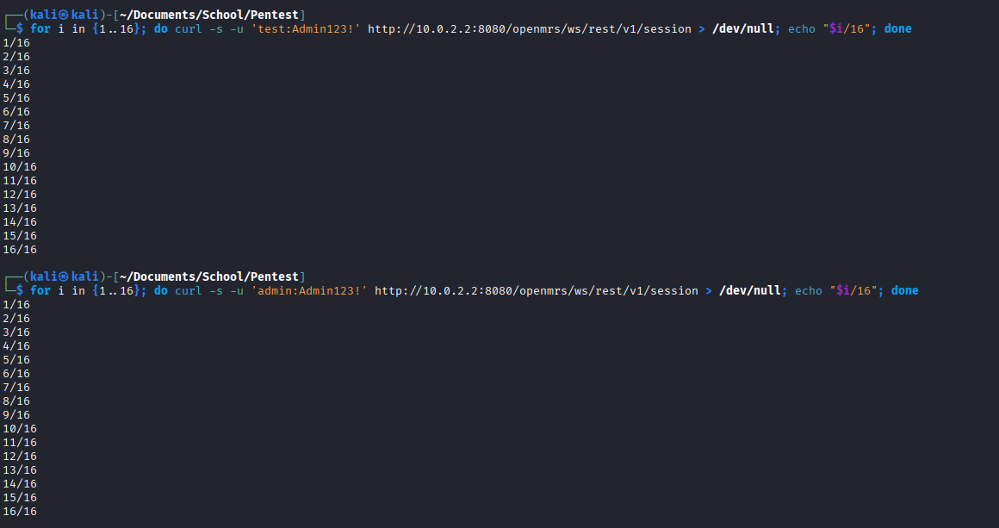

*Figuur 4 — 16x curl pogingen voor test user en admin user*

### Bewijs — Admin logs (lockout na 7 pogingen)

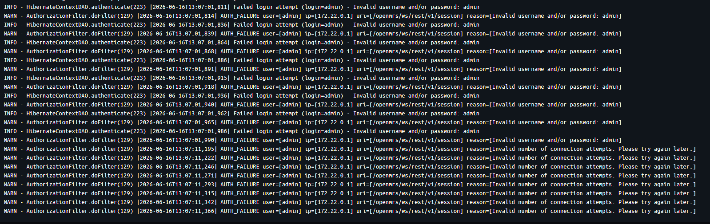

*Figuur 5 — Admin logs: eerst 7x "Invalid username and/or password", dan lockout bericht "Invalid number of connection attempts"*

**Log output:**
```
1-7:  Invalid username and/or password: admin
8-16: Invalid number of connection attempts. Please try again later. ← LOCKOUT ACTIEF
```

### Bewijs — Test logs (geen lockout, nooit geblokkeerd)

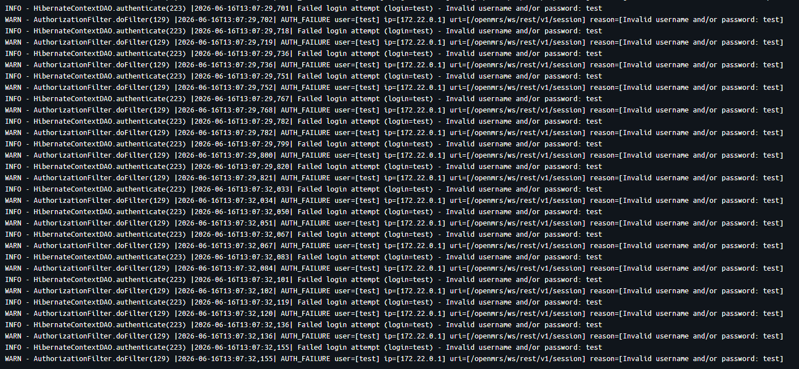

*Figuur 6 — Test logs: 16x "Invalid username and/or password" — geen verandering, geen lockout*

**Log output:**
```
1-16: Invalid username and/or password: test
      (geen "connection attempts" bericht — geen lockout)
```

### Impact

Aanvaller verkrijgt:
1. **Via Methode A:** Complete gebruikerslijst zonder beperking
2. **Via Methode B:** Bevestiging welke gebruikersnamen bestaan (observeerbaar in applicatielogs en indirecte toepassingen waar logging beschikbaar is)

Combinatie maakt gerichte brute force (F-01) significant efficiënter.

### Aanbeveling

- Beperk de `/user` API tot expliciete beheerdersrollen
- Retourneer geen gebruikerslijsten voor lager-geprivilegieerde accounts
- Uniform lockout-gedrag: dezelfde foutmelding voor bestaande en niet-bestaande accounts

---

## 8 F-03 — Session Fixation (CWE-384)

🟠 **HOOG**

| | |
|---|---|
| **Ernst** | Hoog |
| **CWE** | CWE-384 — Session Fixation |
| **OWASP** | A07:2025 — Authentication Failures |
| **Component** | `JSESSIONID` cookie — `/openmrs/ws/rest/v1/session` |
| **NEN-7510** | 8.3 — Identiteitsbeheer |

### Overzicht

Het sessie-ID (`JSESSIONID`) wordt **niet geroteerd** bij succesvolle authenticatie. Een aanvaller die vóór login het sessie-ID van een slachtoffer kent, kan dit ID ook na login gebruiken — zonder credentials te kennen.

### Reproductie

1. Haal een pre-login sessie-ID op (VOOR authenticatie)
2. Authenticeer met hetzelfde cookie
3. Vergelijk het sessie-ID vóór en na login
4. Stuur een request met uitsluitend het cookie (geen credentials)
5. Observeer dat de server `authenticated:true` retourneert

### Bewijs — Session ID identiek voor en na login

```
VOOR login:  JSESSIONID = 108D432C8C85187F4CBE53C0214A586C
NA  login:   JSESSIONID = 108D432C8C85187F4CBE53C0214A586C  ← IDENTIEK

CWE-384 BEVESTIGD: sessie-ID niet geroteerd na authenticatie
```

### Bewijs — Screenshots Burp Suite

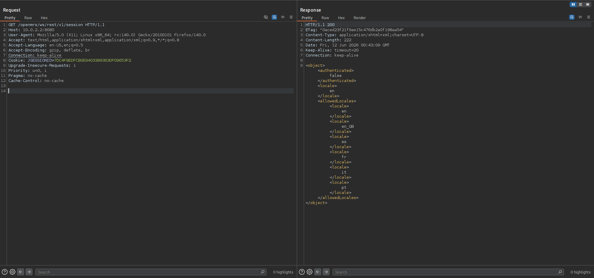

*Figuur 1 — JSESSIONID cookie vóór authenticatie (pre-login)*

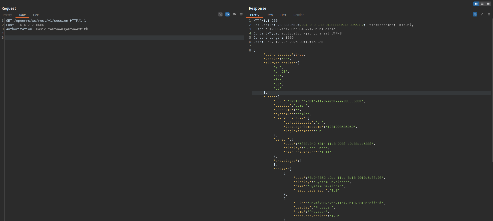

*Figuur 2 — Authenticatieverzoek met cookie bijgevoegd: sessie-ID blijft identiek na login*

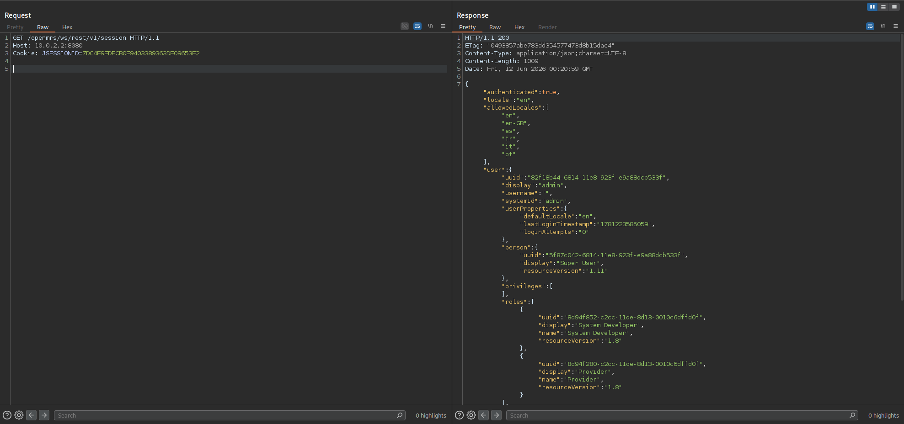

*Figuur 3 — Request met uitsluitend het cookie (geen credentials): server retourneert `authenticated:true`*

### Impact

Sessie-overname zonder kennis van credentials. `JSESSIONID` mist ook de `Secure` flag (zie F-09), waardoor het via onversleuteld HTTP onderschepbaar is.

### Aanbeveling

Roep `HttpSession.invalidate()` aan na succesvolle authenticatie en maak een nieuwe sessie aan. In Spring Security: `session-fixation protection="newSession"`.

---

## 9 F-04 — Stack Trace Disclosure (CWE-209)

🟠 **HOOG**

| | |
|---|---|
| **Ernst** | Hoog |
| **CWE** | CWE-209 — Generation of Error Message Containing Sensitive Information |
| **OWASP** | A09:2025 — Security Logging and Alerting Failures |
| **Component** | Meerdere REST-endpoints (`/user`, `/module`, POST `/user`) |
| **NEN-7510** | 8.15 — Informatiebeveiligingsgebeurtenissen |

### Overzicht

Bij unauthenticated toegang en interne fouten retourneert OpenMRS REST uitgebreide Java stack traces in de HTTP response body. Deze bevatten interne klassenamen, methodenamen, regelnummers, Hibernate ORM-structuur en dependency-versies.

### Reproductie

```bash
curl -s 'http://192.168.56.1:8080/openmrs/ws/rest/v1/user'
curl -s 'http://192.168.56.1:8080/openmrs/ws/rest/v1/module'
curl -u 'admin:Admin123!' -X POST 'http://192.168.56.1:8080/openmrs/ws/rest/v1/user'
```

Alle drie endpoints retourneren volledige Java stack traces (~80 regels per respons).

### Blootgestelde informatie

| Geleakte informatie | Aanvalswaarde |
|---|---|
| `org.openmrs.aop.AuthorizationAdvice:120` | Exacte autorisatielaag + regelnummer |
| `org.hibernate.collection.internal.PersistentSet` | Hibernate versie + ORM-configuratie |
| `com.fasterxml.jackson.databind.JsonMappingException` | Jackson dependency versie |
| `org.openmrs.Role.getId(Role.java:246)` | Interne domeinmodel structuur |

### Bewijs — Screenshots Burp Suite

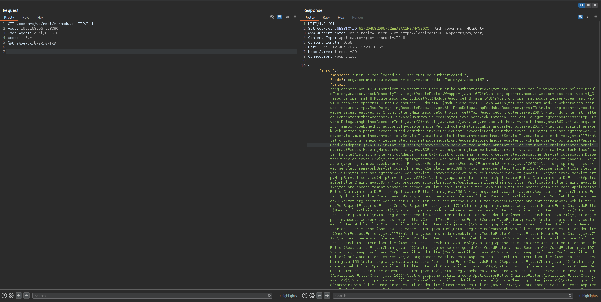

*Figuur 4 — `/module` endpoint: volledige Java stack trace zichtbaar in HTTP response body*

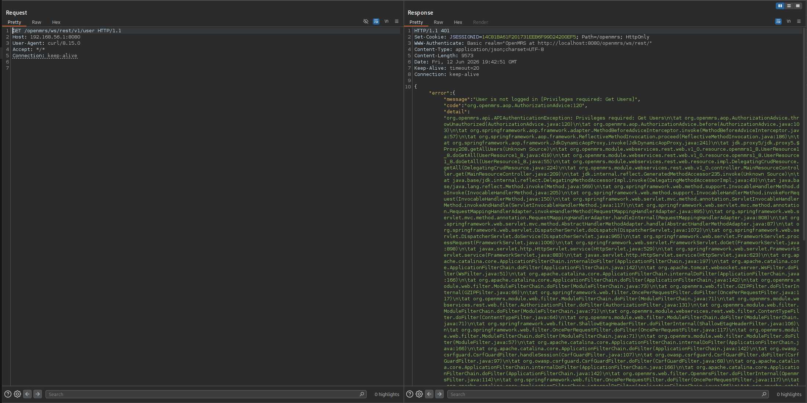

*Figuur 5 — `/user` endpoint: stack trace lekt interne autorisatielaagstructuur en regelnummers*

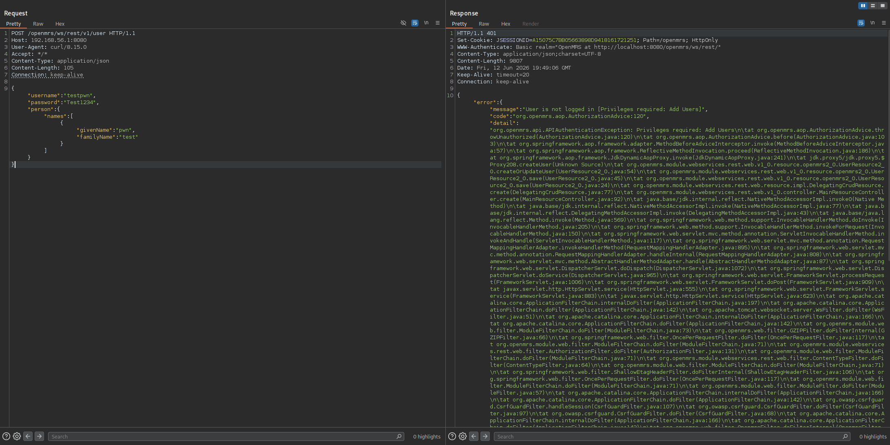

*Figuur 6 — `POST /user` zonder authenticatie: stack trace lekt volledige autorisatie-aanroepketen*

### Bewijs — `/session/diag` met geldige credentials (HTTP 500 + Jackson stack trace)

`GET /ws/rest/v1/session/diag` met geldige admin-credentials retourneert HTTP 500 met een
volledige Hibernate/Jackson stack trace in de response body:

```json
{
  "error": {
    "code": "org.springframework.http.converter.json.AbstractJackson2HttpMessageConverter:465",
    "detail": "com.fasterxml.jackson.databind.JsonMappingException: ... (through reference chain: ...org.openmrs.Role.getId(Role.java:246))"
  }
}
```

Dit lekt de exacte Jackson-versie, de Hibernate `PersistentSet`-implementatie en de
interne klassestructuur van het domeinmodel — identiek aan de overige F-04-instances.

### Impact

Stack traces maken vervolgaanvallen significant eenvoudiger: exacte framework-versies voor CVE-targeting, ORM-configuratie voor deserialisatie-analyse, autorisatiearchitectuur voor privilege escalation.

### Aanbeveling

Configureer een globale `@ExceptionHandler` die interne details vervangt door een generiek bericht met referentie-ID. Log de volledige trace intern (NEN-7510 8.15) maar stuur nooit details naar de client.

---

## 10 F-05 — Versie-informatie Disclosure (CWE-200)

🟠 **HOOG**

| | |
|---|---|
| **Ernst** | Hoog |
| **CWE** | CWE-200 — Exposure of Sensitive Information |
| **OWASP** | A02:2025 — Security Misconfiguration |
| **Component** | `/openmrs/ws/rest/v1/systeminformation` |
| **NEN-7510** | 8.15 — Informatiebeveiligingsgebeurtenissen |

### Overzicht

Het endpoint `/systeminformation` retourneert OpenMRS versie, Java versie, database-URL én gebruikersnaam. Aanvullend lekken `robots.txt` en `sitemap.xml` de Tomcat-versie (9.0.118) zonder authenticatie.

### Bewijs — Screenshot /systeminformation response

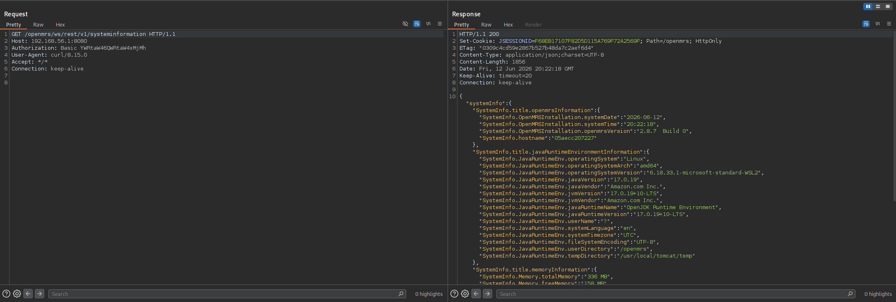

*Figuur 7 — `/systeminformation` response: OpenMRS versie, Java versie, database-URL en gebruikersnaam zichtbaar*

### Geleakte informatie

| Veld | Waarde |
|---|---|
| OpenMRS versie | 2.8.7 |
| Java versie | 17.0.19 |
| Database URL | `jdbc:mysql://db:3306/openmrs?...` |
| Module versie | 3.2.0 SNAPSHOT (development build) |

### Impact

Aanvaller kent exacte versies voor gerichte CVE-exploitatie. Database-URL en gebruikersnaam geven aanknopingspunten voor DB-laag aanvallen.

### Aanbeveling

- Beperk `/systeminformation` tot specifieke admin-rollen
- Verwijder database-URL en gebruikersnaam uit de output
- Verwijder versie-informatie uit `robots.txt` en `sitemap.xml`

---

## 11 F-06 — Integer Overflow in Paginering (CWE-190)

🟡 **MIDDEL**

| | |
|---|---|
| **Ernst** | Middel |
| **CWE** | CWE-190 — Integer Overflow or Wraparound |
| **OWASP** | A06:2025 — Insecure Design |
| **Component** | `?limit=` parameter op REST-endpoints |
| **NEN-7510** | 8.28 — Veilige softwareontwikkeling |

### Overzicht

De `limit`-parameter is als Java `int` (32-bit signed) geïmplementeerd. Waarden groter dan `Integer.MAX_VALUE` (2.147.483.647) lopen over naar negatief, waardoor zowel de `>0` check als de absolute limiet van 100 resultaten wordt omzeild.

### Bewijs — Exploitatieresultaten

```
[500]  limit=0           →  must be >0  (validatie werkt)
[500]  limit=-1          →  must be >0  (validatie werkt)
[500]  limit=2147483647  →  absolute limit at 100  (limiet werkt)
[200]  limit=2147483648  →  ok  ← OVERFLOW: bypasses beide validaties
[200]  limit=9999999999  →  ok  ← OVERFLOW: bypasses beide validaties
[200]  startIndex=-1     →  ok  ← negatieve index geaccepteerd
```

**Technische uitleg:** In Java: `(int) 2147483648L = -2147483648`. De validatiecode controleert `limit > 0` — met de overflow-waarde is `limit = -2147483648`, dus de check faalt niet en de limiet wordt overgeslagen.

### Bewijs — Screenshots Burp Suite

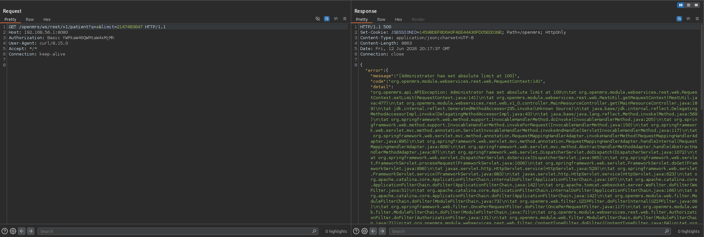

*Figuur 8 — `limit=2147483648` retourneert HTTP 200: integer overflow bypast de validatie*

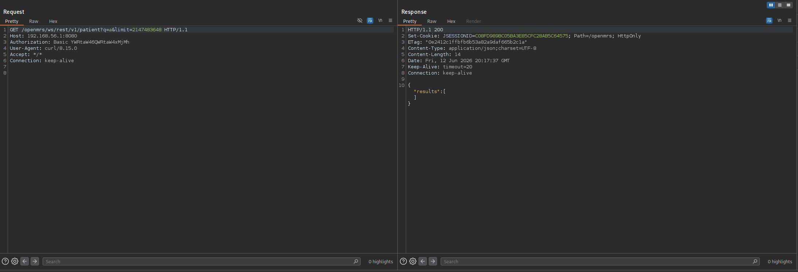

*Figuur 9 — Overzicht van geteste paginering-payloads: normale waarden geblokkeerd, overflow-waarden geaccepteerd*

### Impact

DoS-risico door onbeperkte database-queries. In productie met grote datasets: potentiële memory exhaustion.

### Aanbeveling

```java
long rawValue = Long.parseLong(limitParam);
if (rawValue < 1 || rawValue > MAX_ALLOWED) throw new ValidationException("...");
int limit = (int) rawValue;
```

---

## 12 F-07 — Log Injection (CWE-117)

🟡 **MIDDEL**

| | |
|---|---|
| **Ernst** | Middel |
| **CWE** | CWE-117 — Improper Output Neutralization for Logs |
| **OWASP** | A05:2025 — Injection |
| **Component** | `AuthorizationFilter` / `HibernateContextDAO` — Basic Auth username logging |
| **NEN-7510** | 8.15 — Toegangscontrole op informatiebronnen |

### Overzicht

De OpenMRS REST module logt de gebruikersnaam uit de `Authorization: Basic` header direct in de applicatielogs zonder newline-sanitisatie. Een aanvaller kan een newline (`\n`) inbedden in de username om willekeurige tekst als aparte logregel in te voegen en zo audit logs te vervuilen of forensisch bewijs te manipuleren.

**Kwetsbare code** (commit `3bd5fff`, hersteld in commit `b51cffb`):

```java
// RestUtil.java — logRequest()
log.warn("AUTH_FAILURE user=[" + username + "] ip=[" + ip + "]");
// username niet gesanitiseerd → \n splitst de logregel
```

### Reproductie

**Command 1 — duidelijke demonstratie:**

```bash
curl -s -o /dev/null \
  -u $'admin\n[ATTACKER-INJECTED] Dit log-regel is nep en door een aanvaller toegevoegd':wrongpassword \
  http://10.0.2.2:8080/openmrs/ws/rest/v1/session
```

**Command 2 — realistisch aanvalsscenario (audit log vervuiling):**

```bash
curl -s -o /dev/null \
  -u $'admin\nINFO - HibernateContextDAO.authenticate(223) | Successful login for admin ip=[10.0.0.1]':wrongpassword \
  http://10.0.2.2:8080/openmrs/ws/rest/v1/session
```

> `$'...'` (bash ANSI-C quoting) is vereist om `\n` als echte newline in de username te sturen.

### Bewijs — Command 1 (duidelijke demonstratie)

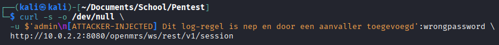

*Figuur 10 — Terminal: Command 1 uitgevoerd; `[ATTACKER-INJECTED]` verschijnt als losse logregel*

### Bewijs — Command 2 (realistisch aanvalsscenario)

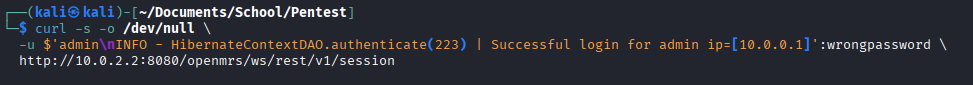

*Figuur 11 — Terminal: Command 2 uitgevoerd; neppe `Successful login for admin ip=[10.0.0.1]` ingevoegd*

### Bewijs — Gecombineerde Docker logs

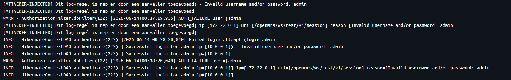

*Figuur 12 — Docker logs na beide commands: de neppe `Successful login`-regel staat als zelfstandige auditlogregel tussen echte entries — een SIEM die zoekt op `Successful login` ziet een neppe succesvolle inlog*

### Impact

Een aanvaller die een brute force uitvoert (zie F-01) kan nà de aanval neppe "Successful login"-regels injecteren om forensisch onderzoek te bemoeilijken. Audit logs verliezen betrouwbaarheid, wat strijdig is met NEN-7510 8.15. In SIEM-systemen kan dit false negatives veroorzaken.

### Aanbeveling

```java
String safeUsername = username.replaceAll("[\r\n]", "_");
log.warn("AUTH_FAILURE user=[" + safeUsername + "] ...");
```

Of gebruik een structured logging framework (bijv. Logback met `%replace`) dat newlines automatisch escapet.

### Hervalidatie — 2026-06-16 (post-mitigatie)

Pentest-hertest uitgevoerd met dezelfde `$'admin\n...'`-syntax (bash ANSI-C quoting,
echte newline) na commit `831dafb`:

**`AuthorizationFilter` (REST module) — ✅ gemitigeerd:**
```
WARN - AuthorizationFilter.doFilter(129) |...| AUTH_FAILURE user=[admin[ATTACKER-INJECTED] Dit log-regel is nep...] ip=[...]
```
De `\n` is gestript door `RestUtil.sanitizeForLog()` — injectie staat nu op dezelfde regel als de AUTH_FAILURE entry en is daarmee niet meer als valse zelfstandige logregel te plaatsen.

**`HibernateContextDAO.authenticate()` (OpenMRS Core) — ❌ buiten module-scope:**
```
INFO - HibernateContextDAO.authenticate(223) |...| Failed login attempt (login=admin
INFO - HibernateContextDAO.authenticate(223) | Successful login for admin ip=[10.0.0.1]) - Invalid username...
INFO - HibernateContextDAO.authenticate(223) | Successful login for admin ip=[10.0.0.1]
```
OpenMRS Core logt de username ongesaniteerd. De injectie slaagt hier nog steeds — de neppe `Successful login`-regels zijn zichtbaar als zelfstandige INFO-entries. Dit pad valt **buiten de scope** van de REST Webservices module en vereist een upstream fix in OpenMRS Core.

**Conclusie hervalidatie F-07:** De mitigatie is effectief voor alle code binnen de REST module (CodeQL 9 → 0 alerts). De resterende kwetsbaarheid zit in OpenMRS Core's logging en is als out-of-scope restrisico gedocumenteerd in `06-mitigatie-en-validatie/06.md`.

---

## 13 F-08 — Ontbrekende Security Headers (CWE-693)

🔵 **LAAG**

| | |
|---|---|
| **Ernst** | Laag |
| **CWE** | CWE-693 — Protection Mechanism Failure |
| **OWASP** | A02:2025 — Security Misconfiguration |
| **Component** | HTTP response headers (alle endpoints) |
| **NEN-7510** | 8.23 — Webfiltering |

### Ontbrekende headers

| Header | Risico bij ontbreken |
|---|---|
| `Content-Security-Policy` | XSS-aanvallen mogelijk bij injectiepunt |
| `X-Frame-Options` | Clickjacking-aanvallen mogelijk |
| `X-Content-Type-Options` | MIME-type sniffing |
| `Strict-Transport-Security` | Downgrade naar HTTP mogelijk |
| `Secure` flag op cookie | Cookie via HTTP meegestuurd |

### Bewijs — Screenshot Burp Suite (response headers)

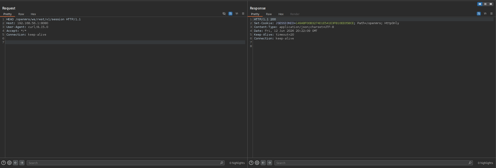

*Figuur 13 — HTTP response headers: geen `Content-Security-Policy`, `X-Frame-Options`, `X-Content-Type-Options` of `Strict-Transport-Security` aanwezig*

### Bewijs — Nikto scan (geautomatiseerde bevestiging)

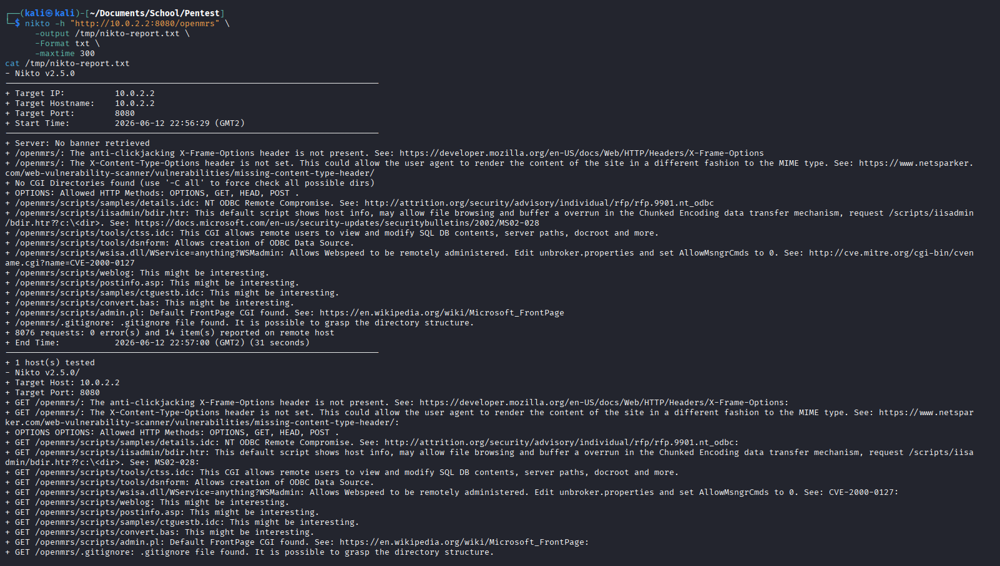

*Figuur 14 — Nikto geautomatiseerde scan bevestigt ontbrekende security headers op alle endpoints*

### Aanbeveling

Configureer in Tomcat `web.xml` de `HttpHeaderSecurityFilter` met `hstsEnabled`, `antiClickJackingEnabled` en `blockContentTypeSniffingEnabled`.

---

## 14 F-09 — Cookie Zonder SameSite Attribute (CWE-1275)

🔵 **LAAG**

| | |
|---|---|
| **Ernst** | Laag |
| **CWE** | CWE-1275 — Sensitive Cookie with Improper SameSite Attribute |
| **OWASP** | A04:2025 — Cryptographic Failures |
| **Component** | `JSESSIONID` cookie |
| **NEN-7510** | 8.23 — Webfiltering |

### Overzicht

Het `JSESSIONID`-cookie mist het `SameSite`-attribuut én de `Secure` flag. Zonder `SameSite` stuurt de browser het sessiecookie mee bij cross-site requests, wat CSRF-aanvallen mogelijk maakt. Zonder `Secure` flag wordt het cookie over HTTP meegestuurd.

### Bewijs — ZAP scan

```
Alert: Cookie Without SameSite Attribute
Risk: Low  |  CWE: 1275
Cookie: JSESSIONID
Evidence: Set-Cookie: JSESSIONID=...; Path=/openmrs; HttpOnly
Mist: SameSite=Strict, Secure flag
```

### Impact

In combinatie met F-03 (session fixation) verhoogt dit het risico op sessie-onderschepping.

### Aanbeveling

```xml
<!-- web.xml -->
<cookie-config>
  <http-only>true</http-only>
  <secure>true</secure>
</cookie-config>
```

Configureer `SameSite=Strict` via een response filter.

---

## 15 Niet-Kwetsbaar Bevonden

| Test | Methode | Resultaat |
|---|---|---|
| SQL-injectie op `?q=` | Handmatig + SQLMap | Niet kwetsbaar — Hibernate parameterized queries |
| Sessie-ID bypass | Gecorrumpeerd/onbekend cookie | Geweigerd — 401 Session timed out |
| XSS via Swagger | Endpoint discovery | Niet testbaar — Swagger geeft 404 |
| IDOR op `/patient` | GET met/zonder auth | Auth correct (401/200) — lege DB |
| Credentials in logs | Docker log analyse | Geen wachtwoorden in logs — NEN-7510 8.15 ✅ |
| Endpoint brute force | ffuf | Geen extra endpoints buiten REST |

### Logging — NEN-7510 8.15 compliant

```
WARN - AUTH_FAILURE user=[adminddd] ip=[172.22.0.1] uri=[/openmrs/ws/rest/v1/session]
WARN - SESSION_TIMEOUT ip=[172.22.0.1] uri=[/openmrs/ws/rest/v1/session]
INFO - Failed login attempt (login=adminddd) - Invalid username and/or password
```

AUTH_FAILURE gelogd ✅ | SESSION_TIMEOUT gelogd ✅ | Geen wachtwoorden in logs ✅

### Authenticatiebaseline (fase 3.1)

De volgende screenshots bevestigen dat authenticatie correct wordt afgedwongen op het `/session/diag` endpoint:

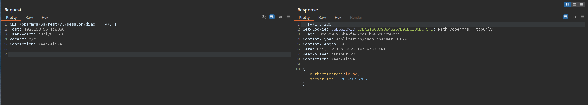

*Figuur 15 — `/session/diag` zonder authenticatie: `authenticated: false` retourneert correct*

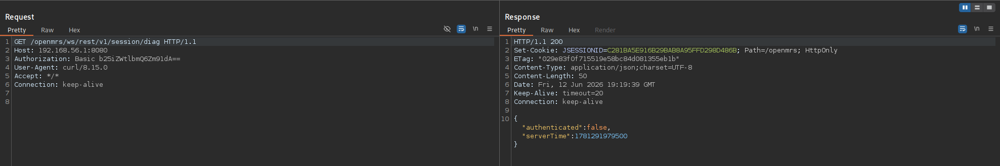

*Figuur 16 — `/session/diag` met ongeldige credentials: authenticatie gefaald*

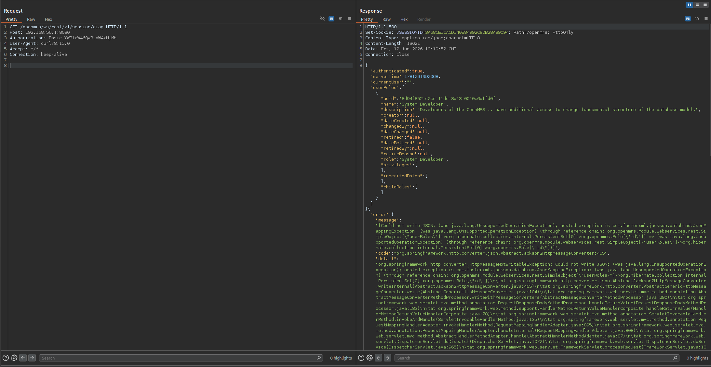

*Figuur 17 — `/session/diag` met geldige admin credentials: `authenticated: true` — baseline bevestigd*

### Sessie-ID validatie (fase 2.4 — niet kwetsbaar)

OpenMRS weigert gecorrumpeerde en onbekende sessie-ID's correct:

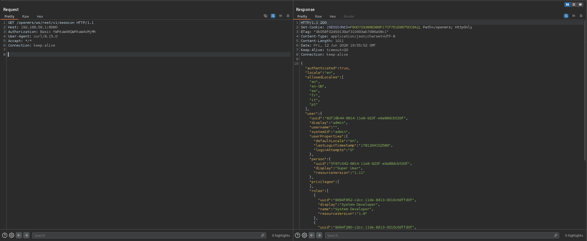

*Figuur 18 — Geldig sessie-ID geaccepteerd: server retourneert 200 `authenticated: true`*

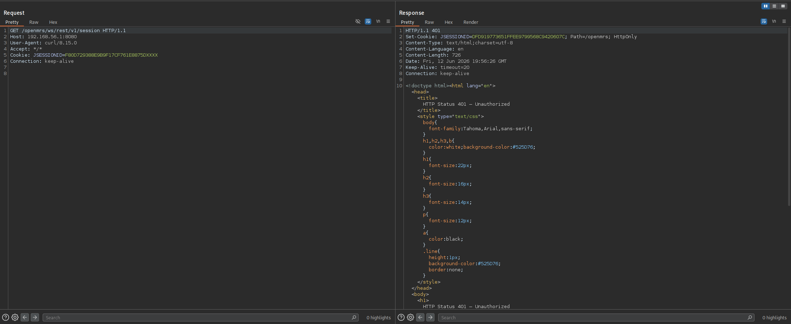

*Figuur 19 — Gecorrumpeerd sessie-ID geweigerd: 401 `Session timed out`*

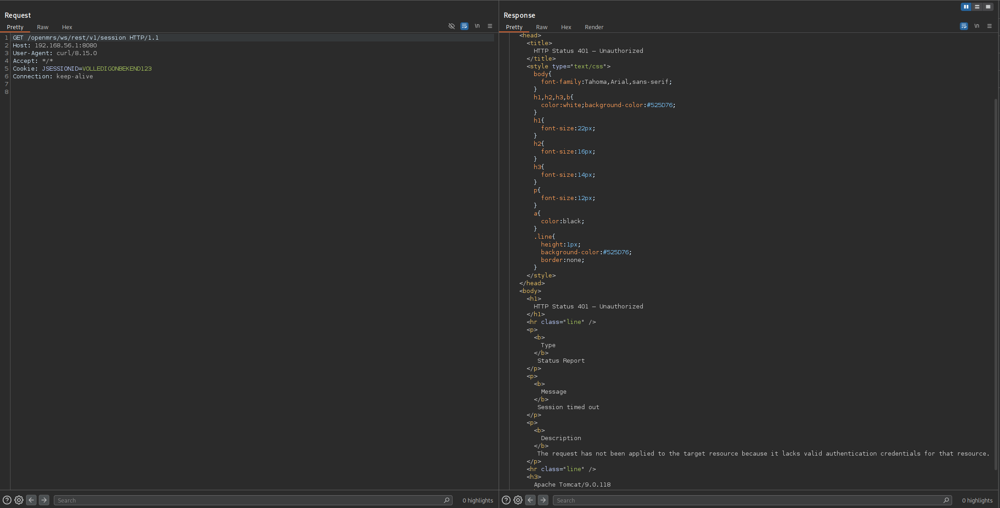

*Figuur 20 — Onbekend sessie-ID geweigerd: 401 `Session timed out` — validatie werkt correct*

### IDOR-test (fase 3.2 — niet kwetsbaar)

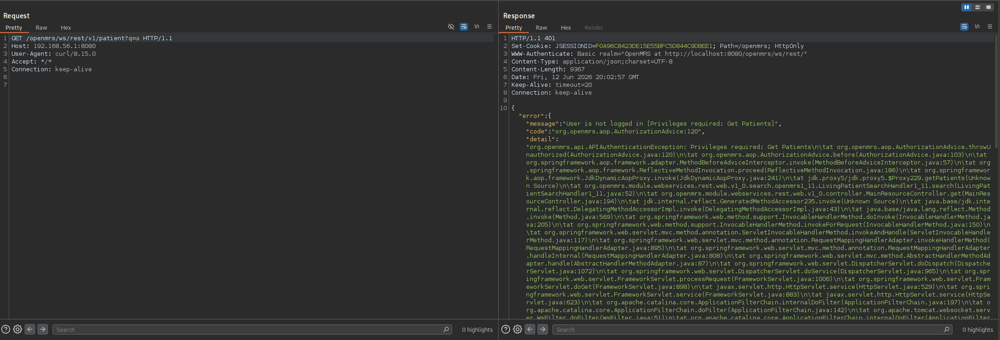

*Figuur 21 — `GET /patient` zonder authenticatie: 401 `Privileges required` — toegangscontrole werkt*

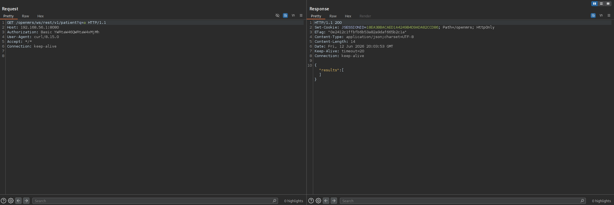

*Figuur 22 — `GET /patient` met admin auth: 200 lege lijst — geen patiëntdata in testomgeving*

### SQL Injection test (fase 4.2 — niet kwetsbaar)


*Figuur 23 — SQL injection testpayload: Hibernate parameterized queries voorkomen injectie*


*Figuur 24 — Aanvullende SQL injection payloads: geen kwetsbaarheid aangetoond*

---

## 16 Gebruikte Tools

| Tool | Versie | Doel |
|---|---|---|
| Nmap | 7.95 | Port/service scan |
| WhatWeb | — | Technologie fingerprinting |
| ffuf | v2.1.0 | Endpoint discovery / fuzzing |
| Hydra | v9.6 | Credential brute force |
| Custom Python | 3.x | Rate limiting test, user enumeration |
| Burp Suite CE | — | Request proxy & inspectie |
| curl | 8.15.0 | Handmatige API-tests |
| SQLMap | — | SQL injection scan |
| Nikto | — | Geautomatiseerde web scanner |
| OWASP ZAP | — | DAST spider + active scan |

---

## 17 Conclusie en Aanbevelingen

De penetratietest heeft **9 bevindingen** opgeleverd, waarvan 1 kritiek, 4 hoog en 2 middel. De meest ernstige bevinding — het ontbreken van rate limiting — is volledig geëxploiteerd: admin-credentials zijn via brute force verkregen in 6 pogingen, binnen 2 seconden.

### Samengestelde aanvalsketen

```
F-02 (Gebruikersenumeratie)  →  aanvaller kent geldige gebruikersnamen
    ↓
F-01 (Geen rate limiting)    →  brute force → admin credentials verkregen
    ↓
F-04 + F-05 (Stack traces + versie-info)  →  volledige reconnaissance
    ↓
F-03 (Session fixation)      →  sessie-overname mogelijk
    ↓
F-08 + F-09 (Geen Secure/SameSite cookie) →  cookie onderschepbaar via HTTP
    ↓
F-07 (Log injection)         →  audit trail gemanipuleerd, aanval verborgen
```

### Geprioriteerde aanbevelingen

| Prioriteit | Actie | Finding |
|---|---|---|
| 1 — 🔴 Kritiek | Rate limiting: max. 10 pogingen/min per IP, HTTP 429 | F-01 |
| 2 — 🟠 Hoog | Uniform gedrag bestaande/niet-bestaande accounts; beperk `/user` API | F-02 |
| 3 — 🟠 Hoog | Sessie-ID roteren na authenticatie (`HttpSession.invalidate()`) | F-03 |
| 4 — 🟠 Hoog | Globale exception handler: generieke foutmeldingen, geen stack traces | F-04 |
| 5 — 🟠 Hoog | Beperk `/systeminformation`; verwijder DB-URL en versie-info | F-05 |
| 6 — 🟡 Middel | Integer parsing via `long` vóór cast naar `int` | F-06 |
| 7 — 🟡 Middel | Sanitiseer username vóór logging: `replaceAll("[\r\n]", "_")` | F-07 |
| 8 — 🔵 Laag | Security headers: CSP, X-Frame-Options, X-Content-Type-Options, HSTS | F-08 |
| 9 — 🔵 Laag | Cookie: `SameSite=Strict` en `Secure` flag op JSESSIONID | F-09 |

---

## 18 Pentest Hervalidatie — Post-Mitigation

**Doel:** Valideren dat de mitigaties uit de audit-bevindingen het risico aantoonbaar
verlagen. De pentest (F-01–F-09) is de leidende validatiebron; onderstaande tabel
geeft de hervalidatie-status per bevinding.

**Hervalidatie uitgevoerd op: 2026-06-16** (na afronding van de codemitigaties).
Zie `pentestfindings.md` sectie 4 voor de ruwe hertest-output en `06-mitigatie-en-validatie/06.md`
voor het volledige voor/na-overzicht per bevinding.

| Bevinding | Mitigatie | Hervalidatie-status |
|---|---|---|
| F-01 — Geen rate limiting | `AuthorizationFilter.java`: in-memory IP-rate-limiter (max 10/60 s), HTTP 429 + `ACCESS_BLOCKED` log — commit `59bf421` | ✅ **Gemitigeerd** — zie §6 Mitigatie + Validatie |
| F-02 — Gebruikersenumeratie (API + lockout side-channel) | Geen code-fix — open bevinding | ❌ Open; logging-hertest 2026-06-16 bevestigt lockout-gedrag in applicatielogs (zie `pentestfindings.md` §4, sectie 5.3) |
| F-03 — Session Fixation | Geen code-fix — open bevinding | ❌ Open |
| F-04 — Stack Trace Disclosure | Geen code-fix — open bevinding | ❌ Open |
| F-05 — Versie-informatie | Geen code-fix — open bevinding | ❌ Open |
| F-06 — Integer Overflow | Geen code-fix — open bevinding | ❌ Open |
| F-07 — Log Injection | `RestUtil.sanitizeForLog()` op alle call-sites (commit `831dafb`); CodeQL 9 alerts → 0 (run `27280969725`) | ⚠️ **Deels gemitigeerd** — `AuthorizationFilter` (REST module): ✅ newlines gestript, injectie op één regel gehouden. `HibernateContextDAO.authenticate()` (OpenMRS Core, buiten module-scope): ❌ logt username ongesaniteerd — neppe `INFO Successful login`-regels nog steeds injecteerbaar. Pentest-hertest 2026-06-16 bevestigt beide. |
| F-08 — Ontbrekende Security Headers | Geen code-fix — open bevinding | ❌ Open |
| F-09 — Cookie Zonder SameSite | Geen code-fix — open bevinding | ❌ Open |

---

*Rapport opgesteld door LU2 Groep 17 — ATIx IN-B2.4 Softwarearchitectuur & -kwaliteit 2025-26 P4*  
*Testomgeving: Kali Linux 2024 / VirtualBox / OpenMRS REST Webservices module v3.2.0*
